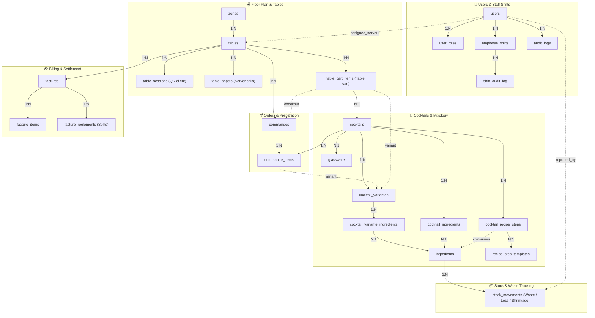
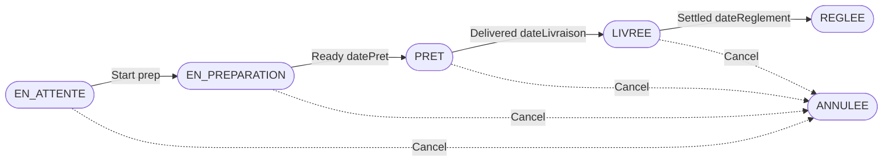

# OpenBar — Architecture & Project Context

## Project Identity

**OpenBar** is a real-time bar management application designed to digitize the complete cycle: order intake → preparation → service → billing.

- **Repo**: `FunWarry/Open-Bar` (GitHub)
- **GitHub Project**: `PVT_kwHOBOlRss4Bac05`
- **Figma**: `XSVwFk64kgtqgUN9n5qoMw`
- **Target Deployment**: Local PWA on mini-PC / Raspberry Pi 5 over local bar Wi-Fi network (no internet dependency required for local operations)

---

## Technology Stack (Current)

| Layer | Technology | Version | Notes |
|-------|------------|---------|-------|
| Backend | Spring Boot | 4.1.1 | |
| Runtime | Java | 22 (pinned) | Lombok 1.18.34 incompatible with JDK 23+ compiler internals |
| Database | PostgreSQL | — | Managed via Docker Compose |
| ORM | JPA/Hibernate + Lombok `@Data` | via Spring | |
| Security | Spring Security + custom JWT | JJWT 0.13.0 | Requires `JWT_SECRET` (≥ 32 characters) |
| Real-time | WebSocket STOMP | via Spring | 5 active topics |
| Frontend | Angular | 20 | |
| UI | Ionic | 8.8.11 | Angular Material abandoned |
| State | NgRx (store + effects) | 20 | **Auth only** — domain state uses services + signals |
| HTTP | RxJS / HttpClient | 7.8 | |
| i18n | Transloco (`@jsverse/transloco`) | — | All user-visible text must use `{{ 'KEY' | transloco }}` |
| Canvas | Konva.js | — | Interactive 2D floor plan |
| PDF | OpenPDF | 2.0.3 | Legal invoices, receipts, and table stand sheets |
| QR Codes | ZXing | 3.5.4 | High-contrast QR matrix generation (PNG, SVG, Wi-Fi standard schema) |
| Backend tests | JUnit 5 + Mockito + Testcontainers | 1.21.4 | Unit + Spring Boot integration tests with isolated PostgreSQL |
| Frontend tests | Karma + Jasmine | — | Headless browser unit tests |
| E2E tests | Playwright | 1.50+ | End-to-end browser tests (Chromium headless) |
| Database Backups | Automated Docker cron + rotation | — | `prodrigestivill/postgres-backup-local:15-alpine` (7d/4w/6m retention) |
| Reverse Proxy & TLS | Nginx | — | Port 443 HTTPS, TLS 1.2/1.3, HTTP 80 redirect, camera header, SAN certs |
| CI | GitHub Actions | 1 workflow (`ci.yml`) | Backend, Frontend, E2E, SonarCloud |
| Quality | SonarCloud + Qodana | — | Quality Gate enforcement |

---

## Backend Architecture

Strict layered pattern: **Controller → Service → Repository** (no layer skipping).

```
src/main/java/com/bar/gestioncocktail/
├── config/     # SecurityConfig, WebSocketConfig, JwtProperties, OpenApiConfig, AsyncConfig
├── controller/ # REST endpoints (@PreAuthorize mandatory on write endpoints)
├── dto/        # Java records with static XxxDTO from(Entity e)
├── event/      # Domain events (OrderCreatedEvent, InvoiceSettledEvent, TableUpdatedEvent, etc.)
├── listener/   # Asynchronous event listeners (StompBroadcastEventListener, TableEventListener)
├── model/      # JPA entities (@Data Lombok, @PrePersist/@PreUpdate)
├── repository/ # Spring Data JPA (extends JpaRepository<Entity, Long>)
├── security/   # JwtAuthenticationFilter, JwtAuthorizationFilter, JwtTokenProvider
└── service/    # Business domain logic (@Transactional on write methods, ApplicationEventPublisher)
```

**Circular References**: Strictly disabled via `spring.main.allow-circular-references: false`. Services communicate asynchronously via Spring ApplicationEvents and dedicated listeners.

**Secrets**: `JWT_SECRET` is required (≥ 256 bits) — defined in `.env` / environment variables, validated on startup via `JwtProperties.validate()`.

---

## Frontend Architecture

```
frontend/src/
├── app/
│   ├── app.routes.ts          # All routes lazy-loaded
│   ├── core/
│   │   ├── guards/            # AuthGuard, RoleGuard, AdminGuard
│   │   ├── interceptors/      # authInterceptor, errorInterceptor
│   │   ├── models/            # TypeScript interfaces
│   │   ├── services/          # Shared HTTP client services
│   │   └── store/             # NgRx (auth only: actions, effects, reducer, selectors)
│   └── features/
│       ├── auth/
│       ├── cocktails/
│       ├── commandes/
│       ├── dashboard-barman/
│       ├── dashboard-manager/
│       ├── dashboard-serveur/
│       ├── employees/             # Staff shift management + EmployeeShiftModalComponent
│       ├── factures/
│       ├── ingredients/
│       ├── schedule/              # Schedule view + ScheduleHistoryModal + ShiftHistoryModal (replay)
│       └── tables/
└── test/                      # Mirror structure of src/app/ — ALL *.spec.ts files located here
    ├── core/
    └── features/
```

**Key Architectural Decisions:**
- Angular Material → **Abandoned** → Ionic 8+
- Capacitor → **Abandoned** → PWA (`@angular/pwa`, Service Worker)
- NgRx → **Auth only** — all other state uses direct services + Angular signals
- Tests → **`src/test/`** (mirror Maven structure, never co-located with source components)
- Styling → **Adaptive Theme System** using CSS variables from `variables.css` (no hardcoded hex/RGB colors)

---

## Data Model



*Standalone configuration & logging tables*:
- `establishment_closures` : Exceptional closures and recurring holidays
- `shift_presets` : Predefined shift templates (duration, breaks)
- `week_schedule_publications` : Publication log of employee schedules
- `app_settings` : Global establishment settings singleton (currency, anti-fraud toggles, legal data, margin alert thresholds target/warning, default VAT rate)
- `happy_hour_rules`, `happy_hour_days`, `happy_hour_categories`, `happy_hour_cocktails` : Promotional Happy Hour & dynamic schedule-based pricing rule engine
- `stock_movements` : Audit log of stock losses, breakages, expired ingredients, spills, staff tastings, and shrinkage (`ingredient_id`, `quantity`, `unit`, `reason`, `reported_by`, `cost`, `notes`, `recorded_at`)

---

## User Roles & Permissions

| Role | Domain Role | Key Permissions |
|------|-------------|-----------------|
| `ADMIN` | Technical maintenance & setup | User CRUD, full system access, app settings |
| `MANAGER` | Bar supervision (primary business role) | Analytics, order cancellation, stock toggle, shift & schedule management |
| `SERVEUR` | Order intake & table service | Create/cancel orders, table tracking, personal shift view, table billing/encaissement, table call acknowledgement |
| `BARMAN` | Drink preparation & stock | Order status progression, cocktail/ingredient recipe view, stock outage toggles |

**NgRx Selectors**: `selectIsAdmin`, `selectIsManager`, `selectIsBarman`, `selectIsAuthenticated`, `selectCurrentUser`

---

## Order Lifecycle



---

## WebSocket STOMP Topics

| Topic | Event |
|-------|-------|
| `/topic/commandes` | New order created / order updated |
| `/topic/commandes/{id}` | Order status changed |
| `/topic/tables` | Table occupied / liberated / updated |
| `/topic/stock/alerte` | Low stock alert triggered |
| `/topic/schedule-publications` | Team schedule published |
| `/topic/serveur/appels` | Table assistance / bill request alert triggered |
| `/topic/table/{tableId}/appels` | Table alert acknowledgement / resolution update |
| `/topic/tables/{tableId}/cart` | Collaborative table cart state synchronization |

---

## Audit & Replay Endpoints

| Method | URL | Roles | Description |
|--------|-----|-------|-------------|
| `GET` | `/api/shifts/{id}/history` | MANAGER, ADMIN | Immutable history of a single shift |
| `GET` | `/api/schedule/audit-log?week=&userId=` | MANAGER, ADMIN | Weekly schedule audit log (optional staff filter) |
| `GET` | `/api/schedule/at?week=&at=` | All authenticated | Time-travel replay reconstructing schedule at timestamp T |

---

## Ephemeral Table Sessions & Anti-Fraud QR Code Validation

To prevent stale or fraudulent remote orders via public QR code links, OpenBar supports an ephemeral session lifecycle linked to table occupation and bill settlement:

- **Entity & Table**: `TableSession` mapped to `table_sessions` (`id`, `table_id`, `session_token`, `status`, `opened_at`, `last_activity_at`, `expires_at`).
- **Statuses**: `ACTIVE`, `EXPIRED`, `CLOSED`.
- **Lifecycle & Invalidation**:
  - Automatically invalidated (transitioned to `CLOSED`) when a table is liberated or its bill is settled via `TableLiberatedEvent`.
  - Invalidation operates directly on managed entities (`findByTableIdAndStatus` + `saveAllAndFlush`) to avoid Hibernate L1 cache eviction hazards.
- **Strict Anti-Fraud Mode**: Configurable via manager settings (`AppSettings.tableSessionValidationEnabled`). When enabled, `POST /api/public/commandes` validates the `sessionToken` payload; invalid or expired tokens result in `403 Forbidden` (`InvalidTableSessionException`).
- **Endpoints**:

| Method | URL | Roles | Description |
|--------|-----|-------|-------------|
| `GET` | `/api/public/tables/{tableId}/session` | Public | Check or initialize an active ephemeral table session |
| `POST` | `/api/public/tables/{tableId}/session/refresh` | Public | Refresh / renew an active session token |

---

## Collaborative Table Cart for Multi-Guest QR Ordering

OpenBar allows guests seated at the same physical table to collaboratively construct their order in real time from individual smartphones:

- **Entity & Table**: `TableCartItem` mapped to `table_cart_items` (`id`, `table_id`, `guest_session_id`, `guest_name`, `cocktail_id`, `cocktail_variante_id`, `quantite`, `notes`, `created_at`, `updated_at`).
- **WebSocket STOMP Topic**: `/topic/tables/{tableId}/cart` broadcasts consolidated `TableCartResponseDTO` whenever any guest adds, modifies, or removes items, or checks out the cart.
- **Guest Authentication**: `WebSocketAuthInterceptor` allows anonymous patrons to subscribe exclusively to their table's cart (`/topic/tables/{tableId}/cart`) and alerts topic using `X-Guest-Session`, `X-Session-Token`, or `Authorization: Guest <id>` with `ROLE_ANONYMOUS`, strictly preventing unauthorized access to staff topics (`/topic/commandes`, `/topic/serveur/appels`).
- **Automatic Lifecycle & Cleanup**: Cleaned up automatically upon table liberation or bill settlement via `TableLiberatedEvent` (`tableCartItemRepository.deleteByTableId(tableId)`).
- **Consolidated Submission**: Any guest can submit the consolidated cart via `POST /api/public/tables/{tableId}/cart/submit`. The server creates a single grouped `Commande`, sets cart status to `SUBMITTED`, notifies other guests via STOMP, and cleans up the ephemeral cart items.
- **Endpoints**:

| Method | URL | Roles | Description |
|--------|-----|-------|-------------|
| `GET` | `/api/public/tables/{tableId}/cart` | Public | Retrieve current collaborative table cart |
| `POST` | `/api/public/tables/{tableId}/cart/items` | Public | Add item to collaborative table cart |
| `PUT` | `/api/public/tables/{tableId}/cart/items/{itemId}` | Public | Update item quantity or notes |
| `DELETE` | `/api/public/tables/{tableId}/cart/items/{itemId}` | Public | Remove item from collaborative table cart |
| `DELETE` | `/api/public/tables/{tableId}/cart` | Public | Clear all items from collaborative table cart |
| `POST` | `/api/public/tables/{tableId}/cart/submit` | Public | Submit consolidated collaborative order to the bar |

---

## Gross Margin, COGS & Multi-Unit Conversion Engine

OpenBar provides live tracking of recipe Cost of Goods Sold (COGS), gross margin amount, and gross margin percentage:

- **Unit Conversion Engine**: `UnitConversionService` provides standardized conversion for volume units (`L`, `CL`, `ML`, `OZ`, `DASH`, `DROP`, `CUP`, `TSP`, `TBSP`) and mass units (`KG`, `G`, `MG`, `LB`).
- **Margin Calculation Engine**: `MarginCalculationService` calculates recipe production cost, gross profit amount, and gross profit margin percentage across base recipes and custom variants (`CocktailVariante`), resolving ingredient unit costs dynamically and taking into account VAT.
- **Configurable Settings & Alerts**:
  - `default_vat_rate`: Establishment-wide default VAT percentage (configurable in App Settings with country presets).
  - `target_gross_margin_percentage`: Target margin threshold (default 70%), triggering healthy status badges (`HEALTHY` / green).
  - `warning_gross_margin_percentage`: Warning threshold (default 50%), triggering warning badges (`WARNING` / orange) or critical alerts (`CRITICAL` / red when below warning).
- **Manager Dashboard & Catalog Integration**: Visual margin health badges (`MarginHealthBadgeComponent`), live COGS and gross profit KPI cards in `DashboardManagerComponent`, real-time margin computation during cocktail creation/edition (`CocktailFormComponent`).

---

## Running Locally

```bash
# Database
cd backend/src/main/resources && docker compose up -d

# Backend
export JWT_SECRET=$(openssl rand -base64 32)
cd backend && mvn spring-boot:run   # → http://localhost:8080

# Frontend
cd frontend && npm install && ng serve   # → http://localhost:4200
```

> ⚠️ **JDK 22 (pinned)** required — Lombok 1.18.34 is incompatible with JDK 23+ compiler internals.

---

## Database Backup & Disaster Recovery

OpenBar provides automated backups, configurable retention, and manual CLI utilities:

- **Automated Service**: `prodrigestivill/postgres-backup-local:15-alpine` container in `docker-compose.prod.yml`.
- **Scheduled Snapshot**: Cron `0 3 * * *` (03:00 daily), compressed with gzip (`.sql.gz`).
- **Retention Strategy**:
  - `BACKUP_KEEP_DAYS: 7` (daily backups kept for 7 days)
  - `BACKUP_KEEP_WEEKS: 4` (weekly backups kept for 4 weeks)
  - `BACKUP_KEEP_MONTHS: 6` (monthly backups kept for 6 months)
- **Persistent Volume**: `openbar_backups` mounted to `/backups`.
- **Manual Backup Script**: `scripts/backup-db.sh` (or `scripts/backup-db.ps1`) for on-demand snapshots.
- **Disaster Recovery Restore Script**: `scripts/restore-db.sh` (or `scripts/restore-db.ps1`) with archive integrity verification, automated pre-restore safety snapshot, connection draining, and post-restore sanity checks.

---

## Local HTTPS / TLS & PWA Reverse Proxy

Mobile browsers (iOS Safari, Android Chrome) enforce a secure context for `navigator.mediaDevices.getUserMedia` (QR code camera scanning) and Service Worker offline registration:

- **Nginx Reverse Proxy**: Port 443 with TLS 1.2/1.3, strong ciphers, and session cache (`docker-compose.prod.yml`).
- **HTTP Redirection**: Port 80 permanent 301 redirect to HTTPS.
- **Permissions Header**: `Permissions-Policy: camera=(self), microphone=(), geolocation=()` enabling camera feed.
- **Local Certificate Generation**: `scripts/generate-local-certs.sh` and `scripts/generate-local-certs.ps1` with Subject Alternative Names (SAN: `localhost`, `openbar.lan`, `*.openbar.lan`, `openbar.local`, `127.0.0.1`, LAN IP).
- **Zero-Config Fallback**: `frontend/entrypoint.sh` automatically generates fallback self-signed certificates if none are mounted.

---

## Stock Loss & Shrinkage Tracking

OpenBar provides full lifecycle audit logging and real-time inventory deduction for stock loss, breakage, and waste:

- **Entity & Table**: `StockMovement` mapped to `stock_movements` (`id`, `ingredient_id`, `quantity`, `unit`, `reason`, `reported_by`, `notes`, `cost`, `recorded_at`).
- **Reasons (`StockWasteReason`)**: `BROKEN_BOTTLE`, `EXPIRED`, `SPILL`, `STAFF_TASTING`, `COMPLIMENTARY_DRINK`.
- **Automatic Inventory Deduction**: When waste/loss is recorded via `POST /api/stock/waste`, the ingredient stock is automatically decremented (with non-negative guard).
- **Financial Cost Computation**: Cost is calculated as `quantity * ingredient.prixUnitaire` (or explicitly provided) and recorded immutably.
- **Endpoints**:

| Method | URL | Roles | Description |
|--------|-----|-------|-------------|
| `POST` | `/api/stock/waste` | BARMAN, MANAGER, ADMIN | Record stock waste, loss, or tasting with auto deduction |
| `GET` | `/api/stock/movements?ingredientId=` | BARMAN, MANAGER, ADMIN | Retrieve audit log of stock movements (optional ingredient filter) |
| `GET` | `/api/stock/waste/summary` | MANAGER, ADMIN | Retrieve manager summary with financial loss breakdown by reason |

---

## Quality & CI/CD Standards

1. **Documentation is mandatory** in English on all services, DTOs, controllers, guards, and store files.
2. **Never use `@SuppressWarnings`** — fix underlying code/lint warnings directly.
3. **No hardcoded text** — always use Transloco `fr.json` and `en.json` with 100% key parity.
4. **Adaptive theme** — use CSS variables for all styling (`var(--background-bg-0)`, `var(--primary)`, etc.).
