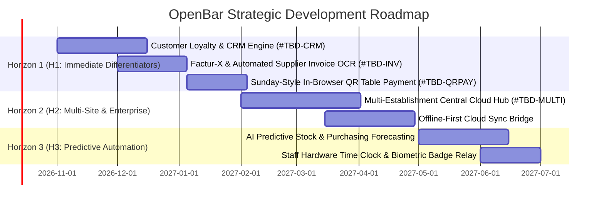

# OpenBar — Comprehensive POS & Bar Management Market Competitive Analysis & Roadmap

> **Document Version**: 1.0.0  
> **Date**: October 2026  
> **Target Audience**: Product Managers, Software Architects, Independent Bar Owners, Hospitality Non-Profits  
> **Status**: Active Reference Document  

---

## Executive Summary

The Point-of-Sale (POS) and hospitality management software market has undergone a dramatic transformation over the past decade. The shift from legacy, on-premise, proprietary cash registers (such as NCR Aloha, Micros Oracle) to cloud-based Software-as-a-Service (SaaS) platforms (such as Toast, Lightspeed, Zelty, Popina, SumUp) promised lower upfront capital expenditure, remote management, and continuous feature updates. 

However, this transition introduced severe systemic pain points for bar and restaurant operators:
1. **Predatory Monetization & Compounding OpEx**: Monthly recurring subscriptions (€60–€250/month per terminal) combined with mandatory payment processing markups (typically 1.4% to 2.9% + €0.10–€0.30 per card transaction) siphon away razor-thin hospitality profit margins.
2. **Proprietary Hardware Lock-In**: Operators are compelled to purchase proprietary tablet docks, card readers, and terminal enclosures that are rendered useless if they switch providers.
3. **Fragile Cloud Dependency & Saturday Night Outages**: Cloud-native POS systems degrade severely or fail outright when public internet connectivity or cellular 4G/5G links drop during peak service hours, resulting in lost sales, bartender bottlenecks, and lost patron orders.
4. **Neglect of Non-Profits & Educational Associations**: Student unions (BDE), sports clubs, community associations, and charitable pop-ups are forced either to run illegal paper slips/cash boxes or bear exorbitant commercial SaaS fees designed for high-turnover enterprise restaurants.
5. **Generic Food Focus vs. Lack of Mixology Depth**: Mainstream POS solutions treat drinks as simple SKU items with a price tag, ignoring recipe cascades (syrups, infusions, pre-batches), fine volume dosages (cl/ml/drops), allergen inheritance, and spirit flavor profiles.

**OpenBar** was engineered as an uncompromising antidote to these market dynamics:
- **Zero Cloud & Zero Internet Dependency**: Deployed 100% locally on a low-cost, high-reliability micro-server (Raspberry Pi 5 or mini-PC) broadcasting over the venue's local Wi-Fi.
- **Fair, Multi-Tier Business Model**: **100% Free** for non-profit organizations, associations, and student unions; **ultra-low-cost, fair one-off / transparent license** for commercial businesses without monthly software subscription extortion or transaction cuts.
- **Open Standards & Bring-Your-Own-Hardware (BYOH)**: Standard Progressive Web App (PWA) operating on any smartphone, tablet, or PC; direct local network TCP communication with physical bank payment terminals (Concert IP protocol on port 8888) and standard ESC/POS thermal printers on port 9100.
- **Deep Mixology & Cocktail Intelligence**: First-of-its-kind integrated cocktail library (IBA & contemporary), flavor profile matching wheels, dynamic co-occurrence chord graphs, crafted syrup yield depletion cascades, weighted average unit costing (PAMP/WAC), and mystery drink gamification.

---

## 1. Competitor Breakdown & Industry Landscape

Below is an exhaustive breakdown of the leading hospitality POS players in France, Europe, and the international market.

```
┌────────────────────────────────────────────────────────────────────────────────────────┐
│                               POS MARKET LANDSCAPE (2026)                               │
├───────────────────────────────┬────────────────────────────────────────────────────────┤
│ FRENCH & EUROPEAN LEADERS     │ INTERNATIONAL GIANTS                                   │
│ • Zelty (High-volume chains)  │ • Toast POS (US market juggernaut, heavy fee lock-in) │
│ • Popina (iPad bar & café)    │ • Lightspeed Restaurant (Global enterprise SaaS)       │
│ • Tactill (Simple retail/bar) │ • Square for Restaurants (SME & mobile food)           │
│ • SumUp / Tiller (Micro-SMBs) │                                                        │
│ • L'Addition (Apple centric)  │ AT-TABLE PAYMENT DISRUPTORS                            │
│                               │ • Sunday (QR bill-splitting & tipping)                 │
└───────────────────────────────┴────────────────────────────────────────────────────────┘
```

---

### 1.1. Toast POS

- **Headquarters**: Boston, USA (Publicly traded, NYSE: TOST).
- **Core Market Segment**: Mid-market to enterprise restaurants, bars, multi-unit franchises.
- **Architecture**: Android-based cloud POS with semi-offline buffering mode.

#### Pricing Structure & Monetization
- **Software**: From $69/month per terminal (Base) up to $189+/month for advanced modules (KDS, inventory, loyalty, payroll).
- **Hardware**: Proprietary Toast Flex terminals ($799–$1,200), Toast Go handhelds ($450), proprietary docks and thermal printers.
- **Processing Fees**: Mandatory payment processing lock-in. Charges interchange-plus or flat rate (~2.49% to 2.99% + $0.15). If third-party processors are requested, Toast charges a penalty fee ($50–$100/mo).

#### Strengths
- Highly integrated ecosystem (POS, KDS, online ordering, scheduling, payroll).
- Ruggedized Toast Go handheld hardware built for spills and drops.
- Strong kitchen management workflows.

#### Fatal Flaws & Operational Vulnerabilities
- **Aggressive fee creep**: Notorious for adding forced consumer fees (e.g., attempt to levy a $0.99 fee on guest orders in 2023, later rolled back after industry backlash).
- **Heavy vendor lock-in**: Proprietary Android hardware cannot be flashed or reused with any other POS software.
- **Internet reliance**: Offline mode stores credit cards for deferred capture, but if the local router loses WAN, inter-terminal real-time sync (table transfer, bar to kitchen routing) becomes unstable.

---

### 1.2. Lightspeed Restaurant (formerly Lightspeed + Gastrofix)

- **Headquarters**: Montreal, Canada.
- **Core Market Segment**: Upscale restaurants, hotel F&B, boutique bars, multi-location groups.
- **Architecture**: iOS / iPadOS native cloud application with local network server option (Liteserver).

#### Pricing Structure & Monetization
- **Software**: Tiered monthly subscription starting at €79/month (Basic) to €189/month (Standard) to €399/month (Pro / Enterprise) plus add-ons.
- **Hardware**: Standard Apple iPads + proprietary enclosures and peripherals (€1,200–€2,500 initial setup kit).
- **Processing Fees**: Lightspeed Payments pushes 1.4% to 2.6% + €0.15 transaction fees. Penalizes external EFTPOS/TPE terminals with an extra €50/month integration surcharge.

#### Strengths
- Elegant UI, comprehensive floor plan builder, strong wine list / cellar inventory tracking.
- Multi-location corporate consolidated reporting.
- Advanced accounting integrations (SAP, Oracle, French FEC, Xero).

#### Fatal Flaws & Operational Vulnerabilities
- Prohibitively expensive for independent cocktail bars, seasonal beach bars, and food trucks.
- Liteserver local fallback hardware is costly, difficult to configure, and often fails to seamlessly sync modified tabs.
- Customer support responsiveness has declined following corporate acquisitions.

---

### 1.3. Square for Restaurants

- **Headquarters**: San Francisco, USA (Block, Inc.).
- **Core Market Segment**: Coffee shops, small bars, food trucks, pop-up events, fast-casual.
- **Architecture**: iOS (iPad) and Square Terminal (Android custom hardware) cloud application.

#### Pricing Structure & Monetization
- **Software**: Free plan available (limited features); Plus plan at $60/month per location + $40/month per additional terminal.
- **Hardware**: Square Stand ($149), Square Register ($799), Square Terminal ($299).
- **Processing Fees**: 1.65% to 2.6% + €0.10 per transaction. Closed payment network — zero support for local European bank contracts or Concert IP TPEs.

#### Strengths
- Fast onboarding; no long-term contract requirement.
- Clean user experience with minimal staff training required.
- Robust developer APIs.

#### Fatal Flaws & Operational Vulnerabilities
- **Not tailored for high-volume nightlife**: Order modification, table split billing, and complex bar tabs under rush hours are cumbersome.
- **Zero mixology support**: Cannot handle partial bottle inventory counts, recipe sub-steps, or yield ratios.
- **Fund freezing risks**: Automated fraud algorithms frequently freeze merchant funds on sudden spike volumes (e.g., busy Friday night or festival).

---

### 1.4. SumUp / Tiller (Tiller Systems)

- **Headquarters**: Paris, France (Acquired by SumUp in 2021).
- **Core Market Segment**: French and European small to medium restaurants, brasseries, neighborhood cocktail bars.
- **Architecture**: iOS (iPad) cloud POS paired with SumUp payment terminals.

#### Pricing Structure & Monetization
- **Software**: €59 to €99/month per iPad terminal.
- **Hardware**: iPad + Star Micronics / Epson printers + SumUp Solo card reader (€800–€1,500).
- **Processing Fees**: 1.25% to 1.75% via SumUp reader.

#### Strengths
- Strong French regulatory compliance (NF525 certified, certified ticket logs, French fiscal archiving).
- Good local customer support network across France.
- Simple, intuitive touchscreen order taking.

#### Fatal Flaws & Operational Vulnerabilities
- Post-acquisition stagnation: minimal innovation in bar-specific features since SumUp integration.
- Weak stock depletion modeling: no support for multi-unit cocktail conversions (e.g., bottles to cl to dashes).
- SumUp Bluetooth card readers are notoriously sluggish during intense bar rushes compared to dedicated wired IP TPEs.

---

### 1.5. Zelty

- **Headquarters**: Nantes, France.
- **Core Market Segment**: Multi-site franchises, fast food chains, high-volume hospitality groups (e.g., Big Mamma, Five Guys France).
- **Architecture**: iPad native app with centralized cloud back-office.

#### Pricing Structure & Monetization
- **Software**: €79 to €150/month per site + module add-ons (KDS €29/mo, Click & Collect €39/mo, Delivery integration €39/mo, Inventory €49/mo).
- **Hardware**: iPads and professional Elo touchscreens.
- **Processing Fees**: Compatible with French bank TPEs via Paywin/Concert IP, but back-office integration requires premium middleware modules.

#### Strengths
- Exceptional performance on high-volume chains, central franchise menu distribution.
- Deep integration with food delivery platforms (Deliveroo, Uber Eats).
- Very reliable back-office infrastructure.

#### Fatal Flaws & Operational Vulnerabilities
- Completely over-engineered and unaffordable for independent bars and small operations (monthly bill quickly exceeds €250/mo per location).
- Tailored for kitchen burger/pizza workflows, not craft mixology or bar tab ledgers.
- Closed ecosystem with high onboarding friction.

---

### 1.6. Popina

- **Headquarters**: Paris, France.
- **Core Market Segment**: Independent French bars, bistros, trendy urban cocktail joints.
- **Architecture**: iPad native iOS application with cloud sync.

#### Pricing Structure & Monetization
- **Software**: €59 to €89/month per iPad.
- **Hardware**: Exclusively Apple iPad (€400–€1,200) + compatible thermal printers.
- **Processing Fees**: Works with external card terminals or integrated solutions (1.2%–1.5%).

#### Strengths
- Excellent reputation among Parisian bars and coffee shops.
- Clean design, rapid order entry, NF525 certified.
- Native split-bill feature and happy hour rule configuration.

#### Fatal Flaws & Operational Vulnerabilities
- Strict Apple hardware lock-in: cannot run on Android tablets, inexpensive Linux kiosks, or waitstaff smartphones.
- Limited inventory management: basic item decrement without raw ingredient multi-level recipe tracking.
- Ongoing recurring license fees add up to €700–€1,100 per year per terminal indefinitely.

---

### 1.7. Tactill

- **Headquarters**: Paris, France.
- **Core Market Segment**: Micro-retailers, boutiques, small cafés, simple neighborhood bars.
- **Architecture**: iOS cloud-first app.

#### Pricing Structure & Monetization
- **Software**: €29 to €69/month.
- **Hardware**: iPad / iPhone based.
- **Processing Fees**: External or integrated (Zettle / SumUp).

#### Strengths
- Clean, minimalist interface with near-zero learning curve.
- Affordable entry price for small shops.
- NF525 certified.

#### Fatal Flaws & Operational Vulnerabilities
- Lacks advanced restaurant and bar operations: no real floor plan canvas, no KDS workstation dispatch, no running bar tabs, no bottle audit gauging.

---

### 1.8. L'Addition

- **Headquarters**: Paris / Bordeaux, France.
- **Core Market Segment**: Traditional French restaurants, brasseries, hotel bars.
- **Architecture**: iPad app with local Apple Mac Mini or local router server communicating over local Wi-Fi.

#### Pricing Structure & Monetization
- **Software**: €59 to €120/month per iPad terminal.
- **Hardware**: Expensive Apple bundle (iPads, AirPort / Ubiquiti routers, Mac server, Star printers) costing €2,500 to €5,000 upfront.
- **Processing Fees**: Traditional French TPE bank contracts.

#### Strengths
- Local network operation: like OpenBar, L'Addition popularized running over a dedicated local router without relying on internet access for local orders.
- Strong brand awareness in France; certified NF525.

#### Fatal Flaws & Operational Vulnerabilities
- **Exorbitant total cost of ownership (TCO)**: Expensive Apple hardware + hefty upfront setup fees + perpetual monthly subscriptions.
- Dated user interface that has not modernized at the pace of modern web applications.
- Zero support for craft cocktail creation, flavor pairing wheels, or customer collaborative table carts.

---

### 1.9. Sunday (Sunday App)

- **Headquarters**: Paris / London.
- **Core Market Segment**: Pay-at-table QR code layer for existing restaurant POS systems (Big Mamma spin-off).
- **Architecture**: Web app via QR code communicating with third-party POS backends via cloud APIs.

#### Pricing Structure & Monetization
- **Software**: €0 to €49/month setup.
- **Processing Fees**: Premium commission levied on every QR payment (0.9% to 1.9% + €0.15) or charged to the diner as a service/tipping fee.

#### Strengths
- Lightning-fast bill splitting and settlement directly from the guest's mobile browser without waiting for waitstaff.
- Boosts staff tips and accelerates table turnover by 15–20 minutes per service.
- Apple Pay and Google Pay 1-click checkout.

#### Fatal Flaws & Operational Vulnerabilities
- **Parasitic add-on, not a standalone POS**: Does not take orders, does not manage stock, does not route drinks to barmen.
- Siphons margin from each transaction.
- Relies on constant internet connection from both diner and cloud POS API webhook.

---

## 2. Feature Comparison Matrix

The table below benchmarks **OpenBar** against the primary market competitors across 28 critical operational dimensions.

| Operational Dimension | OpenBar | Toast POS | Lightspeed | Square | SumUp / Tiller | Zelty | Popina | L'Addition | Sunday |
|---|---|---|---|---|---|---|---|---|---|
| **Deployment & Architecture** |
| 100% Local On-Premise Operation (No WAN Needed) | **✅ Yes (RPi5 / Mini-PC)** | ⚠️ Degraded | ⚠️ Requires Liteserver | ❌ Cloud only | ❌ Cloud only | ❌ Cloud only | ❌ Cloud only | ✅ Yes (Mac local) | ❌ Cloud only |
| Zero Subscription Fee Option (Non-Profits / Assos) | **✅ 100% Free** | ❌ No | ❌ No | ❌ No | ❌ No | ❌ No | ❌ No | ❌ No | ❌ No |
| Low-Cost Transparent Commercial Tier | **✅ Fair Low-Cost** | ❌ $69–$189/mo | ❌ €79–€399/mo | ❌ $60/mo | ❌ €59–€99/mo | ❌ €79–€250/mo| ❌ €59–€89/mo | ❌ €59–€120/mo| ❌ % cut |
| Zero Transaction Payment Commission | **✅ 0% (Direct TPE)** | ❌ 2.49–2.99% | ❌ 1.4–2.6% | ❌ 1.65–2.6% | ❌ 1.25–1.75% | ⚠️ Depends | ⚠️ Depends | ✅ 0% (Bank TPE) | ❌ 0.9–1.9% |
| Bring-Your-Own-Device (BYOD - PWA on any OS) | **✅ Yes (iOS/And/PC)**| ❌ Proprietary | ❌ iPad only | ⚠️ Square HW | ❌ iPad only | ❌ iPad only | ❌ iPad only | ❌ iPad only | ✅ Mobile Web |
| **Floor Plan & Room Management** |
| Interactive 2D Canvas Floor Plan (Konva.js / SVG) | **✅ Built-in** | ✅ Built-in | ✅ Built-in | ⚠️ Basic | ⚠️ Basic | ✅ Built-in | ✅ Built-in | ✅ Built-in | ❌ N/A |
| Multi-Floor / Rooftop Isolation & Seating | **✅ Built-in (#548)**| ✅ Built-in | ✅ Built-in | ⚠️ Limited | ❌ Single view | ✅ Built-in | ⚠️ Limited | ✅ Built-in | ❌ N/A |
| Integrated Table Reservation Book | **✅ Built-in (#456)**| ⚠️ Add-on ($) | ⚠️ Add-on ($) | ⚠️ Basic | ⚠️ Third-party | ⚠️ Add-on ($) | ⚠️ Third-party | ⚠️ Third-party | ❌ N/A |
| **Order Intake & Waitstaff Experience** |
| Fast Mobile Tablet / Phone Order Taking | **✅ High-speed PWA** | ✅ Toast Go | ✅ iPad Mini | ✅ Terminal | ✅ iPad | ✅ iPad | ✅ iPad | ✅ iPad | ❌ N/A |
| Disconnected Offline Buffer Queue (Zero lost sales) | **✅ IndexedDB buffer**| ⚠️ Cards only | ⚠️ Fragile | ⚠️ Unreliable | ❌ Lost | ❌ Lost | ❌ Lost | ⚠️ Local sync | ❌ Fails |
| Bar Tabs / Ardoises (No Table Requirement) | **✅ Built-in (#405)**| ✅ Built-in | ✅ Built-in | ✅ Built-in | ⚠️ Basic | ⚠️ Basic | ✅ Built-in | ✅ Built-in | ❌ N/A |
| **Bar & Kitchen Preparation (KDS)** |
| Real-time WebSocket Kanban by Workstation | **✅ STOMP Bar/Kitchen**| ✅ Toast KDS ($)| ⚠️ Add-on ($) | ⚠️ Add-on ($) | ❌ Tickets only| ✅ Add-on ($) | ❌ Tickets only| ❌ Tickets only| ❌ N/A |
| Direct Network ESC/POS Thermal Printing (Port 9100) | **✅ Binary CP850** | ⚠️ Proprietary | ✅ Epson/Star | ⚠️ Proprietary | ✅ Supported | ✅ Supported | ✅ Supported | ✅ Supported | ❌ N/A |
| Operational Checklists & Hygiene SOP Engine | **✅ Built-in (#553)**| ❌ Third-party | ❌ Third-party | ❌ No | ❌ No | ❌ No | ❌ No | ❌ No | ❌ N/A |
| **Mixology & Recipe Management** |
| Fine Volumetric Dosages (cl, ml, dashes, drops) | **✅ Native multi-unit**| ❌ Kitchen oz/lb| ❌ Basic | ❌ Simple SKU | ❌ Simple SKU | ❌ Simple SKU | ❌ Simple SKU | ❌ Simple SKU | ❌ N/A |
| House-Crafted Syrup / Infusion Yield Cascade | **✅ Built-in (#518)**| ❌ No | ⚠️ Complex ERP | ❌ No | ❌ No | ❌ No | ❌ No | ❌ No | ❌ N/A |
| Dynamic Flavor Pairing Wheel & Co-Occurrence Graph | **✅ Built-in (#533)**| ❌ No | ❌ No | ❌ No | ❌ No | ❌ No | ❌ No | ❌ No | ❌ N/A |
| Gamified Mystery Drink Roulette Wheel | **✅ Built-in (#460)**| ❌ No | ❌ No | ❌ No | ❌ No | ❌ No | ❌ No | ❌ No | ❌ N/A |
| Standard IBA & Curated Cocktail Catalog Import | **✅ Built-in (#510)**| ❌ No | ❌ No | ❌ No | ❌ No | ❌ No | ❌ No | ❌ No | ❌ N/A |
| **Stock, Purchasing & Cellar Audits** |
| Supplier Purchase Orders & Goods Delivery BL | **✅ Built-in (#453)**| ⚠️ Add-on ($) | ⚠️ Add-on ($) | ❌ Basic | ❌ Basic | ⚠️ Add-on ($) | ❌ Basic | ❌ Basic | ❌ N/A |
| Weighted Average Unit Cost Recalculation (PAMP/WAC) | **✅ Built-in (#453)**| ⚠️ Add-on ($) | ⚠️ Add-on ($) | ❌ No | ❌ No | ⚠️ Add-on ($) | ❌ No | ❌ No | ❌ N/A |
| Periodic Physical Stocktake & Partial Bottle Gauging | **✅ Built-in (#457)**| ⚠️ Add-on ($) | ⚠️ Add-on ($) | ❌ Third-party | ❌ Third-party | ⚠️ Add-on ($) | ❌ Third-party | ❌ Third-party | ❌ N/A |
| **Billing, TPE & Regulatory Compliance** |
| Direct Bank TPE Integration via Concert IP (Port 8888)| **✅ Native local TCP**| ❌ Proprietary | ❌ Cloud gateway| ❌ Square only| ❌ SumUp BT | ⚠️ Middleware | ⚠️ Middleware | ✅ French TPE | ❌ Stripe/Web |
| Split Billing by Items, Equals & Custom Amounts | **✅ Built-in** | ✅ Built-in | ✅ Built-in | ✅ Built-in | ✅ Built-in | ✅ Built-in | ✅ Built-in | ✅ Built-in | ✅ Native QR |
| French NF525 / CGI Art. 286 Anti-Fraud Integrity | **✅ SHA-256 seal + Z**| ❌ US only | ✅ Certified | ⚠️ Partial | ✅ Certified | ✅ Certified | ✅ Certified | ✅ Certified | ⚠️ Relay only |
| Cash Drawer Session Audits & Float Tracking | **✅ Built-in (#405)**| ✅ Built-in | ✅ Built-in | ✅ Built-in | ✅ Built-in | ✅ Built-in | ✅ Built-in | ✅ Built-in | ❌ N/A |
| **Patron Self-Service Experience** |
| Patron QR Menu & Real-Time Collaborative Cart | **✅ Built-in (#405)**| ⚠️ Toast Mobile | ⚠️ Order & Pay | ⚠️ Square QR | ❌ Third-party | ⚠️ Add-on ($) | ❌ Third-party | ❌ No | ⚠️ Pay only |
| Anti-Fraud Ephemeral Session Invalidation | **✅ Built-in (#405)**| ⚠️ Table state | ⚠️ Table state | ❌ Static URL | ❌ Static URL | ⚠️ Table state | ❌ Static URL | ❌ Static URL | ⚠️ Static URL |
| In-Browser QR Table Payment (Sunday-style) | ⚠️ Planned (H1) | ✅ Toast Pay | ✅ Lightspeed | ✅ Square Pay | ❌ No | ⚠️ Sunday/Lyf | ⚠️ Sunday/Lyf | ⚠️ Sunday/Lyf | **✅ Core feature**|
| Customer Loyalty & CRM Engine | ⚠️ Planned (H1) | ✅ Built-in ($) | ✅ Built-in ($) | ✅ Square Loyalty| ❌ Basic | ⚠️ Add-on ($) | ⚠️ Basic | ⚠️ Basic | ⚠️ Tips/Review |

---

## 3. OpenBar Core Differentiators & Competitive Moat

OpenBar's value proposition is built upon five foundational pillars that distinguish it from the rest of the market:

```
┌───────────────────────────────────────────────────────────────────────────────────────┐
│                                  OPENBAR'S FIVE MOATS                                 │
├───────────────────────────────────────────────────────────────────────────────────────┤
│ 1. ABSOLUTE LOCAL SOVEREIGNTY  │ Zero internet dependency. Raspberry Pi 5 runs 100%  │
│                                │ of orders, websockets, printing, and billing offline. │
├────────────────────────────────┼──────────────────────────────────────────────────────┤
│ 2. REVOLUTIONARY TCO & ETHICS  │ 100% Free for non-profits / associations (BDE, clubs)│
│                                │ Low-cost, fair license for bars. 0% payment cuts.     │
├────────────────────────────────┼──────────────────────────────────────────────────────┤
│ 3. HARDWARE LIBERATION (BYOH)  │ No proprietary screens. PWA runs on iOS, Android, PC.│
│                                │ Raw Concert IP (:8888) & ESC/POS (:9100) sockets.    │
├────────────────────────────────┼──────────────────────────────────────────────────────┤
│ 4. DEDICATED MIXOLOGY ENGINE   │ Recipe cascades, partial bottle gauging, IBA library,│
│                                │ dynamic flavor pairing wheels & mystery roulette.    │
├────────────────────────────────┼──────────────────────────────────────────────────────┤
│ 5. PLUG & PLAY MODULARITY      │ 10 switchable modules. Seamlessly adapts from food   │
│                                │ truck to cocktail club to full dining restaurant.     │
└────────────────────────────────┴──────────────────────────────────────────────────────┘
```

### 3.1. Absolute Local Sovereignty (Zero Cloud / Zero Internet Dependency)
In high-energy nightlife environments, public internet or cellular network connectivity is a single point of failure:
- When a storm hits, a local fiber line is cut, or mobile cell towers saturate during festival hours, cloud-native POS solutions (Square, Zelty, SumUp) freeze. Waitstaff cannot add drinks, tickets stop printing at the bar, and cards cannot be tallied.
- **OpenBar** operates entirely on the establishment's local Wi-Fi router powered by a self-contained micro-server (Raspberry Pi 5 with NVMe SSD or industrial mini-PC running Linux + Docker). All STOMP WebSockets, Spring Boot endpoints, PostgreSQL writes, and Konva 2D canvas manipulations remain 100% responsive locally with single-digit millisecond latency regardless of external internet availability.

### 3.2. Unbeatable Total Cost of Ownership (TCO) & Social Mission
- **Non-Profit & Associative Free Access**: Community centers, cultural associations, amateur sports clubs, and student unions (BDE) operate on shoe-string budgets and cannot afford €80/month commercial software subscriptions. OpenBar is delivered **100% free of charge** for non-profit and associative use, ensuring compliant billing, responsible alcohol tracking, and inventory accounting for civil society.
- **Ethical, Low-Cost Commercial Tier**: For commercial bars, restaurants, and hospitality businesses, OpenBar offers a transparent, low-cost model without predatory monthly per-terminal licenses and **zero commission on transactions**.
- **No Payment Gateway Ransom**: While competitors force merchants into captive merchant accounts charging 1.5% to 3.0% on gross volume, OpenBar connects directly to the establishment's existing bank card terminal (TPE) via the standard French Concert IP protocol. The bar retains its negotiated interchange rates with its own bank (typically 0.3% to 0.6% in France/EU). Over a yearly card volume of €500,000, **this saves €5,000 to €12,000 annually in processing extortion alone**.

### 3.3. Bring-Your-Own-Hardware (BYOH) Liberation
- Rather than forcing operators to buy custom Android hardware (Toast) or premium Apple hardware (Lightspeed, Popina, L'Addition), OpenBar's modern PWA architecture runs seamlessly on any device equipped with a modern web browser:
  - Personal smartphones carried by waitstaff (iOS or Android).
  - Inexpensive Android tablets mounted on bar counters.
  - Standard desktop touchscreens or laptops at the management desk.
- Peripherals are handled via industry-standard network protocols:
  - **Printers**: Raw TCP socket on port 9100 (binary ESC/POS format with CP850 encoding for accents), supporting all EPSON, Star Micronics, Citizen, and generic thermal printers.
  - **Payment Terminals**: Concert IP TCP socket on port 8888, supporting Ingenico, PAX, Verifone, and Castles bank terminals.

### 3.4. The World's First Native Craft Mixology POS Engine
Generic POS systems treat drinks as static SKUs. OpenBar incorporates specialized bar science:
- **Liquid Volumetrics & Conversions**: Automatic conversions between procurement units (70cl bottles, 1L bottles, kegs) and recipe service dosages (2cl, 4cl, dashes, drops, leaves).
- **House-Crafted Ingredient Cascades (#518)**: Track multi-step pre-batches (e.g., house thyme syrup, spiced rum infusions). When a cocktail is prepared, inventory de-stocks from pre-batch bottles first, with automatic cascade fallback to base raw ingredients and yield ratios.
- **Flavor Profile Wheel & Pairing Chords (#533)**: Dynamic chord graph showing spirit co-occurrences, helping bartenders recommend complementary drinks in real time based on flavor tags (sour, fruity, smoky, bitter, spicy, herbal).
- **Gamified Mystery Drink Roulette (#460)**: Guests spinning a physical/digital roulette wheel at the table or bar display to discover randomized cocktails, with built-in stock depletion biasing towards overstocked bottles.

### 3.5. Plug & Play Modular Architecture
Establishments are not homogeneous. A seasonal pop-up beach bar does not need an elaborate kitchen display system, while a large brasserie requires table bookings and split billing. OpenBar provides 10 toggleable modules via `EstablishmentModule`:
1. `CUISINE_KDS` — Kitchen display system and multi-station routing.
2. `HAPPY_HOUR` — Dynamic schedule and category pricing rule engine.
3. `EMPLOYEE_MANAGEMENT` — Staff planning, shift audit logs, and schedule publishing.
4. `FLOOR_PLAN` — Konva 2D interactive floor plan and multi-floor table layouts.
5. `QR_CLIENT_ORDERING` — Ephemeral table QR sessions and collaborative patron carts.
6. `STOCK_TRACKING` — Automated recipe destocking and shrinkage tracking.
7. `CASH_DRAWER` — Till opening/closing, cash drops, and certified Z-reports.
8. `BAR_TABS` — Standing patron ledgers (ardoises) without table assignment.
9. `COCKTAIL_LIBRARY` — IBA classic and contemporary catalog import wizard.
10. `INVENTORY_AUDIT` — Periodic physical stocktakes and partial bottle gauging.

---

## 4. Feature Gap Analysis

While OpenBar outperforms market competitors on resilience, cost, hardware freedom, and cocktail specialization, the benchmark reveals four distinct functional gaps required to achieve complete competitive dominance in the broader hospitality market.

```
┌────────────────────────────────────────────────────────────────────────────────────────┐
│                                IDENTIFIED FEATURE GAPS                                 │
├────────────────────────────────┬───────────────────────────────────────────────────────┤
│ GAP 1: CUSTOMER LOYALTY & CRM  │ No native customer profile database, points ledger,   │
│ (High Value — Near Term H1)    │ punch cards, or targeted promotional SMS/email flows. │
├────────────────────────────────┼───────────────────────────────────────────────────────┤
│ GAP 2: SUPPLIER INVOICE IMPORT │ Purchase orders and goods receipts exist (#453), but  │
│ (High Value — Near Term H1)    │ supplier invoices must still be keyed in manually     │
│                                │ without Factur-X / PDF automated parsing.             │
├────────────────────────────────┼───────────────────────────────────────────────────────┤
│ GAP 3: DIRECT-AT-TABLE QR PAY  │ Patrons can order via QR (#405), but settling their   │
│ (Medium Value — Near Term H1)  │ bill still requires physical waitstaff or cash desk.  │
│                                │ Missing a Sunday-style in-browser card/Apple Pay flow.│
├────────────────────────────────┼───────────────────────────────────────────────────────┤
│ GAP 4: MULTI-SITE SUPERVISION  │ Independent bar groups owning 2–5 venues lack a single│
│ (Strategic — Mid Term H2)      │ aggregate reporting dashboard and catalog push tool.  │
└────────────────────────────────┴───────────────────────────────────────────────────────┘
```

---

## 5. Prioritized Product Roadmap & Implementation Horizons



### Horizon Summary

| Horizon | Primary Focus | Target Milestones | Business Impact |
|---|---|---|---|
| **Horizon 1 (H1)** | **Customer Retention, Procurement Automation & Frictionless Settlement** | 1. Customer Loyalty & CRM Engine<br>2. Automated Supplier Invoice Import (Factur-X & PDF)<br>3. In-Browser Direct QR Table Payment | Increases guest lifetime value, saves 4–6 manager hours per week on accounting, boosts table turnover during peak rush. |
| **Horizon 2 (H2)** | **Multi-Establishment & Hybrid Cloud Supervision** | 1. Central Multi-Site Management Dashboard<br>2. Cloud-to-Local Recipe & Menu Distribution<br>3. Consolidated Financial Reporting | Unlocks commercial multi-unit bar operators, hospitality groups, and multi-truck franchises. |
| **Horizon 3 (H3)** | **Intelligent Automation & Advanced Hardware** | 1. AI-Assisted Predictive Stock Re-orders<br>2. Physical RFID/NFC Badge Terminal Relay for Shift Clocks | Positions OpenBar as the most technologically advanced bar management platform in the European market. |

---

## 6. Ready-to-Implement GitHub Issue Blueprints

Below are the pre-drafted specification sheets formatted for immediate creation as GitHub issues in the repository.

---

### Issue Blueprint 1: Customer Loyalty & CRM Engine

```markdown
Title: feat(crm): customer loyalty program, digital punch cards & targeted promo engine

## Summary
Implement an integrated Customer Loyalty & CRM module enabling establishments to capture patron profiles, award points/stamps on paid orders, maintain digital balance wallets (cagnotte), and apply loyalty perks during in-venue and QR ordering.

## Business Value
- Enables independent bars to compete with chain loyalty apps.
- Encourages repeat visits and higher average ticket sizes.
- Compliant with RGPD / GDPR with patron opt-in and data export.

## Functional Scope
1. **Patron Entity & Identification**:
   - `Customer` profile: phone number, email, nickname, birthday, consent timestamps.
   - Quick search at cash desk and waiter tablet by phone, QR code scan, or name.
2. **Loyalty Program Schemes**:
   - **Points Ledger**: 1 € spent = X points, redeemable for discounts or free drinks.
   - **Digital Punch Card**: Buy N craft beers / signature cocktails, get the (N+1)th free.
   - **Cashback / Cagnotte**: Tiered percentage returned to patron wallet for future visits.
3. **Waiter & QR Ordering Integration**:
   - One-click customer attach on table orders, bar tabs, and QR client carts.
   - In-modal perk redemption during settlement (`EncaissementModalComponent`).
4. **RGPD Compliance**:
   - Patron data pseudonymization, self-service export, and automatic anonymization after 24 months of inactivity.
5. **Modular Capability**:
   - Registered as `CUSTOMER_LOYALTY` in `EstablishmentModule` and App Settings.

## Technical Impacts
- **Backend**:
  - Entities: `Customer`, `LoyaltyAccount`, `LoyaltyTransaction`, `LoyaltyRewardRule`.
  - Service: `CustomerLoyaltyService` (`@Transactional`).
  - Controller: `/api/crm/customers/**`, `/api/crm/loyalty/**`.
  - Schema: New tables `customers`, `loyalty_accounts`, `loyalty_transactions`, `loyalty_rules` in `schema.sql`.
- **Frontend**:
  - Views: `/crm/customers`, customer detail modal, loyalty attach pill on `DashboardServeurComponent`.
  - Design system: Reusable `app-searchable-select`, `app-action-button`, `app-stat-card`.
- **Testing**:
  - Full pyramid: JUnit 5 unit tests, Karma frontend specs, demo dataset seeding in `demo_dataset.json`, Playwright E2E scenario `crm-loyalty.spec.ts`.
```

---

### Issue Blueprint 2: Automated Supplier Invoice Import via Factur-X & PDF Parsing

```markdown
Title: feat(procurement): automated supplier invoice import via Factur-X and PDF parsing

## Summary
Extend the purchasing and procurement engine (#453 / #518) to allow managers to upload digital supplier invoices (Factur-X hybrid XML/PDF standard and standard supplier PDF invoices), automatically matching invoiced lines against Purchase Orders (`PurchaseOrder`) and Delivery Slips (`PurchaseOrderDelivery`), reconciling price discrepancies, and updating Weighted Average Costs (PAMP/WAC).

## Business Value
- Eliminates manual re-entry of multi-page distributor invoices (Metro, France Boissons, C10, Transgourmet).
- Anticipates the mandatory French B2B electronic invoicing reform (Factur-X standard).
- Detects supplier price hikes instantly before they erode cocktail margins.

## Functional Scope
1. **Factur-X / ZUGFeRD Hybrid Extraction**:
   - Native parsing of embedded `factur-x.xml` within PDF invoices (EN 16931 profile).
   - Instant extraction of supplier SIREN, invoice reference, date, line items, VAT rates, and net totals.
2. **Fallback PDF Heuristic Parser**:
   - Text extraction for standard PDF invoices using Apache PDFBox, matching known distributor line formats.
3. **Automated Purchase Order Reconciler**:
   - Suggests matches with existing `DRAFT` or `ORDERED` purchase orders by supplier and delivery date.
   - Highlights cost differences (e.g. Lime carton invoiced at €14.50 HT vs estimated €12.00 HT) with visual variance chips.
4. **One-Click Stock Intake & WAC Recalculation**:
   - Accepting the invoice auto-generates delivery receipt records and updates ingredient inventory.

## Technical Impacts
- **Backend**:
  - Dependencies: PDFBox / Factur-X parser library.
  - Entities: `SupplierInvoice`, `SupplierInvoiceItem`.
  - Service: `SupplierInvoiceParserService`, `InvoiceReconciliationService`.
  - Controller: `/api/purchases/invoices/upload`, `/api/purchases/invoices/{id}/reconcile`.
- **Frontend**:
  - Views: Drag-and-drop upload drawer in `/purchases`, reconciliation diff table with visual warning badges.
- **Testing**:
  - JUnit 5 tests covering valid Factur-X files, corrupted files, price discrepancy warnings; Karma unit specs for upload UI; Playwright E2E workflow.
```

---

### Issue Blueprint 3: Direct-at-Table QR Code Payment Gateway

```markdown
Title: feat(billing): optional direct-at-table QR payment gateway integration

## Summary
Introduce an optional, seamless pay-at-table capability into the client QR experience (`/client/table/:token`). Guests scanning their table QR code can view the live collaborative bill, select their items or choose an equal split, add staff tips, and pay instantly via Apple Pay, Google Pay, or bank card without waiting for a waiter with a physical TPE.

## Business Value
- Drastically reduces table waiting time at checkout (saves 10–15 minutes per service during peak rush).
- Increases waitstaff tips via intuitive percentage tip selector chips (5%, 10%, 15%, Custom).
- Fully complementary to existing in-venue Concert IP physical TPEs.

## Functional Scope
1. **Guest Payment Drawer in QR Ordering**:
   - Accessible from table view when orders are active.
   - Real-time synchronization of remaining balance via WebSocket topic `/topic/table/{tableId}/bill`.
2. **Flexible Settlement Modes**:
   - Pay full bill, pay custom amount, or pick specific drinks to settle (split billing).
   - Configurable staff tip toggle with presets.
3. **Direct Gateway Integration**:
   - Pluggable gateway architecture (supporting Payplug, Stripe, or direct bank e-commerce endpoints).
   - Generates fiscal receipt and triggers thermal ticket print on bar/waiter printer.
4. **Table Auto-Liberation Option**:
   - Once total table balance reaches 0.00 €, prompt guests and notify waitstaff via STOMP WebSocket.

## Technical Impacts
- **Backend**:
  - Service: `QrPaymentService`, `OnlinePaymentGatewayClient`.
  - Event: `TableBillSettledOnlineEvent` bridging into `FactureService` and `TableLiberatedEvent`.
  - Security: Public signed payment session tokens with strict CSRF and expiration verification.
- **Frontend**:
  - Client component: `TablePaymentModalComponent` integrated within `/client/commande`.
  - Theme: High-contrast responsive mobile wallet layout using standard CSS variables.
```

---

### Issue Blueprint 4: Multi-Establishment Central Cloud Hub

```markdown
Title: feat(multi-site): multi-establishment centralized analytics dashboard & menu catalog sync

## Summary
Provide an enterprise supervision layer for operators managing multiple bars, food trucks, or franchises. Centralizes business telemetry (aggregated revenue, best-selling cocktails, stock alerts) and allows one-click distribution of standard recipes and menu catalogs from a central dashboard to connected local OpenBar servers.

## Business Value
- Enables multi-venue hospitality groups to standardize recipes and pricing across all establishments.
- Gives owners real-time multi-bar revenue visibility from a single smartphone screen.
- Maintains local offline sovereignty: if the cloud sync drops, local bars continue running uninterrupted.

## Functional Scope
1. **Establishment Cloud Registration & Pairing**:
   - Each local OpenBar instance can optionally register with an organization hub using a secure API key.
2. **Asynchronous Telemetry Push**:
   - Local instances push end-of-day certified Z-reports and hourly sales aggregates to the central hub when internet connectivity is present.
3. **Central Catalog & Recipe Master**:
   - Group headquarters designs seasonal cocktail recipes and distributes them to selected venue profiles.
4. **Group Consolidated Dashboard**:
   - High-level KPIs: Total group revenue, comparative labor cost ratios, group-wide ingredient consumption for bulk supplier negotiations.

## Technical Impacts
- **Backend**:
  - New cloud gateway agent: `MultiEstablishmentSyncService` with exponential backoff offline queue.
  - REST client communicating with optional OpenBar Cloud Hub.
- **Frontend**:
  - New tab in App Settings for Multi-Site pairing and sync status.
  - Group supervisor dashboard view.
```

---

## 7. Strategic Synthesis & Conclusion

OpenBar occupies a unique and defensible position in the hospitality software ecosystem:
1. **It solves the vulnerability of cloud-first POS systems** by guaranteeing 100% operational uptime on local hardware (Raspberry Pi 5 / mini-PC), eliminating Saturday night rush crashes.
2. **It reclaims operational margins** by rejecting recurring monthly software subscription extortion and third-party payment commission lock-in, while offering a 100% free solution to non-profit associations and student unions.
3. **It elevates craft bar management** from basic retail tallying to sophisticated culinary mixology with real-time flavor profiling, cascade ingredient yield tracking, and gamified patron experiences.

By executing on the prioritized roadmap—delivering customer loyalty, automated supplier invoice ingestion, and direct QR table payments—OpenBar will not only bridge its remaining functional gaps with commercial giants like Toast and Lightspeed, but surpass them as the most resilient, cost-effective, and specialized bar management platform available.
