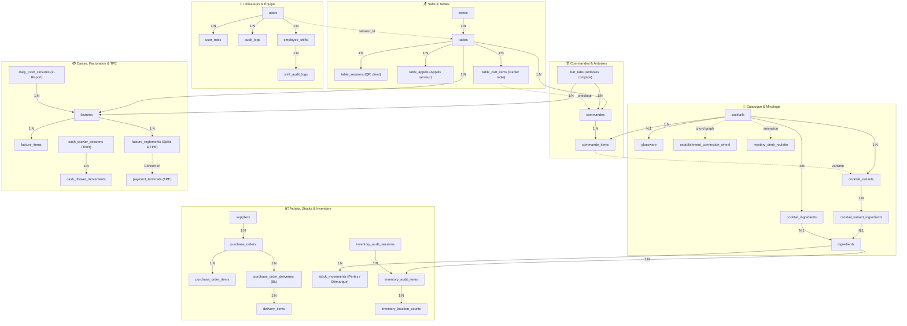
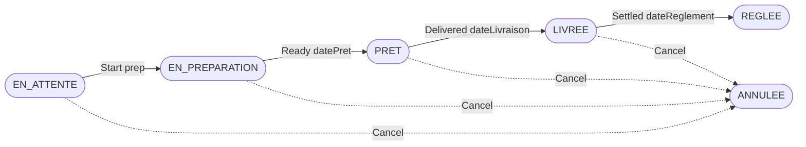

# 🍹 OpenBar — Cahier des charges

> Application de gestion de bar en temps réel · Version 0.8.0 · Octobre 2026

---

## Table des matières

1. [Contexte et objectifs](#1-contexte-et-objectifs)
2. [Stack technique](#2-stack-technique)
3. [Rôles utilisateurs](#3-rôles-utilisateurs)
4. [Modèle de données](#4-modèle-de-données)
5. [WebSocket STOMP](#5-websocket-stomp)
6. [Fonctionnalités & 10 Modules Plug-and-Play](#6-fonctionnalités--10-modules-plug-and-play)
7. [Design System Figma](#7-design-system-figma)
8. [Dette technique & Assurance Qualité](#8-dette-technique--assurance-qualité)
9. [Roadmap & Réalisations](#9-roadmap)
10. [Conventions de code](#10-conventions-de-code)
11. [Décisions actées](#11-décisions-actées)

---

## 1. Contexte et objectifs

OpenBar digitalise et fluidifie l'ensemble du cycle opérationnel d'un bar : prise de commande → préparation → service → facturation, avec communication temps réel entre les acteurs, 100% en réseau local, sans abonnement cloud récurrent et sans dépendance à Internet.

### Problème adressé

- Coordination inefficace entre serveurs et barmans (tickets papier, appels oraux)
- Vulnérabilité critique aux pannes Internet des solutions SaaS cloud
- Erreurs de caisse et double saisie des montants sur les terminaux bancaires (TPE)
- Absence de visibilité temps réel sur l'état des commandes et le délai d'attente
- Gestion manuelle des stocks et absence d'inventaire physique fiable
- Coûts exorbitants d'abonnement au terminal et commissions cachées
- Facturation longue, complexe et gestion fastidieuse du partage de l'addition

### Solution

Système d'exploitation complet pour bar et restaurant sur réseau local, avec WebSocket pour la communication temps réel (< 50ms) entre serveurs, barmans, cuisine, caisse et clients, liaison directe TPE par protocole Concert IP, et modularité totale.

---

## 2. Stack technique

#### Stack actuelle (code existant v0.8.0)

| Couche | Technologie | Version | Notes |
|--------|-------------|---------|-------|
| Backend | Spring Boot | **4.1.1** | Runtime Java 22 (épinglé — Lombok 1.18.34 incompatible JDK 23+) |
| Documentation API | Springdoc OpenAPI | **3.1.1** | Swagger UI interactif sur `/swagger-ui.html` |
| Base de données | PostgreSQL | **15 / 16** | ACID, persistance sur volume Docker dédié |
| ORM | JPA / Hibernate + Lombok | 1.18.34 | Entités Java, DTOs Java Records avec `from(Entity)` |
| Sécurité | Spring Security + JWT | JJWT **0.13.0** | Filtres custom, rotation refresh tokens, timeout 4h |
| Assainissement HTML | Jsoup | 1.23.2 | Nettoyage XSS global sur tous les DTOs textuels |
| Temps réel | WebSocket STOMP | via Spring | 11 topics actifs |
| PDF | OpenPDF | 2.0.3 | Factures A4, Z-Reports scellés, fiches de stocktake |
| QR Code | ZXing | 3.5.4 | Génération matricielle PNG et chevalets vectoriels |
| Frontend | Angular | **22.2.0** | Standalone components, Signals, routing lazy-loaded |
| UI | Ionic | **9.0.5** | Mobile/tablet-first, Angular Material abandonné |
| State management | NgRx | **22.0.1** | Auth store uniquement (état métier en services + signals) |
| i18n | Transloco | **8.4.0** | 100% translatable, parité stricte FR/EN |
| Canvas 2D | Konva.js | **10.7.0** | Plan de salle vectoriel réactif avec grille magnétique |
| Offline Store | IndexedDB (`idb`) | **8.0.3** | File d'attente locale serveur avec purge auto |
| Protocole TPE | Client Socket TCP brut | Natif Java | Protocole Concert standard CB IP port 8888 |
| Impression Réseau | ESC/POS TCP Socket | Natif Java | Port brut 9100, protocole CP850, impulsion tiroir-caisse |

#### Décisions architecturales actées

| Décision | Choix | Raison |
|----------|-------| -------|
| UI composants | **Ionic 9.0.5** (Angular Material abandonné) | Mobile/tablet-first pour écrans tactiles de bar |
| Déploiement | **PWA + Service Worker** (Capacitor abandonné) | Réseau WiFi local du bar — App Store inutile |
| Build natif | ~~Capacitor~~ **abandonné** | PWA suffit en réseau local, zéro friction d'installation |
| Canvas plan de salle | **Konva.js 10.7.0** | Canvas 2D libre, drag & drop, rotation, snap magnétique |
| Terminaux TPE | **Protocole Concert IP (LAN)** | Envoi direct du montant sur le TPE sans saisie manuelle |
| Impression tickets | **ESC/POS TCP 9100 brut** | Zéro spooler OS / CUPS, impression ultra-rapide |
| Documentation API | **Springdoc OpenAPI 3.1.1** | Swagger UI interactif pour synchronisation front/back |
| Documentation Code | **JavaDoc + TSDoc** | JavaDoc obligatoire backend, TSDoc obligatoire frontend |
| i18n | **Transloco** (`@jsverse/transloco`) | Lazy loading natif, typage strict, parité FR/EN |
| Déploiement prod | **Nginx sur mini-PC local** (Raspberry Pi 5) | Réseau WiFi du bar, zéro dépendance internet |

> **PWA locale** : L'app tourne sur le réseau WiFi du bar. La coupure internet n'a aucun impact. Service Worker cache l'app shell (cache-first) et rejoue les requêtes POST/PUT en attente à la reconnexion WiFi.

#### Design

| Outil | Détail |
|-------|--------|
| Figma | fileKey `XSVwFk64kgtqgUN9n5qoMw` — **8 pages, 60+ composants** (vérifié juillet 2026) |
| Approche | Design first — tous les écrans designés en Figma avant implémentation |

### Architecture backend

Pattern strict : **Controller → Service → Repository** — aucun saut de couche toléré.

```
src/main/java/com/bar/gestioncocktail/
├── config/       # SecurityConfig, WebSocketConfig, JwtProperties
├── controller/   # REST endpoints (@RolesAllowed)
├── service/      # Logique métier (@Transactional sur writes)
├── repository/   # Spring Data JPA
├── model/        # Entités JPA (@Data Lombok, @PrePersist/@PreUpdate)
├── dto/          # LoginRequest / LoginResponse (à étendre)
└── security/     # JwtAuthenticationFilter, JwtAuthorizationFilter, JwtTokenProvider
```

### Architecture frontend

Feature-based : `features/` + `core/`. Lazy loading sur toutes les routes (`loadComponent`). NgRx uniquement pour l'auth ; le reste est géré en services directs.

### Lancer le projet

```bash
# Base de données
cd backend/src/main/resources && docker compose up -d

# Backend
cd backend && mvn spring-boot:run   # → http://localhost:8080

# Frontend
cd frontend && npm install && ng serve   # → http://localhost:4200
```

---

## 3. Rôles utilisateurs

L'enum `UserRole` définit 4 rôles : `ADMIN`, `MANAGER`, `SERVEUR`, `BARMAN`.

| Rôle | Nature | Accès | Interface | Couleur |
|------|--------|-------|-----------|---------|
| `ADMIN` | Maintenance technique | Tout — gestion users, config système | Interface admin — **pas un rôle métier** | Partagé Manager |
| `MANAGER` | Rôle métier principal | Supervision complète du bar, annulation commandes, toggle disponibilité cocktails | Plan de salle (config + supervision), stats, facturation | `#f39c12` |
| `SERVEUR` | Rôle métier | Tables, commandes (création/suivi/annulation) | Plan de salle (lecture), prise de commande | `#2ecc71` |
| `BARMAN` | Rôle métier | Commandes (changement statut), stocks, cocktails (CRUD), ingrédients | Kanban, stocks, catalogue cocktails | `#4fc3f7` |

> **Décisions actées sur les rôles :**
> - `ADMIN` = accès de maintenance technique uniquement, pas un rôle opérationnel bar
> - `MANAGER` supervise le bar : peut annuler une commande en urgence et toggler la disponibilité d'un cocktail
> - `BARMAN` change le statut des commandes (EN_PREPARATION → PRET) et gère les stocks

Guards Angular : `AuthGuard` (toute route authentifiée), `RoleGuard` (paramétrable via `data.roles`), `AdminGuard` (ADMIN uniquement).

NgRx selectors : `selectIsAdmin`, `selectIsManager`, `selectIsBarman`, `selectIsAuthenticated`, `selectCurrentUser`.

---

## 4. Modèle de données



*Configuration singleton* : `app_settings` (personnalisation admin, devises, unités, terminaux TPE, imprimantes réseau ESC/POS, seuils de marge).

### Cycle de vie d'une commande



| Statut | Timestamp auto | Acteur | Transition depuis |
|--------|---------------|--------|-------------------|
| `EN_ATTENTE` | — | Serveur / Client QR (création) | — (initial) |
| `EN_PREPARATION` | `datePreparation` | Barman / Cuisinier KDS | EN_ATTENTE |
| `PRET` | `datePret` | Barman / Cuisinier KDS | EN_PREPARATION |
| `LIVREE` | `dateLivraison` | Serveur | PRET |
| `REGLEE` | `dateReglement` | Manager / Serveur (Split, TPE, Cash) | LIVREE |
| `ANNULEE` | — | N'importe quel rôle autorisé | Tout statut |

---

## 5. WebSocket STOMP (11 Topics Actifs)

| Topic | Événement & Rôle | Consommateurs |
|-------|------------------|---------------|
| `/topic/commandes` | Nouvelle commande créée ou mise à jour globale | Barman, Serveur, Manager |
| `/topic/commandes/{id}` | Changement de statut sur commande spécifique | Barman, Serveur, Client QR |
| `/topic/tables` | Occupation, déplacement ou libération d'une table | Serveur, Manager |
| `/topic/stock/alerte` | Alerte critique ou warning sur seuil d'ingrédient | Barman, Manager |
| `/topic/serveur/appels` | Appel serveur ou demande d'addition client QR | Serveurs, Managers |
| `/topic/table/{id}/appels` | Acquittement d'un appel par le serveur en salle | Client QR à la table |
| `/topic/tables/{id}/cart` | Synchro temps réel panier collaboratif multi-convives | Convives de la table |
| `/topic/preparation/bar` | Nouvel article affecté au poste bar | Barmans (Comptoir) |
| `/topic/preparation/kitchen` | Nouvel article affecté au poste cuisine | Cuisiniers (Écran KDS) |
| `/topic/establishment/modules`| Toggle à chaud des modules d'établissement | Tous les postes connectés |
| `/topic/bar-tabs` | Ouverture, transfert, mise à jour ou clôture d'ardoise | Barman, Serveur, Manager |
| `/topic/inventory-audits` | Démarrage, comptage ou finalisation de stocktake | Barman, Manager |

---

## 6. Fonctionnalités & 10 Modules Plug-and-Play

OpenBar est conçu sous une architecture modulaire stricte où chaque capacité métier peut être activée ou désactivée à chaud par établissement :

### Tableau des 10 Modules Activables

| Module | Code Enum | Rôle Opérationnel | Statut |
|--------|-----------|-------------------|:------:|
| 🍳 **Cuisine & KDS** | `CUISINE_KDS` | Routage automatique des postes et écran d'affichage cuisine `/kitchen` | ✅ Validé |
| 🎉 **Happy Hour** | `HAPPY_HOUR` | Moteur de promotions et tarifications dynamiques par plages horaires | ✅ Validé |
| 👥 **Équipe & Shifts** | `EMPLOYEE_MANAGEMENT` | Plannings d'équipe, gestion des shifts et replay temporel d'audit | ✅ Validé |
| 🪑 **Plan de Salle** | `FLOOR_PLAN` | Plan 2D Konva.js vectoriel avec magnétisme 50cm et état en direct | ✅ Validé |
| 📲 **Commande QR** | `QR_CLIENT_ORDERING` | Carte digitale client, panier collaboratif et appel serveur | ✅ Validé |
| 📦 **Gestion Stocks** | `STOCK_TRACKING` | Déstockage automatique au centilitre et journal des pertes/démarque | ✅ Validé |
| 🧾 **Ardoises (Bar Tabs)** | `BAR_TABS` | Comptes ouverts au comptoir sans table obligatoire et transferts | ✅ Validé |
| 📚 **Bibliothèque Cocktails** | `COCKTAIL_LIBRARY` | Catalogue 80+ recettes officielles IBA et importateur intelligent | ✅ Validé |
| 📋 **Inventaire Physique** | `INVENTORY_AUDIT` | Sessions de stocktake, jaugeage bouteilles, fiches PDF et réconciliation | ✅ Validé |
| 🎲 **Roulette Mystère** | `MYSTERY_ROULETTE` | Roulette interactive gamifiée, écran TV déporté `/roulette-display` | ✅ Validé |

### Fonctionnalités Majeures de la Plateforme (v0.8.0)

| Domaine | Fonctionnalité | Backend | Frontend | Tests |
|---------|----------------|:-------:|:--------:|:-----:|
| **Paiements** | **Intégration TPE Bancaire Directe (Protocole Concert IP #454/#532)** | ✅ | ✅ | ✅ |
| **Mixologie** | **Roue des Accords de Saveurs Dual-Scope & Variantes (#533/#534/#539)** | ✅ | ✅ | ✅ |
| **Mixologie** | **Cocktail Sunburst Flavor Explorer (#511)** | ✅ | ✅ | ✅ |
| **Mixologie** | **Catalogue Recettes avec Badges Emojis 🍋🍓🥛 & Taux ABV (#506/#508)** | ✅ | ✅ | ✅ |
| **Animation** | **Roulette Cocktail Mystère Gamifiée & Écran TV Déporté (#460/#521)** | ✅ | ✅ | ✅ |
| **Stocks** | **Inventaire Physique de Cave & Jaugeage Visuel Bouteilles (#457/#520)** | ✅ | ✅ | ✅ |
| **Stocks** | **Achats Fournisseurs, Réceptions BL & Recalcul PAMP/WAC (#453/#515)** | ✅ | ✅ | ✅ |
| **Stocks** | **Préparations Maison (Crafted) avec Cascade de Déstockage (#518/#519)** | ✅ | ✅ | ✅ |
| **Caisse** | **Ardoises Clients & Comptes Ouverts au Comptoir Bar Tabs (#452/#493)** | ✅ | ✅ | ✅ |
| **Caisse** | **Cycle de Tiroir-Caisse, Fond d'Ouverture & X-Report (#450/#491)** | ✅ | ✅ | ✅ |
| **Caisse** | **Division d'Addition Chirurgicale FactureSplitComponent (#494/#495)** | ✅ | ✅ | ✅ |
| **Fiscalité** | **Clôture Journalière Z-Report Scellée SHA-256 & Export FEC (#359)** | ✅ | ✅ | ✅ |
| **Impression** | **Impression Réseau Directe ESC/POS TCP :9100 & Impulsion Tiroir (#360)** | ✅ | ✅ | ✅ |
| **Salle** | **Plan de Salle 2D Konva.js Haute Précision & Snap Magnétique (#291/#297)** | ✅ | ✅ | ✅ |
| **Comptoir** | **Kanban Barman STOMP & Mode Rush Batching Tournées (#355)** | ✅ | ✅ | ✅ |
| **Client QR** | **Panier Collaboratif Multi-Convives & Anti-Fraude (#365/#366)** | ✅ | ✅ | ✅ |
| **Sécurité** | **Déconnexion Automatique Sécurisée 4h & Warning Dialog (#498/#499)** | ✅ | ✅ | ✅ |
| **UI System** | **Composants Génériques Card & StatCard, Thème Adaptatif (#526/#528)** | — | ✅ | ✅ |

> Légende tests : ✅ tests écrits et passants · ⚠️ tests partiels · ❌ aucun test · — non applicable
> Dernière mise à jour : 7 septembre 2026 (Ticket #405 — Architecture modulaire & feature flags d'établissement)

---

## 7. Design System Figma

**Fichier** : `XSVwFk64kgtqgUN9n5qoMw` — **8 pages** (vérifié directement via l'API Figma le 9 juillet 2026 — le décompte "6 pages" était obsolète, 2 pages ajoutées depuis : Facturation, Dev Handoff).

**Pages :**
| Page | ID | Contenu |
|------|----|---------|
| 🎨 Design System | `0:1` | Tous les composants DS |
| 🍹 Vue Barman | `57:2` | 8 vues |
| 🗺 Vue Manager | `57:3` | 7 vues |
| 👋 Vue Serveur | `57:4` | 4 vues + 2 variantes |
| Vue système commun | `522:3214` | 6 vues communes (Login, Register…) |
| 💰 Facturation | `626:987` | Non auditée — à couvrir dans un ticket dédié avant implémentation |
| 📱 Vue Client QR Code | `636:987` | ID mis à jour (était `57:5`, obsolète) |
| 📋 Dev Handoff | `638:987` | Non auditée |

> **Principe** : composants en cascade, comme Angular/React. Chaque composant parent n'utilise que des instances de composants enfants — jamais de primitives brutes (rectangles, ellipses, textes).

### 7.1 Tokens couleur

> Extrait le 9 juillet 2026 directement depuis les Variables Figma (`figma.variables.getLocalVariableCollectionsAsync()`) — remplace le tableau précédent, devenu inexact (valeurs hex divergentes, noms de tokens différents). Source de vérité : voir #152.

**Collection `Thème`** (modes Dark/Light — **Light est un placeholder non designé**, cf. #154) :

| Token | Dark | Usage |
|-------|------|-------|
| `Background/bg-0` | `#0f0f1a` | Fond global |
| `Background/bg-1` | `#151521` | Fond secondaire |
| `Background/surface-1` | `#1a1a2e` | Cards, panels |
| `Background/surface-2` | `#21263f` | Éléments surélevés |
| `Background/surface-3` | `#2a3050` | Bordures, dividers |
| `Primary` | `#6c7fe8` | Actions primaires |
| `Primary Strong` | `#5a68d6` | Primary hover/actif |
| `Primary Press` | `#4d5ac4` | Primary pressed |
| `Primary Light` | `#aab4f3` | Primary atténué |
| `Text/Primary` | `#eceefb` | Texte principal |
| `Text/Secondary` | `#a4add0` | Texte secondaire |
| `Text/Muted` | `#7e87a8` | Texte tertiaire |
| `Border/Medium` | `#2e3450` | Bordures standard |
| `Border/Strong` | `#232142` | Bordures marquées |
| `Border/Light` | `#3a4682` | Bordures discrètes |
| `Border/Selected` | `#7c3aed` | État sélectionné |

**Collection `Rôles`** (couleur d'accent par rôle utilisateur) :

| Rôle | Couleur |
|------|---------|
| `Admin` | `#9b8af2` |
| `Manager` | `#f0a33b` |
| `Serveur` | `#34c77b` |
| `Barman` | `#4fc3f7` |

**Collection `OpenBar DS`** (statuts, stock, types — extrait complet dans le code source des tokens implémentés, cf. #152) :

| Groupe | Tokens |
|--------|--------|
| Statut commande | `Status/Waiting` `#f4a52a`, `InProgress` `#2ba8e8`, `Ready` `#2fbf6b`, `Served` `#6e7aa8`, `Canceled` `#e5604f`, `Prioritary` `#ffd700` |
| Statut table | `Table/Free`, `Occupied`, `Reserved`, `InProgress`, `AwaitingPayment` |
| Niveau stock | `Stock/Normal` `#2fbf6b`, `Low` `#f4a52a`, `Critical` `#e5604f` |
| Sémantique | `Semantic/Success`, `Warning`, `Danger`, `Info` |

**Collections `Space`** (4/8/12/16/20/24/32/40px) et **`Radius`** (SM 6px → PILL 999px).

### 7.2 Inventaire des composants

#### Atomiques (feuilles — aucune dépendance)

| Composant | ID Figma | Variants | Taille | Usage |
|-----------|----------|----------|--------|-------|
| `Avatar` | `120:8` | **4** (Barman/Manager/Serveur/Admin) | 40×40 | Initiale colorée dans UserFooter |
| `StatusBadge` | `58:20` | 6 statuts commande | variable | Statut dans CommandeCard |
| `RoleBadge` | `120:23` | **8** (4 rôles × Folded=true/false) | variable | Chip rôle dans NavBar |
| `NavItem` | `120:16` | **4** (State × Folded) | 204×44 | Entrée de navigation sidebar |
| `IngredientLine` | `121:22` | 2 (Dark/Light) | 180×18 | "× N Cocktail" dans CommandeCard |
| `FilterChip` | `132:86` | 2 (Active/Default) | 46×31 | Filtres, tabs stocks |
| `KanbanColHeader` | `132:107` | 4 statuts | 196×40 | En-têtes colonnes kanban |
| `ProgressSegment` | `132:116` | 4 statuts | 24×170 | Barre latérale sidebar barman |
| `StockAlertBanner` | `132:119` | **3** (StockWarning/BelowCritical/Notification) | 960×44 | Bannière alerte stock |
| `StockSeverityBadge` | `133:86` | **3** (Critique/Faible/Normal ✅ ajouté) | variable | Niveau de stock |
| `StockProgressBar` | `133:93` | 3 niveaux | 401×8 | Barre progression stock |
| `TableNode` | `126:109` | **12** (Round/Square × Free/Occupied/InProgress/Reserved/InPayment/Merged ✅) | 64×64 | Nœud plan de salle |
| `LegendItem` | `126:128` | 6 statuts table | variable | Légende plan de salle |
| `QuantityStepper` | `128:79` | 2 (Active/Default) | 80×31 | Sélecteur quantité QR client |
| `CategoryTab` | `128:84` | 2 (Active/Default) | 80×44 | Onglets catégories QR client |
| `StatusBar` | `128:88` | 1 | 390×44 | Barre statut iOS (mobile) |
| `PrioBadge` | `144:97` | 2 (Urgent/Normal) | 78×23 | Badge ⚡ URGENT dans modal |
| `UrgencyStripe` | `149:94` | 2 (Urgent/Normal) | 800×6 | Barre déco haut du modal |
| `SectionLabel` | `149:99` | 2 (Icon=None/Clock) | 200×20 | Titre de section dans modal |
| `Toggle` | `534:910` | 2 (On/Off) | 44×24 | Switch settings, filtres |
| `Spinner` | `534:920` | 3 (S/M/L — 16/24/32px) | variable | Loading states |
| `CheckBox` | `426:2058` | 2 (Checked=True/False) | 24×24 | Formulaires |

#### Composites intermédiaires (utilisent des atomiques)

| Composant | ID Figma | Variants | Dépendances | Usage |
|-----------|----------|----------|-------------|-------|
| `UserFooter` | `121:17` | **8** (4 rôles × Folded) | `Avatar` | Bas de NavBar |
| `MobileHeader` | `128:98` | 2 (Home/Back) | — | Header mobile QR |
| `ProductCard` | `129:95` | 2 (Default/InCart) | `QuantityStepper` | Carte produit QR |
| `CartItem` | `129:104` | 1 | `QuantityStepper` | Item panier QR |
| `StockRow` | `133:133` | 3 niveaux | `StockSeverityBadge` + `StockProgressBar` | Ligne stock |
| `PanelOrderItem` | `159:136` | 3 (InProgress/Ready/Servie) | — | Item commande side panel |
| `TotalRow` | `159:137` | 1 | — | Ligne total side panel |
| `ActivityLog` | `159:141` | 1 | — | Historique récent side panel |
| `MiniCommandeCard` | `139:157` | 4 statuts | — | Carte mini kanban fond stocks |
| `TimerWidget` | `144:98` | 1 | — | Timer modal détail barman |
| `NotesCard` | `144:112` | 2 (Serveur/Allergie) | — | Carte notes contextuelles |
| `CanvasToolbar` | `159:152` | 1 | — | Toolbar verticale plan de salle |
| `CocktailCard` | `199:167` | 3 (Normal/Faible/Critique) | — | Carte cocktail liste barman |
| `IngredientCard` | `221:187` | 3 niveaux stock | — | Carte ingrédient gestion |
| `FormInput` | `199:176` | 2 (Text/Textarea) | — | Champ saisie brut |
| `InputField` | `535:942` | **4** (Default/Focus/Error/Disabled) | `FormInput` | Champ avec label + message d'erreur |
| `PasswordInput` | `535:943` | **4** (Default/Focus/Error/Disabled) | `InputField` | Login, changement mot de passe |
| `Toast` | `536:928` | **4** (Success/Error/Warning/Info) | — | Feedback après actions |
| `EmptyState` | `536:929` | 1 | `ActionButton` | Listes vides partout |
| `PageHeader` | `536:943` | **2** (NoBack/WithBack) | `ActionButton` | Header pages standalone |
| `StatCard` | `199:189` | 3 (Default/Up/Down) | — | Carte statistique dashboard |
| `TableEditionSidePanel` | `495:2978` | 2 (InProgress/InPayment) | `PanelOrderItem` + `ActionButton` | Panel détail table |
| `CommandeModal` | `437:377` | 4 (Status × Urgence) | `OrderItem` + `StatusTimeline` | Modal détail commande barman |

#### Composites hauts (niveau écran)

| Composant | ID Figma | Variants | Dépendances | Usage |
|-----------|----------|----------|-------------|-------|
| `NavBar` | `62:59` | **6** (3 rôles × Compact=true/false) | `NavItem` + `RoleBadge` + `UserFooter` | 64–220px sidebar gauche |
| `Topbar` | `126:141` | 2 (Manager/Serveur) | — | 984×64 barre du haut |
| `ActionButton` | `374:210` | **24** (6 types × 4 états) — Primary/Secondary/Ghost/Danger/Edit/Mark | — | CTA partout |
| `CommandeCard` | `61:90` | 8 variants (4 statuts × 2 priorités) | `StatusBadge` + `IngredientLine` + `ActionButton` | Carte kanban barman |
| `OrderItem` | `139:118` | 4 (En prépa/Prête × Note=Oui/Non) | — | Ligne item modal commande |
| `StatusTimeline` | `437:634` | 5 états | `StatusTimelineStep` | Timeline statuts modal commande |
| `ConfirmModal` | `159:163` | 1 | `ActionButton`×2 | Dialog confirmation fusion |

### 7.3 État des vues

#### Vue Barman (8 écrans)

| Écran | Score composants | Statut | Notes |
|-------|-----------------|--------|-------|
| Interface Barman | 19/20 — 95% | ✅ Complet | Topbar = frame container (normal) |
| Barman — Stocks *(vue shift)* | Élevé | ✅ Complet | Édition rapide pendant le service |
| Barman — Commande détail | 12/13 — 92% | ✅ Complet | Modal Header = container (normal) |
| Barman — Liste Cocktails | Élevé | ✅ Nouveau | Grille 3×3, FilterChips, ActionButtons |
| Barman — Détail Cocktail | Élevé | ✅ Nouveau | IngredientLine, variantes, stock status |
| Barman — Création Cocktail | Élevé | ✅ Nouveau | Formulaire, FilterChips catégorie, étapes |
| Barman — Gestion Ingrédients | Élevé | ✅ Nouveau | StockRow × 5, AlertBanner, FilterChips |
| Barman — Vue Globale Stock | Élevé | ✅ Nouveau | Stat cards, StockRow par catégorie, actions |

#### Vue Manager (7 écrans) — page `57:3`

| Écran | Frame ID | Statut | Notes |
|-------|----------|--------|-------|
| Manager — Plan de salle | `492:1302` | ✅ Complet | Canvas + zones + légende |
| Manager — Plan Détail Table | `492:1346` | ✅ Complet | Canvas + TableEditionSidePanel |
| Manager — Fusion | `492:1388` | ✅ Complet | ConfirmModal overlay |
| Manager — Fusion Résultat | `492:1430` | ✅ **Corrigé** | T4+T5 = instances `TableNode/Merged` 64×64 |
| Manager — Dashboard | `492:1472` | ✅ Complet | StatCards + TopCocktailRow + Kanban mini |
| Manager — Gestion Employés | `492:1514` | ✅ Complet | EmployeeRow × 6, pagination |
| Manager — EDT Planning | `492:1556` | ✅ Complet | Grille 7j × 7 employés, ShiftCell |

#### Vue Serveur (4 vues + 2 variantes) — page `57:4`

| Écran | Frame ID | Statut | Notes |
|-------|----------|--------|-------|
| Serveur — Plan de salle | `516:738` | ✅ Créé | Zones + tables (Free/Occupied/InProgress/Reserved) + légende 6 items |
| Serveur — Détail Table | `516:777` | ✅ Créé | Canvas + T4 ring sélection + TableEditionSidePanel |
| Serveur — Nouvelle commande | `516:814` | ✅ Créé | Types chips + CocktailCard grid + Side panel Table + Validate/Cancel |
| Serveur — Suivi commandes | `516:851` | ✅ Créé | Banner notif + filter tables + kanban 4 colonnes (Cancel/Edit/Mark delivered) |
| Serveur — Nouvelle commande compact | `525:5433` | ✅ Variante | Version compacte 1 ligne |
| Serveur — Suivi commandes (variante) | `526:6194` | ✅ Variante | Variante alternative du kanban |

**Corrections appliquées sur Vue Serveur :**
- Topbar : "Label" → titres contextuels (Floor Plan / New Order / My Orders)
- "⇄ Wedge" → "⇄ Merge" dans le side panel de Détail Table
- "Start" → "Cancel" dans la colonne Pending du kanban (action barman → action serveur)
- Légende Vue 1 : LegendItem "Cancelled" ajouté (6 items complets)

#### Autres vues

| Vue / Écran | Statut | Notes |
|-------------|--------|-------|
| Vue Client QR — Phone | ✅ Complet | — |
| Vue Client QR — Panier | ✅ Complet | — |
| Dashboard Manager / Stats | ❌ Non designé | À créer from scratch |

#### Vue Système Commun — page `522:3214`

| Vue | Frame ID | Composants DS | Statut |
|-----|----------|---------------|--------|
| Login | `538:906` | InputField, PasswordInput, Toast Error | ✅ Créé |
| Register | `538:936` | InputField, PasswordInput, RoleBadge × 3 | ✅ Créé |
| Profile | `540:946` | Avatar, InputField, PasswordInput, Toggle, ActionButton | ✅ Créé |
| 404 Not Found | `540:1040` | ActionButton | ✅ Créé |
| Loading | `540:1049` | Spinner L, logo text | ✅ Créé |
| Empty States | `540:1056` | EmptyState × 3 contextes | ✅ Créé |

### 7.4 Conventions scripting plugin Figma

```js
// TOUJOURS switcher de page avant de lire children
await figma.setCurrentPageAsync(targetPage);

// Snapshot avant boucle de modification (évite les mutations en cours de lecture)
const snap = [...node.children];

// Récupérer un nœud par ID (évite les références stales)
const node = figma.getNodeById('17:120');

// Supprimer en sécurité
function safeRemove(n) { if (n) { try { n.remove(); } catch(e) {} } }

// Charger les fonts AVANT toute écriture de texte
await Promise.all(['Regular', 'Semi Bold', 'Bold'].map(s =>
  figma.loadFontAsync({ family: 'Inter', style: s }).catch(() => {})
));

// Créer un COMPONENT_SET
const set = figma.combineAsVariants([comp1, comp2], page);
set.name = 'NomDuComposant';
set.x = X; set.y = Y;

// Instancier et overrider un texte
const inst = variant.createInstance();
inst.x = x; inst.y = y;
parent.appendChild(inst);
try {
  const txt = inst.findAll(n => n.type === 'TEXT')[0];
  if (txt) txt.characters = 'nouveau texte';
} catch(e) {}
```

---

## 8. Dette technique

| # | Problème | Localisation | Risque | Statut |
|---|----------|-------------|--------|--------|
| 1 | Secret JWT hardcodé | `application.yml` | Sécurité critique | 🔴 Ouvert |
| 2 | `allow-circular-references: true` | `application.yml` | Smell design circulaire | ✅ Résolu (#363) |
| 3 | Bug `dateLivraison` set sur `PRET` | `CommandeService.changerStatut()` | Données incorrectes | 🟡 Ouvert |
| 4 | Couverture de tests insuffisante | Front + back | Régressions silencieuses | ✅ Résolu (PR #103) |
| 5 | Pas de DTOs de sortie | Tous les controllers | Fuite données + boucles JSON | ✅ Résolu (PR #83) |
| 6 | Typo `BARMEN` → `BARMAN` | Enum `UserRole` + controllers | Confusion codebase | ✅ Résolu (PR #85) |
| 7 | Exceptions génériques (`RuntimeException`) | Services | Messages d'erreur peu utiles | 🟡 Partiellement résolu (AuthController PR #100) |
| 8 | Double filtre JWT (auth + authz) | `SecurityConfig` | 2× `loadUserByUsername` par requête | 🟡 Ouvert |
| 9 | Refresh token absent | Backend + Frontend | Sessions non révocables | ✅ Résolu (PR #100) |
| 10 | Tests front co-localisés (Angular défaut) | `src/app/**/*.spec.ts` | Structure incompatible Maven-like | ✅ Résolu (PR #103) |

---

## 9. Roadmap

### Phase 1 — Stabilisation ✅ Terminée

- [x] ~~Écrire les tests backend et frontend~~ — fait (PR #103) : 53 specs Angular + 12 tests Java
- [x] ~~Introduire des DTOs de sortie~~ — fait (PR #83)
- [x] ~~Refresh token JWT (sécurité sessions)~~ — fait (PR #100)
- [x] ~~Déstockage automatique~~ — fait (PR #84)
- [x] ~~Ajout du rôle MANAGER~~ — fait (PR #85)
- [ ] **Corriger le bug `dateLivraison`** — set sur PRET → doit être LIVREE (`CommandeService.changerStatut()`)
- [ ] **Externaliser le secret JWT** — `application.yml` → variable d'environnement

### Phase 2 — Features prioritaires ✅ Terminée

- [x] ~~Export PDF factures~~ — fait (PR #101)
- [x] ~~Saisonnalité cocktails~~ — fait (PR #102)
- [x] ~~Compléter WebSocketService frontend~~ — fait (PR #104) : RxStomp, reconnexion JWT
- [x] ~~Vue Serveur Ionic~~ — fait (PR #106) : plan de salle, modal détail, nouvelle commande, kanban
- [x] ~~Dashboard Manager frontend~~ — fait (PR #105) : stats temps réel, polling 30s
- [x] ~~Division d'addition — UI frontend~~ — fait (#118 / PR #46) : split égal + par article
- [x] ~~Cocktails CRUD frontend~~ — fait (#111) : liste, formulaire, toggle disponibilité
- [x] ~~Ingrédients CRUD frontend~~ — fait (#112) : liste, formulaire, détail, alerte stock
- [x] ~~Tables CRUD frontend~~ — fait (#113) : liste, formulaire, détail + commandes actives
- [x] ~~Commandes frontend~~ — fait (#114) : liste filtrée, détail, annulation
- [x] ~~Factures frontend~~ — fait (#115) : liste, détail, règlement, split
- [x] ~~Notifications temps réel~~ — fait (#117) : panneau historique navbar, badge non-lues
- [x] ~~Migration Angular Material → Ionic~~ — fait (PR #103)

### Phase 3 — Features avancées ✅ Terminée

- [x] ~~Plan de salle interactif avec **Konva.js**~~ — fait (PR #291/#297) : canvas libre 1px=1cm, drag & drop, rotation, zones polygones, modes snap 50cm & magnétisme bord-à-bord, synchronisation vue serveur `/serveur`
- [x] ~~QR code client — `TableSession` + interface non authentifiée~~ — fait (PR #184/#225/#256)
- [x] ~~Fusion de tables — modèle de données + API + UI Manager~~ — fait (PR #186)
- [x] ~~**i18n** — Transloco~~ — fait (`fr.json` / `en.json` 100% synchronisés)
- [ ] **PWA & Offline** — Service worker & résilience réseau local

### Phase 4 — Personnalisation & Audit ✅ Terminée

- [x] ~~Saisonnalité cocktails~~ — fait (PR #102)
- [x] ~~Alertes stock configurables~~ — fait (PR #197) : seuils par ingrédient, bannières barman
- [x] ~~Historique / audit complet~~ — fait (PR #285/#289) : `shift_audit_log`, `ShiftAuditService`, replay temporel
- [x] ~~**Personnalisation admin (branding & palettes HSL)**~~ — fait (PR #217/#218)

#### Spec — Personnalisation admin (branding)

**Objectif** : permettre à un compte `ADMIN` de personnaliser l'identité visuelle de l'application sans intervention technique (utile en cas de déploiement multi-établissement ou de changement de charte).

**Accès** : route `/admin/personnalisation`, protégée par `AdminGuard` + `@PreAuthorize("hasRole('ADMIN')")` côté backend. Lien dédié dans la navbar admin.

**Fonctionnalités** :
1. **Couleurs de la charte** — édition des tokens `Primary` et `Primary Strong` (color picker), avec aperçu live appliqué aux composants `ActionButton`/`NavBar` avant sauvegarde. Les tokens de statut (commande/stock/table) restent fixes — non personnalisables, car porteurs de sens fonctionnel (ex: rouge = urgence) qu'il ne faut pas laisser un admin casser par erreur.
2. **Logo et nom d'établissement** — **v1 : URL d'image** (champ texte validé comme URL http(s), pas d'upload de fichier — évite d'ouvrir une surface d'attaque supplémentaire côté backend pour une v1 ; l'upload de fichier avec stockage/validation de type MIME pourra être une évolution ultérieure si le besoin se confirme), affiché dans la navbar et l'écran de login ; champ texte libre pour le nom affiché (remplace "OpenBar" dans l'UI).
3. **Thème par défaut** — choix Clair/Sombre appliqué à la première connexion d'un utilisateur (préférence individuelle non écrasée si l'utilisateur a déjà fait un choix local). **Limite connue** : le thème Clair n'est pas encore designé dans Figma (placeholder noir, cf. #154) — l'option reste visible dans l'UI mais désactivée/grisée avec message explicatif tant que #154 n'est pas résolu, et **rejetée aussi côté backend** (`BusinessException` sur `PUT /api/settings` avec `defaultTheme=LIGHT`) pour ne pas dépendre uniquement d'un `disabled` HTML contournable par un appel API direct.

**Persistance** : entité singleton `AppSettings` (une seule ligne en base, id fixe, pré-insérée via `schema.sql` pour éviter toute course entre requêtes concurrentes au premier démarrage) — `primaryColor`, `primaryColorStrong`, `logoUrl`, `establishmentName`, `defaultTheme`. Valeurs par défaut = tokens Figma actuels.

**Application dynamique** : au chargement de l'app, un `AppSettingsService` frontend récupère les réglages via `GET /api/settings` (public, pas d'auth requise — nécessaire dès l'écran de login) et injecte les couleurs comme CSS custom properties sur `:root` (dont `--ion-color-primary-rgb`, recalculé depuis le hex pour rester cohérent avec les effets Ionic), en surcouche des tokens par défaut du design system.

**Limites connues de la v1** (périmètre volontairement réduit, à couvrir par des tickets de suivi si le besoin se confirme) :
- `establishmentName` et `logoUrl` sont persistés et exposés par l'API mais **pas encore affichés** dans la navbar ni l'écran de login — seules les couleurs sont effectivement appliquées dans l'UI pour cette itération.
- La page ne suit pas encore la convention i18n Transloco du projet (texte français en dur, comme la majorité des composants existants à date — pas une régression propre à cette page, mais un écart à corriger globalement, pas page par page).

**Hors scope explicite** : personnalisation par rôle (les couleurs Admin/Manager/Serveur/Barman restent fixes), thèmes multiples sauvegardés/historique de versions, personnalisation par établissement dans une architecture multi-tenant (l'app reste mono-instance, cf. décision actée §11).

---

## 10. Conventions de code

### Backend

- Injection par **constructeur** uniquement — pas `@Autowired` sur champs
- `@Data` Lombok sur toutes les entités JPA
- `@PrePersist` / `@PreUpdate` pour `createdAt` / `updatedAt`
- `@Transactional` sur toutes les méthodes write de service
- Pattern **Controller → Service → Repository** — aucun saut de couche

### Frontend Angular + Ionic

- Architecture feature-based : `features/` + `core/`
- Lazy loading sur toutes les routes (`loadComponent`)
- NgRx uniquement pour l'authentification
- **Ionic** pour tous les composants UI (pas Angular Material — migration en cours)
- Services directs (pas NgRx) pour le reste de l'état
- i18n activé dès le départ (Angular i18n ou ngx-translate)

### Tests — règle absolue

**Chaque feature branch inclut ses tests dans le même PR.** On ne merge pas sans tests.

- Backend : JUnit 5 + Mockito (`src/test/java/...`). Au minimum : un test par méthode de service avec logique métier. Les cas limites (idempotence, stock négatif, transitions invalides) sont obligatoires.
- Frontend : Karma + Jasmine (`*.spec.ts` à côté du fichier testé). Au minimum : sélecteurs NgRx, guards, et services HTTP (avec `HttpClientTestingModule`).

### Checklist ajout d'une feature

**Backend**

1. Modèle JPA dans `model/` avec `@Data`, `@PrePersist`, `@PreUpdate`
2. Ligne dans `schema.sql`
3. Repository dans `repository/` (extends `JpaRepository<Entity, Long>`)
4. Service dans `service/` avec `@Transactional` sur les writes
5. Controller dans `controller/` avec `@PreAuthorize`
6. `AuditLogService` si pertinent
7. **Tests unitaires** dans `src/test/java/.../service/` (JUnit 5 + Mockito)

**Frontend**

1. Modèle TypeScript dans `core/models/` ou dossier feature
2. Service HTTP dans le dossier feature
3. Composants (list / form / detail) sous `features/<nom>/`
4. Route lazy-loadée dans `app.routes.ts`
5. Lien dans la navbar si pertinent
6. **Tests** `.spec.ts` pour les sélecteurs, guards et services concernés

**Design Figma**

1. Composant atomique dans le DS (si nouvel élément réutilisable)
2. Composant composite si combinaison de plusieurs atomiques
3. Instance dans les écrans concernés — jamais de primitives brutes
4. Respecter la hiérarchie : tokens → atomiques → composites → écrans

---

## 11. Décisions actées

Ces choix ont été actés et ne doivent pas être remis en question sans raison explicite.

### Stack frontend : Ionic + Angular + Capacitor

**Décision :** migrer de Angular Material vers Ionic + Angular + Capacitor.

**Pourquoi :** l'application est utilisée sur tablettes (barmans, serveurs) et téléphones (serveurs en salle) — Angular Material n'est pas adapté aux interactions tactiles mobile-first. Ionic fournit des composants natifs adaptatifs (iOS/Android/web), Capacitor permet de déployer en natif depuis un seul codebase.

### Mobile / tablet first

Chaque vue est conçue pour fonctionner sur téléphone et tablette en priorité, puis sur écran PC. Les frames Figma utilisent l'auto-layout pour garantir ce comportement responsive.

### Plan de salle : canvas libre avec Konva.js

**Décision :** éditeur de plan de salle avec Konva.js (canvas 2D) — pas de grille fixe.

- Tables : formes rondes et carrées/rectangulaires, drag & drop, rotation, redimensionnement libres
- Zones : polygones libres dessinés point par point, stockés en JSON en base
- Configuration du plan : MANAGER uniquement
- Consultation : SERVEUR en lecture seule (clic table → prise de commande)
- Synchronisation temps réel WebSocket pour tous les rôles

**Pourquoi :** la géographie d'un bar ne rentre pas dans une grille fixe. Konva.js est la bibliothèque de référence pour ce type de canvas interactif dans l'écosystème Angular.

### QR code : TableSession non authentifiée

Chaque table a un QR code permanent lié à `table.id`. Le scan génère une `TableSession` avec token temporaire. L'interface client est non authentifiée, ultra-légère, indépendante du bundle staff. Paiement : directement via l'interface ou validation manuelle par le personnel (terminal/liquide).

### Internationalisation (i18n)

L'application doit être internalisée dès le départ — les bars ne sont pas forcément en France. Utilisation d'un système i18n Angular compatible Ionic.

### Multi-tenant : architecture prête, instance unique pour l'instant

L'architecture est conçue pour permettre une migration multi-tenant ultérieure sans l'implémenter maintenant (une seule instance au démarrage).

### Composition en cascade dans Figma

Tous les composants Figma sont construits selon le principe de composition en cascade (identique à Angular/React). Un composant parent n'utilise que des instances de composants enfants.

**Pourquoi :** cohérence du design system, modifications globales propagées automatiquement, alignement avec la structure de code Angular/Ionic.

### Thème dark avec palette fixe

Thème sombre par défaut, mode clair accessible. Palette définie dans les tokens CSS.

**Pourquoi :** application en conditions de bar (luminosité faible). Le dark mode est le mode principal.

### NavBar verticale — sidebar gauche (220px, desktop) / bottom nav (mobile)

Navigation en sidebar gauche sur desktop/tablette large. En mobile, à adapter en bottom navigation (pattern Ionic standard).

**Pourquoi :** le contenu principal (kanban, plan de salle) nécessite la pleine largeur horizontale sur grand écran ; la bottom nav est le pattern UX natif sur mobile.

### NgRx limité à l'auth

NgRx uniquement pour l'authentification. Le reste est géré en services Angular directs.

**Pourquoi :** éviter la complexité NgRx sur des données déjà synchronisées via WebSocket.

### WebSocket STOMP — 4 topics fixes

Architecture validée : `/topic/commandes`, `/topic/commandes/{id}`, `/topic/tables`, `/topic/stock/alerte`.

### TableNode comme composant Figma

Les tables sont représentées par le composant `TableNode` (12 variants : Round/Square × 6 statuts : Free/Occupied/InProgress/Reserved/InPayment/**Merged**), positionné librement sur le canvas Figma. Les zones sont des frames de délimitation.

### UI entièrement en anglais

Tous les labels, boutons, titres et textes visibles dans l'interface sont en anglais. Le CDC et la documentation restent en français. Cette décision garantit la cohérence avec les composants du DS (Status=Pending, Ready to Serve, Mark delivered…).

### Post-login : redirection directe par rôle

Après une authentification réussie, l'utilisateur est redirigé directement vers sa vue principale sans écran intermédiaire : Barman → Kanban, Serveur → Floor Plan, Manager → Floor Plan. Pas de home dashboard commun.

---

## 12. État Figma — juin 2026

### Corrections appliquées

| Élément | Correction | Statut |
|---------|------------|--------|
| `CeckBox` | Renommé `CheckBox` (typo) — id `426:2058` | ✅ |
| `StockSeverityBadge` | Variant `Level=Normal` ajouté (vert #22c55e) — id `506:737` | ✅ |
| `TableNode` | Variants `Status=Merged` ajoutés Round + Square (violet #7c3aed) — ids `506:741`/`506:744` | ✅ |
| Fusion Résultat `492:1430` | T5 étiré remplacé par T4 + T5 instances `Square/Merged` 64×64 côte à côte | ✅ |
| Vue Serveur — Topbar | "Label" → titres contextuels (Floor Plan / New Order / My Orders) | ✅ |
| Vue Serveur — Side panel | "Wedge" → "Merge" | ✅ |
| Vue Serveur — Kanban | "Start" → "Cancel" dans colonne Pending (action serveur ≠ barman) | ✅ |
| Vue Serveur — Légende | `LegendItem Cancelled` ajouté (6 items complets) | ✅ |

### Nouveaux composants DS créés (juin 2026)

| Composant | ID | Description |
|-----------|-----|-------------|
| `Toggle` | `534:910` | State=On/Off — 44×24px, Accent actif |
| `Spinner` | `534:920` | Size=S/M/L (16/24/32px) — arc accent sur track |
| `InputField` | `535:942` | 4 états — label + input + message erreur |
| `PasswordInput` | `535:943` | 4 états — dots + toggle "Show" accent |
| `Toast` | `536:928` | 4 types — barre latérale colorée + icône + message + × |
| `EmptyState` | `536:929` | Icon placeholder + Title + Subtitle + CTA Ghost |
| `PageHeader` | `536:943` | NoBack / WithBack — titre 28px + sous-titre |

### Vues restantes à designer

- **Dashboard Manager** — aucun écran designé, à créer from scratch (StatCards, TopCocktailRow, Kanban mini temps réel)
- **Barman — Stocks Side Panel** : frame `Statut` toujours vide → ajouter `StatusBadge`

---

## 13. Prochaine session — priorités

> Mis à jour le 15 août 2026 — Bilan post-merge PRs #291–#297 & audit du projet GitHub.

### Roadmap des Tickets Restants & Réalisés

#### 🔴 Priorité Haute
1. ~~📱 **Ticket #A — Vue Client Scanner QR Code** (Issue #225)~~ ✅ (Mergé PR #256)
2. ~~📦 **Ticket #B — Barman Vue Globale Stock** (Issue #226)~~ ✅ (Mergé PR #240)
3. ~~💰 **Ticket #C — Facturation Vue Récap Journée** (Issue #227)~~ ✅ (Mergé PR #241)
4. ~~💳 **Ticket #D — Facturation Règlement Individuel Post-Split** (Issue #228)~~ ✅ (Mergé PR #250)
5. ~~👋 **Ticket #E — Écran Onboarding 1ère connexion** (Issue #229)~~ ✅ (Mergé PR #257)
6. ~~🧩 **Ticket #F — Composant EmptyState réutilisable** (Issue #230)~~ ✅ (Mergé PR #253)

#### 🟡 Priorité Moyenne
7. ~~🍹 **Ticket #G — Vue Barman Ingrédients en Grille de Cartes** (Issue #231)~~ ✅ (Mergé PR #251)
8. ~~👥 **Ticket #H — Manager Gestion Employés Pagination & Shifts** (Issue #232)~~ ✅ (Mergé PR #252)
9. ~~📅 **Ticket #I — Manager EDT Planning Hebdomadaire** (Issue #233)~~ ✅ (Mergé PR #254)
10. ~~🔔 **Ticket #J — Profil Section Préférences et Toggle Son** (Issue #234)~~ ✅ (Mergé PR #255)
11. ~~💵 **Ticket #K — Modal Règlement Champ Pourboire** (Issue #235)~~ ✅ (Mergé PR #249)
12. ~~📱 **Ticket #L — Vue Serveur Mobile Bottom Navigation & MobileTableCard** (Issue #236)~~ ✅ (Mergé PR #258)
13. ~~🗺️ **Ticket #S — Plan de Salle Konva.js & Alignement Vue Serveur** (Issue #291)~~ ✅ (Mergé PR #297)

#### 🟢 Priorité Basse / Dette technique
14. ~~🐛 **Ticket #M — Bug dateLivraison**~~ ✅ (Résolu #224)
15. ~~🔄 **Ticket #N — Supprimer `allow-circular-references: true`**~~ ✅ (Résolu #224)
16. ~~⚠️ **Ticket #O — Exceptions métier**~~ ✅ (Résolu #224)
17. ~~🖨️ **Ticket #P — Facturation Format ticket 58mm** (Issue #237)~~ ✅ (Mergé PR #259)
18. ~~📦 **Ticket #Q — Barman Panel Stock Alignement** (Issue #238)~~ ✅ (Mergé PR #248)
19. ~~👤 **Ticket #R — Profil Formulaire Pré-rempli NgRx** (Issue #239)~~ ✅ (Mergé PR #247)
20. 🧪 **Issue #193 — Tests d'intégration Spring Boot (Testcontainers) et E2E Playwright** [OPEN]
21. ~~🧩 **Ticket #405 — Architecture modulaire & feature flags d'établissement** (Issue #405)~~ ✅ (En cours de merge)

### Rappels plugin Figma

> **CRITIQUE** : toujours appeler `await figma.setCurrentPageAsync(page)` AVANT de lire `page.children`.
> `clone()` sur un COMPONENT dans un COMPONENT_SET place le clone sur la page, pas dans le set — utiliser `set.appendChild(clone)` ensuite.
> `layoutSizingHorizontal = 'HUG'` uniquement sur les auto-layout frames ET les TEXT enfants d'auto-layout. Sur les INSTANCE : utiliser `FIXED` + `resize()`.
> Utiliser `figma.getNodeById(id)` pour éviter les références stales entre scripts.
