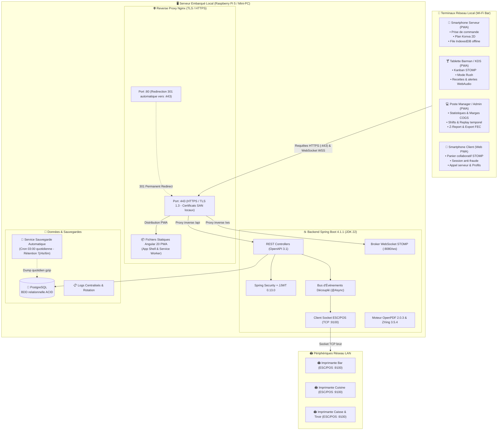
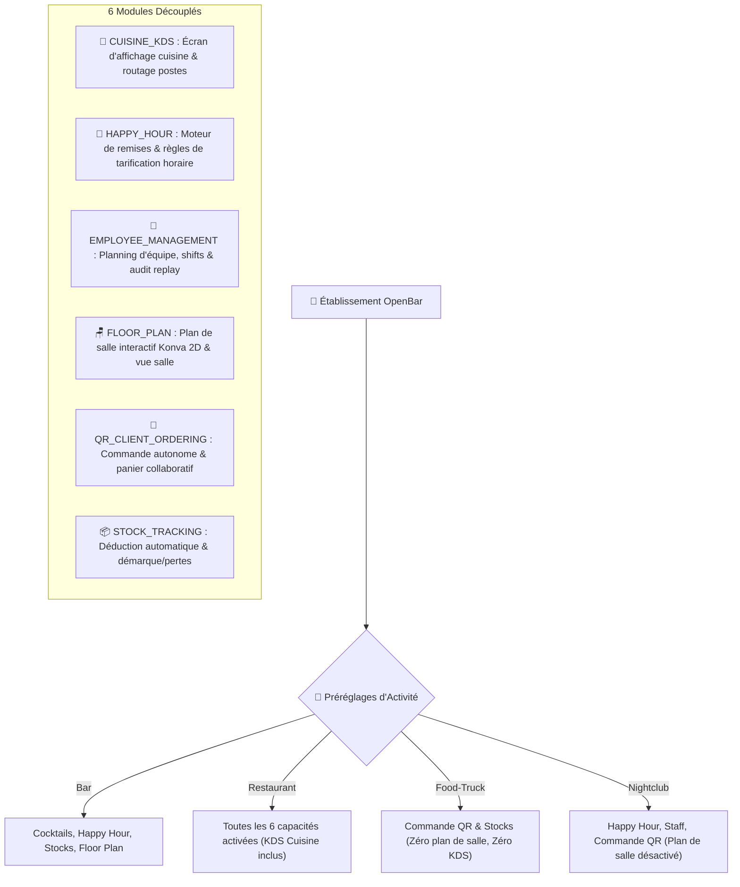

# 🍹 OpenBar

> **L'application PWA tout-en-un de gestion de bar et d'établissement en temps réel, résiliente et 100% autonome en réseau local.**

[](https://github.com/FunWarry/Open-Bar/actions/workflows/ci.yml)
[](https://sonarcloud.io/summary/new_code?id=FunWarry_Open-Bar)
[](https://sonarcloud.io/summary/new_code?id=FunWarry_Open-Bar)
[](https://github.com/FunWarry/Open-Bar/releases)
[-ED8B00?logo=openjdk&logoColor=white)](https://openjdk.org/projects/jdk/22/)
[](https://spring.io/projects/spring-boot)
[](https://angular.dev)
[](https://ionicframework.com)
[](https://jsverse.github.io/transloco/)
[](#9-licence--conditions-légales)
[](https://github.com/users/FunWarry/projects/3/views/1)
[](https://www.figma.com/design/XSVwFk64kgtqgUN9n5qoMw)
[](http://localhost:8080/swagger-ui.html)

---

## 📑 Sommaire

1. [Présentation & Proposition de Valeur](#1-présentation--proposition-de-valeur)
2. [Aperçu Visuel & Showcase UI](#2-aperçu-visuel--showcase-ui)
3. [Architecture Système & Stack Technique](#3-architecture-système--stack-technique)
4. [Guide de Démarrage Rapide (Quickstart)](#4-guide-de-démarrage-rapide-quickstart)
5. [Résilience, Sauvegardes & Sécurité](#5-résilience-sauvegardes--sécurité)
6. [Architecture Modulaire & Configuration](#6-architecture-modulaire--configuration)
7. [État d'Implémentation des Fonctionnalités](#7-état-dimplémentation-des-fonctionnalités)
8. [Qualité du Code, Tests & Contribution](#8-qualité-du-code-tests--contribution)
9. [Licence & Conditions Légales](#9-licence--conditions-légales)

---

## 1. Présentation & Proposition de Valeur

**OpenBar** digitalise et synchronise instantanément l'intégralité de la chaîne opérationnelle d'un établissement de restauration et de débits de boissons : **prise de commande → préparation comptoir & cuisine → service en salle → encaissement et clôture fiscale**.

Conçu pour fonctionner sans aucune dépendance envers le cloud ou Internet, OpenBar est déployé en **Progressive Web App (PWA)** sur un serveur local embarqué (mini-PC ou Raspberry Pi 5). Tous les terminaux (smartphones des serveurs, tablettes de préparation, PC de supervision, téléphones des clients) communiquent via le réseau Wi-Fi local avec une latence quasi nulle grâce à **WebSocket STOMP**.

### Cas d'Usage Adaptés

| Établissement | Défi Adressé | Configuration Clé OpenBar |
|---------------|--------------|----------------------------|
| 🍸 **Bars à Cocktails & Bars à Bières** | Rushes intenses, fiches recettes complexes, ruptures de fûts/spiritueux | Mode *Rush Batching*, alertes sonores de retard, décompte de stock au centilitre, fiches recettes interactives |
| 🍽️ **Brasseries & Restaurants** | Coordination salle / bar / cuisine, additions partagées complexes | Routage multi-postes KDS (*Bar* / *Cuisine* / *Snack*), split addition égalitaire et par article, clôture Z-Report |
| 🚚 **Food-Trucks & Événements Éphémères** | Absence d'Internet fiable, espace réduit, autonomie maximale | Stack compacte sur Raspberry Pi 5 / batterie, commande client QR directe sans contact, mode 100% offline |
| 🎵 **Clubs, Rooftops & Événements** | Musique forte, pénombre, files d'attente au comptoir | UI haut contraste avec thèmes adaptatifs sombres, commande et paiement autonome par QR code sur table |

---

## 2. Aperçu Visuel & Showcase UI

L'expérience OpenBar est découpée en 4 interfaces dédiées, calibrées sur-mesure pour chaque rôle opérationnel :

### 📱 Vue Serveur : Fluidité en Salle & Prise de Commande Rapide
- **Plan de salle 2D interactif (Konva.js)** : Rendu fluide à l'échelle 1px = 1cm, grille magnétique 50cm, contours lumineux d'état (libre, occupée, addition demandée, appel serveur).
- **Prise de commande rapide** (`/serveur/nouvelle-commande/:tableId`) : Moteur de recherche instantané, filtres par famille de produits, exclusion dynamique des allergènes et calcul HT/TVA/TTC en temps réel.
- **Expérience Mobile First** : Barre de navigation inférieure (*Bottom Navigation*), cartes de tables compactes (`MobileTableCard`) et tiroir de panier contextuel.
- **Résilience Offline (IndexedDB)** : En cas de perte temporaire du signal Wi-Fi en terrasse, les commandes sont mises en file d'attente locale (`openbar-offline-db`) et synchronisées automatiquement dès reconnexion.

```
┌────────────────────────────────────────────────────────────────────────┐
│ 🪑 SALLE PRINCIPALE                 [Zone: Terrasse ▼]  [🔍 Table / Commande] │
├────────────────────────────────────────────────────────────────────────┤
│  ┌──────────────┐   ┌──────────────┐   ┌──────────────┐                │
│  │ Table 1 [4p] │   │ Table 2 [2p] │   │ Table 3 [6p] │   ⚡ APPEL    │
│  │ 🟢 LIBRE     │   │ 🟡 PRÉPA     │   │ 🔴 ADDITION  │   SERVEUR      │
│  │ --           │   │ 12m restantes│   │ 42,50 €      │   Table 3      │
│  └──────────────┘   └──────────────┘   └──────────────┘   [ACQUITTER]  │
│                                                                        │
│  [➕ Nouvelle Commande]     [💳 Encaisser Table]     [🔀 Déplacer Table]│
└────────────────────────────────────────────────────────────────────────┘
```

---

### 🍸 Vue Barman & Cuisine : Préparation Optimisée & KDS Temps Réel
- **Kanban STOMP Réactif** : Visualisation en 3 colonnes (`EN_ATTENTE`, `EN_PREPARATION`, `PRET`) synchronisées en continu sans rechargement de page.
- **Mode Rush Batching** : Regroupement automatique des verres identiques entre tickets actifs (ex. 8 Mojitos cumulés) avec calcul proportionnel des dosages ($N \times \text{ingrédients}$) et transition groupée en un clic.
- **Fiches Recettes Dépliables** : Étapes de mixologie chronométrées, verrerie recommandée et suivi visuel des étapes.
- **Alertes Sonores & Visuelles** : Web Audio API native alertant des retards de préparation avec badges clignotants d'urgence.
- **Gestion des Ruptures à Chaud & Démarque** : Désactivation instantanée d'un cocktail en cours de service et saisie des pertes / casses (`StockMovement`).
- **Écran Cuisine KDS Dédié** (`/kitchen`, `/kds`) : Filtrage sélectif par poste de préparation (`BAR`, `KITCHEN`, `SNACK`).
- **Impression Tickets 80mm** : Sortie directe sur imprimante thermique réseau via socket ESC/POS.

```
┌─────────────────────────── KANBAN PRÉPARATION ─────────────────────────┐
│ EN ATTENTE (3)            │ EN COURS (2)              │ PRÊT (1)       │
├───────────────────────────┼───────────────────────────┼────────────────┤
│ ⚡ URGENT [Table 4 - 08m] │ [Table 2 - 04m]           │ [Table 5]      │
│ • 2x Old Fashioned        │ • 1x Negroni              │ • 1x Spritz    │
│ • 1x Espresso Martini     │ • 1x Moscow Mule          │                │
│ [RECETTE] [COMMENCER]     │ [TERMINER] [IMPRIMER]     │ [LIVRÉ]        │
├───────────────────────────┴───────────────────────────┴────────────────┤
│ 🔥 MODE RUSH ACTIF : 5x Mojito cumulés (Table 1, 4, 7) ➔ [PRÉPARER LOT]│
└────────────────────────────────────────────────────────────────────────┘
```

---

### 📊 Vue Manager & Direction : Pilotage Financier, Équipes & Conformité
- **Cockpit Statistique & Marges en Direct** : Suivi du chiffre d'affaires, panier moyen, coût de revient (COGS) et alertes automatiques de marge brute cible.
- **Gestion des Plannings & Shifts Employés** : Grille hebdomadaire, modèles de shifts préenregistrés, journal d'audit immuable et fonction *Time-Travel Replay* (reconstitution du planning à n'importe quel instant T).
- **Clôture de Caisse Quotidienne (Z-Report)** : Assistant de comptage des espèces tiroir par dénomination, justification obligatoire des écarts de caisse, scellement numérique SHA-256 (conformité CGI art. 286 / BOI-TVA-DECLA-30-10-30) et export d'écritures comptables au format standard français **FEC**.
- **Facturation Avancée** : Division d'addition (partage égalitaire ou par sélection d'articles), gestion des pourboires et remises commerciales, impression de reçus thermiques détaillés et téléchargement de factures A4 PDF conformes.
- **Pilotage des Modules Fonctionnels** : Activation/désactivation à la volée des 6 modules de l'établissement avec préréglages instantanés (*Bar*, *Restaurant*, *Food-Truck*, *Nightclub*).

---

### 📲 Vue Client QR : Commande Autonome Sans Application Native
- **Scan & Go Instantané** : Aucun téléchargement requis sur App Store / Play Store ; ouverture directe dans le navigateur mobile.
- **Jetons de Session Éphémères Anti-Fraude** : Protection de l'accès à la table (`TableSession`) invalidée automatiquement à la libération de la table.
- **Panier Collaboratif Multi-Convives en Temps Réel** : Tous les invités d'une même table voient et partagent le panier via STOMP (`/topic/tables/{id}/cart`) avec indication du prénom de chaque convive.
- **Profils Gustatifs & Filtres Diététiques** : Moteur de recommandation interactif par profil (fruité, fumé, doux, sec, épicé) et filtres mocktails / sans gluten / vegan.
- **Bouton d'Appel Serveur & Addition** : Alerte sonore et visuelle discrète envoyée en salle avec temporisation anti-spam de 60 secondes.

---

## 3. Architecture Système & Stack Technique

### Matrice des Technologies

| Couche | Technologie | Version | Rôle & Justification |
|--------|-------------|---------|-----------------------|
| **Backend Runtime** | **Java** | **22 (épinglé)** | Performance élevée et LTS. Version strictement épinglée (compatibilité Lombok 1.18.34). |
| **Backend Framework** | **Spring Boot** | **4.1.1** | Cœur applicatif, injection de dépendances, architecture événementielle découplée. |
| **Sécurité & JWT** | **Spring Security + JJWT** | **0.13.0** | Authentification stateless JWT avec refresh tokens sécurisés. |
| **Base de Données** | **PostgreSQL** | **15 / 16** | Persistance relationnelle ACID, schémas déclaratifs stricts (`schema.sql`). |
| **Temps Réel** | **WebSocket STOMP** | via Spring | Synchronisation bidirectionnelle instantanée sur 11 topics spécialisés. |
| **Impression Réseau** | **ESC/POS Socket Client** | Natif Java | Communication binaire directe sur port TCP 9100 avec imprimantes thermiques LAN. |
| **Génération PDF** | **OpenPDF** | **2.0.3** | Factures A4 officielles, Z-Reports certifiés et chevalets de table pliables. |
| **Génération QR Codes**| **ZXing** | **3.5.4** | Matrice QR vectorielle/PNG haute résolution pour tables et appairage Wi-Fi invité. |
| **Frontend Framework** | **Angular** | **20** | Architecture moderne basée sur les composants *standalone*, signaux réactifs et lazy-loading. |
| **Composants UI** | **Ionic** | **8.8.11** | Ergonomie mobile/tactile optimisée pour l'exploitation en salle et comptoir. |
| **Internationalisation**| **Transloco** | **8.4.0** | 100% de l'interface traduisible avec parité stricte FR/EN (2 500+ clés). |
| **Canvas 2D** | **Konva.js** | **10.3.2** | Plan de salle interactif haute performance avec magnétisme 50cm. |
| **Stockage Offline** | **IndexedDB (`idb`)** | **8.0.3** | File d'attente locale des commandes serveur en cas de rupture de signal Wi-Fi. |
| **Reverse Proxy & TLS**| **Nginx** | **Alpine** | Terminaison HTTPS locale (port 443), redirection 301 HTTP, en-têtes caméra WebRTC. |
| **Sauvegarde BDD** | **Postgres-Backup-Local** | **15-alpine** | Snapshots quotidiens gzip avec rétention glissante (7j, 4s, 6m). |

---

### Diagramme d'Architecture Système



---

## 4. Guide de Démarrage Rapide (Quickstart)

### Prérequis Système
- **Java** : **JDK 22 strictement** (*ne pas utiliser JDK 23+ en raison des internals de compilation Lombok*). [SDKMAN!](https://sdkman.io/) recommandé (`sdk env install`).
- **Node.js** : **Version 22 LTS+** et npm.
- **Docker & Docker Compose** : Requis pour la base PostgreSQL et le déploiement conteneurisé.
- **Git** : Cloner le dépôt localement.

---

### Option A : Environnement de Développement Local

#### 1. Lancer la base de données PostgreSQL
```bash
cd backend/src/main/resources
docker compose up -d
```

#### 2. Démarrer le Backend Spring Boot
```bash
cd backend
# Définir un secret JWT valide (minimum 32 caractères)
export JWT_SECRET="une_cle_secrete_openbar_tres_longue_et_securisee_32ch"

# Lancer l'application
mvn spring-boot:run
```
*Le backend démarre sur `http://localhost:8080`. L'interface interactive Swagger UI est accessible sur [`http://localhost:8080/swagger-ui.html`](http://localhost:8080/swagger-ui.html).*

#### 3. Démarrer le Frontend Angular
```bash
cd frontend
npm install
npm start
```
*L'application web démarre sur `http://localhost:4200` (ou accessible sur votre réseau local via `http://<VOTRE_IP_LOCALE>:4200`).*

#### Comptes de Démonstration Préconfigurés

| Rôle | Identifiant / Email | Mot de Passe | Écran d'Accueil |
|------|---------------------|--------------|-----------------|
| **ADMIN** | `admin@openbar.lan` | `admin123` | Paramètres & Administration (`/admin/settings`) |
| **MANAGER** | `manager@openbar.lan` | `manager123` | Dashboard Supervision (`/dashboard-manager`) |
| **SERVEUR** | `serveur@openbar.lan` | `serveur123` | Plan de Salle & Commandes (`/serveur`) |
| **BARMAN** | `barman@openbar.lan` | `barman123` | Kanban de Préparation (`/barman`) |

---

### Option B : Déploiement Embarqué en Production (Raspberry Pi 5 / Mini-PC)

La production fonctionne via un cluster Docker Compose autonome intégrant Nginx (avec terminaison TLS), Spring Boot, PostgreSQL et le conteneur de sauvegarde automatique.

#### 1. Préparer les variables d'environnement
Créer un fichier `.env` à la racine :
```env
POSTGRES_PASSWORD=VotreMotDePasseBddUltraSecurise
JWT_SECRET=VotreSecretJwtDeProductionMinimum32CaracteresTresLong
TZ=Europe/Paris
```

#### 2. Générer les certificats TLS pour le réseau local
Les navigateurs mobiles bloquent l'accès à la caméra (scan QR code) et l'enregistrement du Service Worker PWA sur les adresses IP non sécurisées. Générez un certificat local avec Subject Alternative Names (SAN) :

```bash
# Sous Linux / macOS :
./scripts/generate-local-certs.sh

# Sous Windows PowerShell :
.\scripts\generate-local-certs.ps1
```

#### 3. Démarrer l'ensemble de la stack
```bash
docker compose -f docker-compose.prod.yml up -d --build
```
- **Application PWA sécurisée** : `https://openbar.lan` ou `https://<IP_SERVEUR>`
- **Redirection automatique HTTP ➔ HTTPS** : Port 80 redirigé vers le port 443
- **Installation sur smartphone/tablette** : Transférer `certs/openbar.crt` sur le terminal et l'ajouter aux autorités de confiance pour activer le scan caméra et le mode hors-ligne sans avertissement.

---

## 5. Résilience, Sauvegardes & Sécurité

### Stratégie de Sauvegarde & Rétention Automatique

Les données de votre établissement (commandes, factures scellées, stocks, employés) sont protégées par le conteneur `backup` intégré à `docker-compose.prod.yml` :
- **Snapshot quotidien automatique** : Chaque nuit à **03:00** (`SCHEDULE: 0 3 * * *`).
- **Compression gzip sécurisée** : Fichiers `.sql.gz` avec horodatage strict.
- **Politique de rétention glissante** :
  - `BACKUP_KEEP_DAYS: 7` (7 derniers jours conservés)
  - `BACKUP_KEEP_WEEKS: 4` (4 dernières semaines conservées)
  - `BACKUP_KEEP_MONTHS: 6` (6 derniers mois conservés)
- **Persistance dédiée** : Stockage sur le volume Docker indépendant `openbar_backups`.

### Commandes Manuelles de Sauvegarde & Restauration

```bash
# Sauvegarde manuelle instantanée
./scripts/backup-db.sh           # Linux / macOS
.\scripts\backup-db.ps1          # Windows PowerShell

# Restauration / Disaster Recovery avec sauvegarde préalable automatique
./scripts/restore-db.sh -f ./backups/openbar_backup_2026-09-07_030000.sql.gz
.\scripts\restore-db.ps1 -File .\backups\openbar_backup_2026-09-07_030000.sql.gz
```

### Sécurité & Protection Réseau Local
1. **Terminaison HTTPS Locale Obligatoire** : En-têtes `Permissions-Policy: camera=(self)` configurés dans Nginx pour déverrouiller `getUserMedia` sur Safari iOS et Chrome Android.
2. **Assainissement des Entrées (Jsoup)** : Filtre anti-XSS systématique désinfectant tous les champs textuels des requêtes REST avant enregistrement en base.
3. **Jetons de Session Éphémères Anti-Fraude** : Protection de l'API de commande publique empêchant les commandes pirates depuis l'extérieur de l'établissement.
4. **Masquage des Erreurs Techniques** : Les traces de pile (*stack traces*) et détails de structure SQL sont systématiquement supprimés des réponses HTTP 500 en profil de production.

---

## 6. Architecture Modulaire & Configuration

OpenBar dispose d'une architecture de capacités modulaires activables à la carte selon les besoins spécifiques de chaque établissement :



### Assistant de Configuration Initiale (`/setup`)
Au premier démarrage d'un établissement vierge, un parcours d'onboarding fluide guide le gestionnaire :
1. Définition de l'identité commerciale, fiscale et légale (SIRET, RCS, taux de TVA applicables).
2. Sélection du type d'établissement et préréglage des modules souhaités.
3. Configuration de la devise, du symbole monétaire et de sa position (avant/après le montant).
4. Saisie des identifiants Wi-Fi invité pour la génération automatique des chevalets de table avec QR code de connexion.
5. Création du compte administrateur principal.

---

## 7. État d'Implémentation des Fonctionnalités

> **Synchronisé avec l'état réel du projet (`.agents/knowledge/features-state.md`)**  
> *Légende :* ✅ Complètement implémenté et testé · 🔄 En cours · — Non applicable

| Domaine / Fonctionnalité | Backend | Frontend | Tests | Description Synthétique |
|---|:---:|:---:|:---:|---|
| **Architecture Modulaire & Plugins (#405)** | ✅ | ✅ | ✅ | 6 capacités activables à la carte, presets d'établissement, guards de routes & synchronisation WebSocket. |
| **Vérification Mises à Jour & Modal (#411)** | — | ✅ | ✅ | Détection automatique des releases GitHub officielles, modal de mise à niveau avec changelog et snooze 24h. |
| **Prise de Commande Offline & Sync (#361)** | ✅ | ✅ | ✅ | File d'attente locale IndexedDB (`openbar-offline-db`), synchronisation automatique en arrière-plan et idempotence backend. |
| **Clôture Caisse Z-Report & Export FEC (#359)** | ✅ | ✅ | ✅ | Assistant de comptage espèces, calcul d'écarts, scellement SHA-256, verrouillage fiscal des ventes et export FEC (PCG). |
| **Impression Directe ESC/POS Réseau (#360)** | ✅ | ✅ | ✅ | Protocole binaire thermique natif sur port TCP 9100, routage par poste (Bar/Cuisine), cut papier et kick tiroir-caisse. |
| **Routage Multi-Postes & KDS Cuisine (#356)** | ✅ | ✅ | ✅ | Affectation des items (`BAR`, `KITCHEN`, `SNACK`), synchronisation temps réel des statuts et écran KDS dédié (`/kitchen`). |
| **Suivi des Pertes & Démarque de Stock (#357)** | ✅ | ✅ | ✅ | Journal d'audit des casses, péremptions, offerts et dégustations avec décompte automatique et valorisation financière. |
| **Suivi des Marges Brutes & COGS (#358)** | ✅ | ✅ | ✅ | Moteur de conversion multi-unités (L, CL, ML, OZ, G, KG), calcul automatique du coût de revient et badges d'alerte de marge. |
| **Moteur Happy Hour & Prix Dynamiques (#354)** | ✅ | ✅ | ✅ | Règles de réductions horaires (pourcentages, prix fixes, montants), gestion des créneaux de nuit et prévisualisation live. |
| **Panier Collaboratif Table Client (#366)** | ✅ | ✅ | ✅ | Panier partagé en temps réel entre convives d'une table via STOMP (`/topic/tables/{id}/cart`) et commande groupée. |
| **Sessions Éphémères & Anti-Fraude QR (#365)** | ✅ | ✅ | ✅ | Jetons de table temporaires invalidés à la libération de la table, protection contre les scans frauduleux hors-salle. |
| **Filtres Gustatifs & Profils Cocktails (#367)** | ✅ | ✅ | ✅ | Profils de saveurs (fruité, fumé, épicé...), tags diététiques (vegan, mocktail, sans gluten) et barre de recommandation interactive. |
| **Appel Serveur & Demande d'Addition (#353)** | ✅ | ✅ | ✅ | Bouton client avec cooldown de 60s, alertes sonores et visuelles sur le plan de salle avec acquittement en un clic. |
| **Générateur QR Codes & Chevalets A4 (#364)** | ✅ | ✅ | ✅ | Export de chevalets de table pliables 2 faces, planches de stickers, QR commande et appairage Wi-Fi invité via ZXing/OpenPDF. |
| **Mode Rush & Batches Comptoir (#355)** | ✅ | ✅ | ✅ | Regroupement des verres identiques entre commandes actives avec calcul des dosages groupés et validation en lot. |
| **Plan de Salle Interactif Konva.js (#291/#297)**| ✅ | ✅ | ✅ | Canvas 2D haute précision, alignement magnétique, grille 50cm, multi-zones et protection hors mode édition. |
| **Division d'Addition & Règlement Multi-Moyens**| ✅ | ✅ | ✅ | Split égalitaire avec suivi des parts restantes, split par sélection d'articles, pourboires, remises et reçus thermiques. |
| **Planning Équipe, Shifts & Replay Temporel (#285)**| ✅ | ✅ | ✅ | Gestion des plannings employés, historique immuable et reconstitution du planning d'équipe à tout instant T. |
| **Conformité Fiscale (SIRET / TVA / Mentions)** | ✅ | ✅ | ✅ | Validation de l'algorithme de Luhn sur SIRET, ventilation multi-taux TVA (20%, 10%, 5.5%), numérotation séquentielle CGI. |
| **Thèmes Visuels Adaptatifs & Couleurs HSL (#217)**| — | ✅ | ✅ | Palette 100% basée sur variables CSS adaptatives (modes clair/sombre), zéro couleur en dur, studio de personnalisation. |
| **Authentification JWT & Rotation Refresh Token** | ✅ | ✅ | ✅ | Sécurité stateless, rotation automatique des tokens, intercepteurs HTTP et guards par rôle (`ADMIN`, `MANAGER`, `SERVEUR`, `BARMAN`). |
| **Reverse Proxy Nginx & Certificats TLS (#338)** | — | ✅ | ✅ | Terminaison TLS 1.2/1.3 locale, redirection HTTP 80 ➔ 443, scripts de génération SAN et validation automatique. |
| **Sauvegardes PostgreSQL & Rétention (#337)** | ✅ | — | ✅ | Conteneur cron quotidien, rotation 7j/4s/6m, scripts CLI de snapshot et restauration de secours testés. |

---

## 8. Qualité du Code, Tests & Contribution

### Standards de Qualité Stricts
- **Anglais Obligatoire Partout dans le Code** : 100% du code (JavaDoc, TSDoc, descriptions OpenAPI, noms de variables/fonctions, messages d'exceptions, libellés de tests) est rédigé en anglais.
- **Zéro `@SuppressWarnings`** : Tout avertissement de linting ou de sécurité doit être résolu à la racine.
- **100% de Parité Transloco** : Chaque chaîne visible par un utilisateur utilise Transloco (`fr.json` et `en.json` tenus en parité stricte).
- **Zéro Couleur en Dur** : Toutes les règles CSS/SCSS s'appuient sur les tokens de design (`var(--background-bg-0)`, `var(--primary)`, etc.).

---

### Pyramide de Tests Complète

Le projet intègre une pyramide de tests automatisés validée à chaque commit :

```
             /\
            /  \     Tests E2E Playwright (Chromium headless)
           / E2E\    Navigation réelle, workflows complets, data-testid
          /------\
         /  Integ \  Tests d'Intégration Backend (Spring Boot + Testcontainers)
        /  Tests   \ PostgreSQL isolé en conteneur éphémère
       /------------\
      /  Unitaires   \ Tests Unitaires Frontend (Karma / Jasmine) & Backend (JUnit 5 + Mockito)
     /   & Non-Regr   \ Couverture nominale, cas d'erreurs et cas limites (>80% couverture)
    /__________________\
```

#### Exécuter la suite de tests en local :
```bash
# 1. Tests unitaires Frontend (Karma)
cd frontend && npx tsc --noEmit && npx ng test --watch=false --browsers=ChromeHeadless

# 2. Tests E2E Frontend (Playwright)
cd frontend && npm run test:e2e

# 3. Tests Backend (Unitaires + Intégration Testcontainers)
cd backend && mvn test

# 4. Scan SonarCloud & Quality Gate local
.\scripts\sonar-scan.ps1   # Windows PowerShell
./scripts/sonar-scan.sh    # Linux / macOS
```

---

### Workflow de Contribution
1. Chaque évolution ou correction de bug est rattachée à une issue sur le [Kanban GitHub](https://github.com/users/FunWarry/projects/3/views/1).
2. Création d'une branche dédiée : `<type>/#<numero>-<description-kebab>` (ex. `feat/#361-offline-order-queue`).
3. Commits atomiques respectant les [Conventional Commits](https://www.conventionalcommits.org/) (`feat:`, `fix:`, `docs:`, `test:`, `refactor:`, `chore:`).
4. Création d'une Pull Request ciblant la branche `dev`.
5. Tous les checks d'intégration continue (GitHub Actions) et le Quality Gate SonarCloud doivent être validés à 100% en vert (`PASSED`) avant toute fusion en `merge commit`.

---

## 9. Licence & Conditions Légales

OpenBar est distribué sous licence **Source-Available Non-Commerciale**.

### Conditions d'Utilisation :
- **Usage Non-Commercial, Recherche & Éducation** : Le code source est librement consultable, modifiable et déployable à des fins d'apprentissage, d'audit technique, de recherche académique ou pour un usage strictement personnel et non lucratif.
- **Exploitation Commerciale en Établissement** : Toute utilisation directe ou indirecte d'OpenBar dans le cadre de l'exploitation d'une activité commerciale lucrative (bar, café, restaurant, food-truck, discothèque, événement payant, prestation de service) requiert l'acquisition préalable d'une **Licence Commerciale d'Exploitation**.

### Acquisition de Licence Commerciale & Support Professionnel :
Pour toute demande de licence commerciale, d'assistance à l'installation sur site ou de développement de fonctionnalités spécifiques :
- **Auteur & Contact** : Mathéo Gevraise ([@FunWarry](https://github.com/FunWarry))
- **Dépôt Officiel** : [https://github.com/FunWarry/Open-Bar](https://github.com/FunWarry/Open-Bar)
- **Suivi de Projet** : [Tableau de bord GitHub Projects](https://github.com/users/FunWarry/projects/3/views/1)

---

<p align="center">
  Conçu avec passion pour l'art du cocktail et l'excellence du service en salle 🍸✨
</p>
