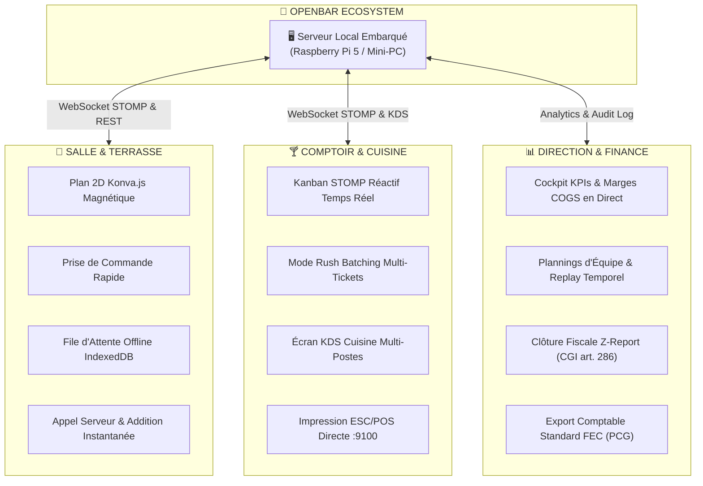
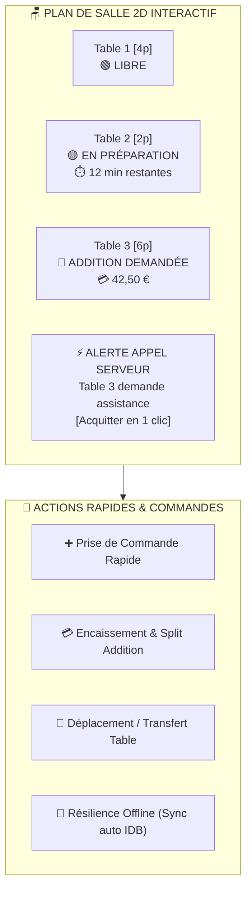
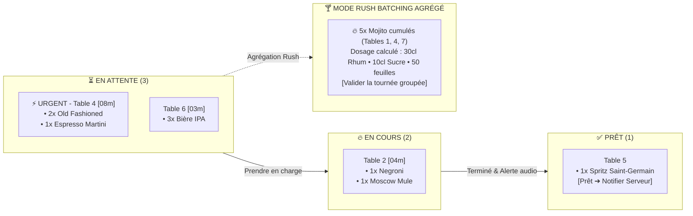
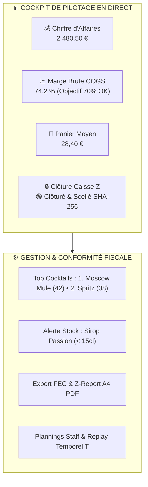
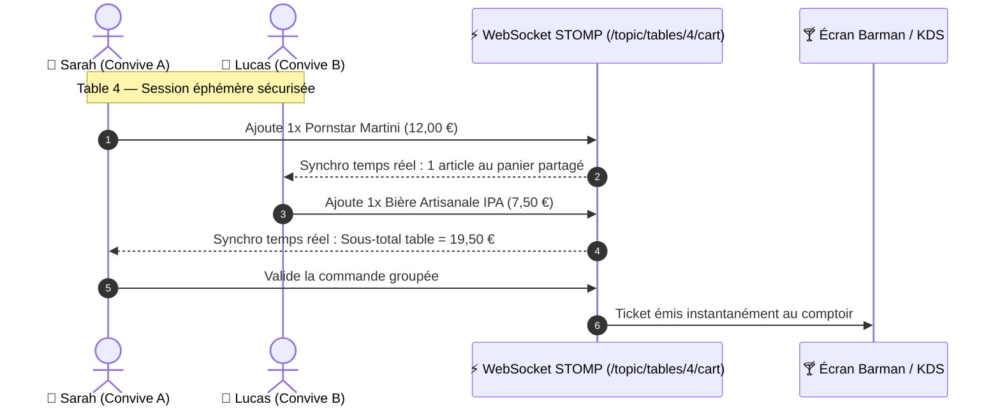
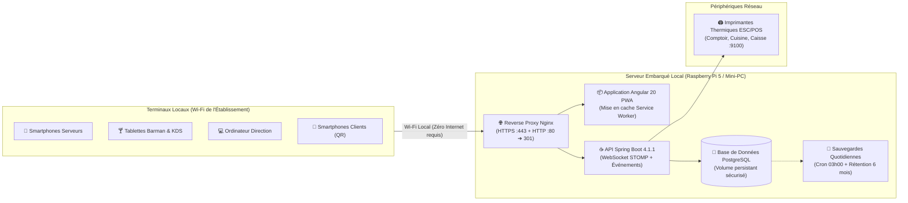

<p align="center">
  
</p>

<h1 align="center">🍹 OpenBar</h1>

<p align="center">
  <strong>L'OS de gestion de bar et d'établissement nouvelle génération : temps réel, autonome en réseau local, sans abonnement cloud et taillé pour le rush.</strong>
</p>

<p align="center">
  <a href="https://github.com/FunWarry/Open-Bar/actions/workflows/ci.yml"></a>
  <a href="https://sonarcloud.io/summary/new_code?id=FunWarry_Open-Bar"></a>
  <a href="https://sonarcloud.io/summary/new_code?id=FunWarry_Open-Bar"></a>
  <a href="https://github.com/FunWarry/Open-Bar/releases"></a>
  <a href="https://openjdk.org/projects/jdk/22/"></a>
  <a href="https://spring.io/projects/spring-boot"></a>
  <a href="https://angular.dev"></a>
  <a href="https://ionicframework.com"></a>
  <a href="https://jsverse.github.io/transloco/"></a>
  <a href="#-licence--conditions-dexploitation"></a>
</p>

<p align="center">
  <a href="#-pourquoi-openbar-"><strong>Pourquoi OpenBar ?</strong></a> •
  <a href="#-ce-que-vous-pouvez-faire-avec-openbar"><strong>Ce qui est possible</strong></a> •
  <a href="#-aperçu-des-4-interfaces-clés"><strong>Showcase UI</strong></a> •
  <a href="#-architecture--fonctionnement-hors-ligne"><strong>Architecture</strong></a> •
  <a href="#-démarrage-rapide-en-60-secondes"><strong>Quickstart</strong></a> •
  <a href="docs/TECHNICAL_GUIDE.md"><strong>Guide Technique 📖</strong></a>
</p>

---

## 💡 Pourquoi OpenBar ?

Gérer un bar ou un restaurant pendant le coup de feu ne devrait pas être une épreuve de force contre la technologie. 

Aujourd'hui, la majorité des exploitants sont confrontés à un triple dilemme :
1. **Le piège du Cloud & des abonnements abusifs** : 60 € à 150 € par mois et par tablette, assortis de commissions prélevées sur chaque transaction. Des milliers d'euros perdus chaque année pour des fonctionnalités élémentaires.
2. **La vulnérabilité face aux coupures Internet** : Quand la box Wi-Fi saute un vendredi soir à 22h, les logiciels SaaS cloud se bloquent. Impossible d'envoyer les bons, impossible d'encaisser, salle paralysée.
3. **Le chaos opérationnel** : Des tickets papier perdus, des barmans qui crient au-dessus de la musique, des clients qui s'impatientent pour commander ou payer, et une gestion des stocks approximative qui ronge la marge.

### La Vision OpenBar

> **Reprendre le contrôle total de son établissement avec un système d'exploitation moderne, ultra-rapide, économique et 100% autonome.**

- 🚫 **Zéro Dépendance Internet** : OpenBar tourne en local sur un simple mini-PC ou un Raspberry Pi 5. Le réseau Internet extérieur peut tomber, le bar continue de tourner à pleine vitesse.
- ⚡ **Instantanéité Temps Réel (< 50ms)** : Grâce à WebSocket STOMP, une commande validée par un serveur en terrasse s'affiche immédiatement sur le Kanban du barman et sur l'écran KDS de la cuisine.
- 💸 **Zéro Commission & Économies Massives** : Aucun abonnement mensuel obligatoire par terminal. Utilisez les tablettes, téléphones et imprimantes thermiques que vous possédez déjà.
- 🎯 **Conçu par et pour le terrain** : Mode *Rush Batching* pour préparer 10 cocktails à la fois, division d'addition en 3 clics, plan de salle 2D magnétique et clôture de caisse conforme en fin de service.

---

## ✨ Ce que vous pouvez faire avec OpenBar

OpenBar n'est pas une simple caisse enregistreuse : c'est un écosystème complet qui orchestre l'ensemble du flux de travail de votre établissement.



### 1. Prise de Commande & Salle Réactive
- **Plan de salle interactif en 2D** : Visualisez votre salle en direct avec des tables lumineuses magnétiques (1px = 1cm). Repérez d'un coup d'œil les tables libres, les commandes en préparation et les clients appelant le serveur.
- **Prise de commande en quelques secondes** : Recherche prédictive, filtres par famille de boissons, exclusion instantanée des allergènes et calcul précis HT/TVA/TTC.
- **Résilience hors-ligne totale (IndexedDB)** : En terrasse ou au sous-sol sans couverture Wi-Fi ? Les commandes sont stockées localement et synchronisées automatiquement dès le retour du signal.

### 2. Barman & Cuisine : Domptez le Rush
- **Kanban dynamique STOMP** : Fini les tickets papier volants. Les commandes s'organisent en colonnes interactives (`EN ATTENTE`, `EN COURS`, `PRÊT`) avec alertes sonores d'urgence dès qu'une commande dépasse le délai cible.
- **Mode Rush Batching** : Le barman peut regrouper tous les cocktails identiques de commandes différentes (ex. 6 Mojitos et 4 Caipirinhas) pour les préparer en une seule passe avec les dosages groupés calculés automatiquement.
- **Routage multi-postes & KDS Cuisine** : Les boissons partent sur l'écran du bar, les tapas et plats chauds sur l'écran de la cuisine (`/kitchen`), avec timers d'attente synchronisés.
- **Impression directe sans pilote (ESC/POS)** : Sortie immédiate des bons de commande sur vos imprimantes thermiques de réseau local via socket TCP brut (port 9100).

### 3. Expérience Client Digitale (QR Code Zéro Friction)
- **Menu digital interactif sans téléchargement** : Le client scanne le QR code posé sur sa table avec son smartphone. La PWA s'ouvre directement dans le navigateur, sans installer d'application lourde.
- **Panier collaboratif multi-convives** : Tous les invités d'une même table partagent le même panier en direct. Chacun ajoute ses consommations avec son prénom, et la commande globale part d'un seul clic.
- **Moteur de recommandation gustative** : Filtres par profil aromatique (fruité, fumé, sec, épicé) et labels diététiques (mocktails sans alcool, vegan, sans gluten).
- **Appel serveur & Demande d'addition** : Un bouton discret notifie la montre ou le smartphone du serveur pour éviter les gestes d'impatience en salle.

### 4. Pilotage Financier, Équipes & Conformité Fiscale
- **Marge brute & Coût de revient (COGS) en direct** : Suivez la rentabilité de chaque cocktail et plat au centilitre près. Recevez des alertes lorsque la marge descend sous votre seuil de rentabilité.
- **Plannings d'équipe avec Time-Travel Replay** : Gérez les plannings et les shifts des employés avec un journal d'audit immuable permettant de reconstituer l'historique de l'équipe à n'importe quel instant T.
- **Clôture de Caisse Quotidienne (Z-Report) & Conformité Fiscale** :
  - Assistant de comptage des espèces avec calcul automatique des écarts.
  - Scellement numérique certifié **SHA-256** (conforme CGI art. 286 / BOI-TVA-DECLA-30-10-30).
  - Export comptable officiel **FEC** (Fichier des Écritures Comptables) directement importable par votre expert-comptable.
- **Division d'addition chirurgicale** : Partage à parts égales ou paiement au verre/plat, pourboires, remises commerciales et impression de reçus thermiques ou factures PDF officielles A4.

---

## 🖥️ Aperçu des 4 Interfaces Clés

### 📱 1. La Vue Serveur : Fluidité & Mobilité en Salle
*Conçue pour une manipulation à une main sur smartphone ou tablette légère.*



---

### 🍸 2. Le Dashboard Barman & KDS Cuisine
*L'écran tactile du comptoir : visibilité instantanée, fiches recettes et cadence soutenue.*



---

### 📊 3. Le Cockpit Manager : Pilotage & Conformité
*Le centre de commande du patron : rentabilité, équipes et clôtures fiscales sécurisées.*



---

### 📲 4. L'Interface Client QR Code
*L'expérience autonome et conviviale directement sur les smartphones des clients.*



---

## 🏗️ Architecture & Fonctionnement Hors-Ligne

OpenBar a été pensé dès le premier jour pour fonctionner dans un **contexte réseau local sécurisé et isolé** :



### Un Système d'une Résilience Éprouvée
- **HTTPS & Certificats Locaux** : Nginx assure la terminaison TLS sur le réseau local avec des certificats Subject Alternative Names (SAN), autorisant l'accès à la caméra du téléphone pour le scan QR et l'installation de la PWA.
- **Sauvegardes automatiques quotidiennes** : Chaque nuit à 03:00, un instantané chiffré et compressé de la base de données est archivé avec une politique de rétention de 7 jours glissants, 4 semaines et 6 mois.
- **Architecture modulaire à 6 blocs** : Activez ou désactivez les fonctionnalités selon votre profil (*Bar à cocktails*, *Restaurant gastronomique*, *Food-truck itinérant* ou *Clubbing*) grâce au sélecteur de modules en un clic.

> 📚 **Besoin d'approfondir les aspects techniques ?**  
> Consultez notre **[Guide Technique & Architecture Système](docs/TECHNICAL_GUIDE.md)** pour le détail des endpoints REST, du modèle relationnel complet, des topics STOMP et des procédures d'exploitation avancées.

---

## 🚀 Démarrage Rapide en 60 Secondes

### Prérequis
- [Docker & Docker Compose](https://docs.docker.com/get-docker/) installés sur votre machine ou serveur local.

### 1. Cloner le projet et lancer la stack de production
```bash
git clone https://github.com/FunWarry/Open-Bar.git
cd Open-Bar

# Lancer la stack complète (PostgreSQL, Spring Boot, Nginx TLS, Backups)
docker compose -f docker-compose.prod.yml up -d
```

### 2. Accéder à l'application
Ouvrez votre navigateur sur : **`https://localhost`** (ou `https://<IP_DE_VOTRE_MACHINE>`).

### 3. Comptes de démonstration prêts à l'emploi

| Rôle | Email de Connexion | Mot de Passe | Expérience Dédiée |
|------|---------------------|--------------|-------------------|
| **Admin** | `admin@openbar.lan` | `admin123` | Configuration globale & Modules (`/admin/settings`) |
| **Manager** | `manager@openbar.lan` | `manager123` | Cockpit statistiques, Plannings & Clôtures (`/dashboard-manager`) |
| **Serveur** | `serveur@openbar.lan` | `serveur123` | Plan de salle 2D & Prise de commandes (`/serveur`) |
| **Barman** | `barman@openbar.lan` | `barman123` | Kanban de préparation & Mode Rush (`/barman`) |

> 👨‍💻 **Pour le développement local pas-à-pas** (exécution manuelle Maven, Angular CLI et Swagger UI), reportez-vous à la section correspondante du **[Guide Technique](docs/TECHNICAL_GUIDE.md#4-guide-de-démarrage-rapide-quickstart)**.

---

## 🗺️ Modules & Adaptabilité Métier

OpenBar s'adapte à tous les types d'établissements grâce à ses 6 capacités activables à la volée :

| Module | Rôle Opérationnel | Bar | Brasserie | Food-Truck | Club |
|---|---|:---:|:---:|:---:|:---:|
| 🍳 **Cuisine & KDS** | Écran d'affichage cuisine et routage par poste de préparation | ❌ | ✅ | ❌ | ❌ |
| 🎉 **Happy Hour** | Moteur de promotions et tarifications dynamiques horaires | ✅ | ✅ | ❌ | ✅ |
| 👥 **Équipe & Shifts** | Plannings d'équipe, gestion des shifts et replay historique | ✅ | ✅ | ❌ | ✅ |
| 🪑 **Plan de Salle** | Plan 2D Konva.js magnétique et affectation des tables | ✅ | ✅ | ❌ | ❌ |
| 📲 **Commande QR** | Carte digitale client, panier collaboratif et appel serveur | ✅ | ✅ | ✅ | ✅ |
| 📦 **Gestion Stocks** | Déduction automatique des doses et journal des pertes | ✅ | ✅ | ✅ | ✅ |

---

## 📊 Tableau d'Avancement des Fonctionnalités

> **État officiel synchronisé avec les tests de la plateforme** (`.agents/knowledge/features-state.md`).

| Fonctionnalité Majeure | Backend | Frontend | Tests & Qualité |
|------------------------|:-------:|:--------:|:---------------:|
| **Architecture Modulaire & Plugins (#405)** | ✅ | ✅ | ✅ Testcontainers + E2E Playwright |
| **Vérification Automatique des Mises à Jour (#411)** | — | ✅ | ✅ Tests unitaires + E2E |
| **Prise de Commande Offline & Sync d'Arrière-Plan (#361)**| ✅ | ✅ | ✅ Idempotence + IndexedDB |
| **Clôture Caisse Z-Report & Export FEC PCG (#359)** | ✅ | ✅ | ✅ Scellement SHA-256 + PDF A4 |
| **Impression Réseau Directe ESC/POS :9100 (#360)** | ✅ | ✅ | ✅ Socket TCP brut natif |
| **Routage Multi-Postes & KDS Cuisine (#356)** | ✅ | ✅ | ✅ STOMP routing + timers |
| **Suivi des Pertes, Casses & Démarque (#357)** | ✅ | ✅ | ✅ Valorisation financière |
| **Suivi des Marges Brutes & Calcul COGS (#358)** | ✅ | ✅ | ✅ Multi-unités (L, CL, G...) |
| **Moteur Happy Hour & Tarification Dynamique (#354)**| ✅ | ✅ | ✅ Déduction automatique |
| **Panier Collaboratif Table Multi-Convives (#366)** | ✅ | ✅ | ✅ STOMP partagé + Auth invité |
| **Sessions Éphémères Anti-Fraude QR (#365)** | ✅ | ✅ | ✅ Invalidation à la libération |
| **Moteur de Recommandation & Profils Gustatifs (#367)**| ✅ | ✅ | ✅ Filtres allergènes & vegan |
| **Appel Serveur & Demande d'Addition (#353)** | ✅ | ✅ | ✅ Cooldown 60s + alertes audio |
| **Générateur QR Codes & Chevalets A4 (#364)** | ✅ | ✅ | ✅ ZXing + OpenPDF pliables |
| **Mode Rush Batching Comptoir (#355)** | ✅ | ✅ | ✅ Dosages groupés automatisés |
| **Plan de Salle 2D Haute Précision (#291/#297)** | ✅ | ✅ | ✅ Konva.js 50cm snap |
| **Division d'Addition & Règlement Multi-Moyens** | ✅ | ✅ | ✅ Split égalitaire & au plat |
| **Plannings Équipe & Replay Temporel (#285)** | ✅ | ✅ | ✅ Audit immuable à l'instant T |

---

## 🛡️ Qualité, Tests & Engagement Technique

OpenBar applique des standards d'ingénierie stricts pour garantir une fiabilité sans compromis sur le terrain :
- **100% de documentation en Anglais** : JavaDoc sur tous les services et DTOs, TSDoc sur les composants Angular, OpenAPI 3.1 sur tous les contrôleurs REST.
- **Zéro `@SuppressWarnings` toléré** : Toutes les alertes de linting et de sécurité sont traitées à la racine.
- **Pyramide de tests complète** : Plus de 2 000 tests unitaires Frontend (Karma), 1 000 tests Backend (JUnit 5 / Mockito), tests d'intégration Testcontainers avec PostgreSQL isolé, et parcours complets E2E sous Playwright.
- **Qualité SonarCloud Grade A** : Couverture supérieure à 80%, zéro vulnérabilité et zéro dette technique bloquante.

---

## ⚖️ Licence & Conditions d'Exploitation

OpenBar est distribué sous licence **Source-Available Non-Commerciale**.

- **Usage Éducatif, Personnel & Recherche** : Le code source est librement consultable, modifiable et déployable gratuitement à des fins d'apprentissage, d'audit technique ou pour des projets strictement non lucratifs.
- **Exploitation Commerciale en Établissement** : Toute utilisation d'OpenBar dans le cadre de l'exploitation d'une activité commerciale lucrative (bar, brasserie, restaurant, food-truck, boîte de nuit, festival payant) nécessite l'acquisition préalable d'une **Licence Commerciale d'Exploitation**.

### 💼 Obtenir une Licence Commerciale ou un Accompagnement
Pour équiper votre établissement, bénéficier d'un accompagnement à l'installation sur matériel dédié ou demander des développements sur-mesure :
- **Auteur & Lead Développeur** : Mathéo Gevraise ([@FunWarry](https://github.com/FunWarry))
- **Dépôt GitHub** : [https://github.com/FunWarry/Open-Bar](https://github.com/FunWarry/Open-Bar)
- **Kanban & Roadmap Publique** : [GitHub Projects OpenBar](https://github.com/users/FunWarry/projects/3/views/1)

---

<p align="center">
  <strong>OpenBar</strong> — Libérez vos équipes, sublimez vos cocktails et régalez vos clients. 🍸🚀
</p>
