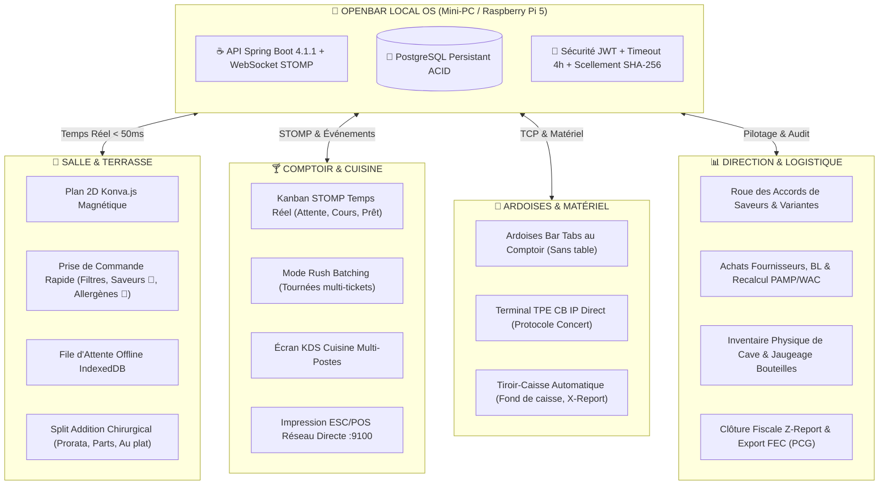
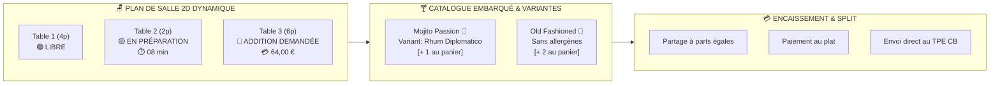
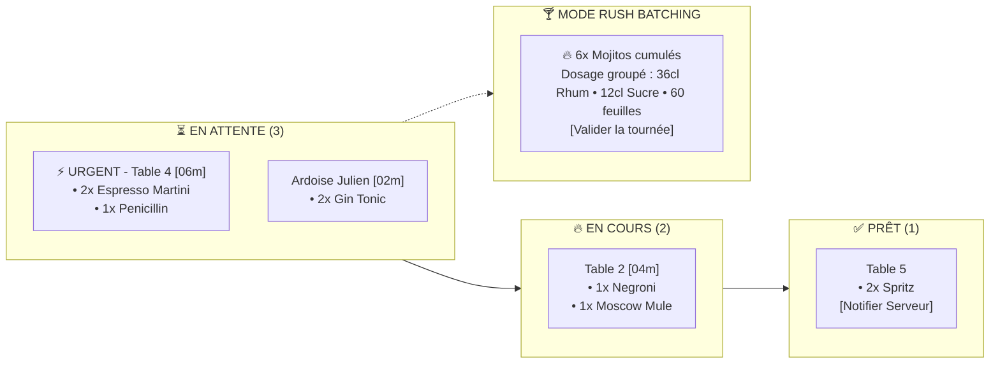
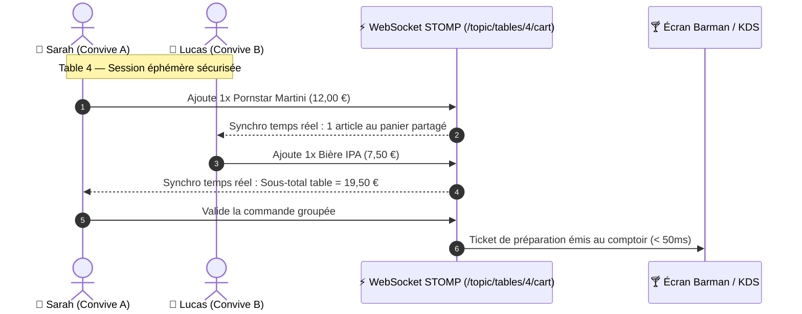
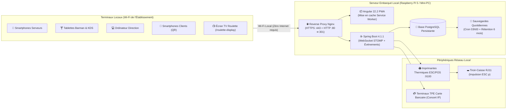

<p align="center">
  
</p>

<h1 align="center">🍹 OpenBar</h1>

<p align="center">
  <strong>L'OS de gestion de bar et d'établissement nouvelle génération : temps réel, 100% autonome en réseau local, sans abonnement cloud, conforme loi anti-fraude TVA et taillé pour le rush.</strong>
</p>

<p align="center">
  <a href="https://github.com/FunWarry/Open-Bar/actions/workflows/ci.yml"></a>
  <a href="https://sonarcloud.io/summary/new_code?id=FunWarry_Open-Bar"></a>
  <a href="https://sonarcloud.io/summary/new_code?id=FunWarry_Open-Bar"></a>
  <a href="https://github.com/FunWarry/Open-Bar/releases"></a>
  <a href="https://openjdk.org/projects/jdk/22/"></a>
  <a href="https://spring.io/projects/spring-boot"></a>
  <a href="https://angular.dev"></a>
  <a href="https://ionicframework.com"></a>
  <a href="https://jsverse.github.io/transloco/"></a>
  <a href="#-licence--conditions-dexploitation"></a>
</p>

<p align="center">
  <a href="#-pourquoi-openbar-"><strong>Pourquoi OpenBar ?</strong></a> •
  <a href="#-ce-que-vous-pouvez-faire-avec-openbar"><strong>Fonctionnalités Clés</strong></a> •
  <a href="#-10-modules-m%C3%A9tier-plug-and-play"><strong>10 Modules Plug & Play</strong></a> •
  <a href="#-aper%C3%A7u-des-interfaces"><strong>Showcase UI</strong></a> •
  <a href="#-architecture--r%C3%A9silience-locale"><strong>Architecture</strong></a> •
  <a href="#-d%C3%A9marrage-rapide-en-60-secondes"><strong>Quickstart</strong></a> •
  <a href="docs/TECHNICAL_GUIDE.md"><strong>Guide Technique 📖</strong></a>
</p>

---

## 💡 Pourquoi OpenBar ?

Gérer un bar, une brasserie ou un événement pendant le coup de feu ne devrait pas être une source constante de stress technique.

Aujourd'hui, la quasi-totalité des exploitants font face à un constat accablant :
1. **Le piège des abonnements Cloud prohibitifs** : 70 € à 160 € par mois et par tablette, plus des commissions sur chaque encaissement. Des milliers d'euros engloutis chaque année pour un simple logiciel de caisse.
2. **Le cauchemar des coupures Internet** : Dès que la box Wi-Fi s'arrête un vendredi soir à 22h, les logiciels SaaS cloud se bloquent net. Impossible de commander, impossible d'envoyer les bons au barman, impossible d'encaisser les clients.
3. **Le chaos des commandes et des stocks** : Bons papier perdus, barmans qui crient au milieu de la musique, erreurs de saisie sur le TPE bancaire, bouteilles coulées sans traçabilité et perte de marge brute.

### La Vision OpenBar

> **Donner aux exploitants l'indépendance technologique totale : un système ultra-performant, élégant, économique et résilient, qui fonctionne sans dépendance Internet.**

- 🚫 **100% Indépendant d'Internet** : OpenBar s'exécute sur votre propre réseau local (sur un simple Raspberry Pi 5 ou un mini-PC). Même si toute la ville perd sa connexion Internet, votre établissement encaisse et sert à pleine vitesse.
- ⚡ **Latence Réactive Sub-50ms** : Grâce au WebSocket STOMP, une commande prise en terrasse s'affiche instantanément sur le Kanban du barman et l'écran KDS de la cuisine.
- 💳 **Intégration TPE Bancaire Directe** : Connexion IP directe aux terminaux de paiement (protocole Concert). Fini les montants saisis à la main sur le TPE : la caisse pilote le terminal sans erreur possible.
- 🍸 **Génie Mixologique & Roue des Accords** : Roue de correspondances gustatives interactive (accords d'arômes, variantes de recettes, calcul automatique du coût matière au centilitre).
- 🎲 **Animation Ludique & Déstockage** : Roue de la Roulette Cocktail Mystère avec affichage sur écran TV déporté et sons de casino pour booster l'ambiance et écouler les surstocks.
- 📦 **Achats & Inventaires Physiques Certifiés** : Gestion des commandes fournisseurs avec recalcul du Coût Moyen Pondéré (PAMP/WAC), jaugeage visuel des bouteilles et réconciliation des écarts de cave.
- 🔒 **Conformité Fiscale Rigoureuse** : Clôture de caisse Z journalière avec scellement numérique SHA-256 (CGI art. 286 / NF525) et export FEC instantané.

---

## ✨ Ce que vous pouvez faire avec OpenBar

OpenBar orchestre harmonieusement tous les métiers de votre bar :


```mermaid
flowchart TD
    subgraph Core ["🍹 OPENBAR LOCAL OS (Mini-PC / Raspberry Pi 5)"]
        direction TB
        LocalServer["☕ API Spring Boot 4.1.1 + WebSocket STOMP"]
        Postgres[("🐘 PostgreSQL Persistant ACID")]
        Sec["🔐 Sécurité JWT + Timeout 4h + Scellement SHA-256"]
    end

    subgraph Salle ["📱 SALLE & TERRASSE"]
        S1["Plan 2D Konva.js Magnétique"]
        S2["Prise de Commande Rapide (Filtres, Saveurs 🍋, Allergènes 🥛)"]
        S3["File d'Attente Offline IndexedDB"]
        S4["Split Addition Chirurgical (Prorata, Parts, Au plat)"]
    end

    subgraph BarmanKDS ["🍸 COMPTOIR & CUISINE"]
        B1["Kanban STOMP Temps Réel (Attente, Cours, Prêt)"]
        B2["Mode Rush Batching (Tournées multi-tickets)"]
        B3["Écran KDS Cuisine Multi-Postes"]
        B4["Impression ESC/POS Réseau Directe :9100"]
    end

    subgraph Comptoir ["🧾 ARDOISES & MATÉRIEL"]
        C1["Ardoises Bar Tabs au Comptoir (Sans table)"]
        C2["Terminal TPE CB IP Direct (Protocole Concert)"]
        C3["Tiroir-Caisse Automatique (Fond de caisse, X-Report)"]
    end

    subgraph Direction ["📊 DIRECTION & LOGISTIQUE"]
        D1["Roue des Accords de Saveurs & Variantes"]
        D2["Achats Fournisseurs, BL & Recalcul PAMP/WAC"]
        D3["Inventaire Physique de Cave & Jaugeage Bouteilles"]
        D4["Clôture Fiscale Z-Report & Export FEC (PCG)"]
    end

    Core <-->|"Temps Réel < 50ms"| Salle
    Core <-->|"STOMP & Événements"| BarmanKDS
    Core <-->|"TCP & Matériel"| Comptoir
    Core <-->|"Pilotage & Audit"| Direction
```

---

## 🧩 10 Modules Métier Plug-and-Play

Chaque établissement est unique. OpenBar s'adapte instantanément à votre concept grâce à son architecture de **capacités activables en 1 clic** (depuis `/setup` ou l'espace Admin) :

| # | Module | Ce qu'il apporte à votre établissement | Bar | Restaurant | Food-Truck | Club |
|---|--------|----------------------------------------|:---:|:---:|:---:|:---:|
| 1 | 🍳 **Cuisine & KDS** | Écran tactile cuisine (`/kitchen`) et routage automatique des plats chauds et tapas | ❌ | ✅ | ✅ | ❌ |
| 2 | 🎉 **Happy Hour** | Moteur de remises horaires dynamiques (% ou prix fixe) qui bascule automatiquement | ✅ | ✅ | ❌ | ✅ |
| 3 | 👥 **Équipe & Shifts** | Plannings hebdomadaires, suivi des présences et replay temporel d'audit | ✅ | ✅ | ❌ | ✅ |
| 4 | 🪑 **Plan de Salle** | Plan 2D vectoriel Konva.js avec grille magnétique (1px = 1cm) et suivi des tables | ✅ | ✅ | ❌ | ❌ |
| 5 | 📲 **Commande QR** | Carte smartphone client, panier collaboratif multi-convives et appel serveur | ✅ | ✅ | ✅ | ✅ |
| 6 | 📦 **Gestion Stocks** | Déstockage automatique au centilitre, alertes de seuils et journal des pertes | ✅ | ✅ | ✅ | ✅ |
| 7 | 🧾 **Ardoises Clients (Bar Tabs)** | Comptes ouverts au comptoir sans table obligatoire, transferts table ➔ ardoise | ✅ | ❌ | ❌ | ✅ |
| 8 | 📚 **Bibliothèque Cocktails** | Catalogue de 80+ recettes officielles IBA et contemporaines avec importateur intelligent | ✅ | ✅ | ✅ | ✅ |
| 9 | 📋 **Inventaire Physique** | Sessions de stocktake, jaugeage visuel des bouteilles, fiches PDF et réconciliation | ✅ | ✅ | ✅ | ❌ |
| 10 | 🎲 **Roulette Mystère** | Roulette interactive gamifiée, écran TV déporté (`/roulette-display`) et sons casino | ✅ | ❌ | ❌ | ✅ |

---

## 🌟 Zoom sur les Fonctionnalités Phares

### 🍸 1. Roue des Accords de Saveurs & Variantes de Cocktails
- **Graphe de correspondances d'ingrédients interactif** : Visualisez les harmonies aromatiques entre spiritueux, jus, sirops et amers sur une roue chromatique interactive.
- **Double portée intégrée** : Basculez entre la bibliothèque mondiale (`LIBRARY`) et la carte de votre établissement (`ESTABLISHMENT`).
- **Variantes de recettes personnalisées** : Proposez des déclinaisons (sans alcool, spiritueux premium, épicé) avec calcul immédiat des dosages et du coût de revient.
- **Visualisation Sunburst hiérarchique** : Explorez vos boissons par Alcool de base ➔ Profil gustatif (Acidulé 🍋, Fruité 🍓, Sucré 🍯, Fumé 💨, Amer ☕, Épicé 🌶️, Herbacé 🌿) ➔ Recettes.

### 💳 2. Intégration TPE Bancaire Directe (Protocole Concert / CB IP)
- **Zéro erreur de caisse** : Le montant de l'addition est transmis directement par le réseau local au terminal bancaire sans aucune saisie manuelle.
- **Support multi-terminaux** : Configurez autant de TPE que nécessaire (Comptoir, Salle, Terrasse) avec attribution de rôles.
- **Tickets d'encaissement certifiés** : Référence d'autorisation, numéro de terminal et PAN de carte masqué imprimés automatiquement sur le reçu.

### 🧾 3. Ardoises & Comptes Clients au Comptoir (Bar Tabs)
- **Fluidité totale au bar** : Ouvrez une ardoise pour un client au comptoir sans lui attribuer de table physique.
- **Transferts transparents** : Transférez les consommations d'une ardoise vers une table ou inversement si le client s'assoit pour dîner.
- **Suivi des encaissements** : Règlements partiels, pourboires, remises commerciales et génération de facture conforme NF525.

### 📦 4. Achats Fournisseurs, BL & Recalcul PAMP / WAC
- **Gestion commerciale des conditionnements** : Commandez vos boissons sous leurs vrais formats d'achat (Bouteille 70cl, 1L, Fût 30L, Carton 6x70cl, Filet 1kg).
- **Réception de marchandises (BL)** : Validez les livraisons pour incrémenter les stocks et recalculer automatiquement le **Prix Moyen Pondéré (PAMP / WAC)** de vos ingrédients.
- **Préparations maison (*House-Crafted*)** : Déclarez vos sirops et infusions avec ratios de rendement et déstockage en cascade sur les ingrédients sources.

### 🍷 5. Inventaire Physique de Cave & Bar (Stocktake)
- **Comptage multi-emplacements** : Divisez l'inventaire entre le Bar Principal, la Cave de Réserve, le Speed Rail et la Terrasse.
- **Outil visuel de jaugeage de bouteilles** : Jaugez les bouteilles entamées en un glissement de doigt (de 10% à 90%).
- **Régularisation automatique** : Calcul instantané des écarts théoriques vs réels, valorisation financière de la démarque et ajustement du stock en un clic.
- **Exports professionnels** : Fiches de comptage vierges et rapports finaux certifiés au format PDF A4 (OpenPDF) et CSV pour votre comptable.

### 🎲 6. Roulette Cocktail Mystère & Écran TV Déporté
- **Animation de salle gamifiée** : Les clients hésitants font tourner la roue sur leur smartphone ou au comptoir avec sons de casino et pluie de confettis.
- **Affichage grand écran TV (`/roulette-display`)** : Connectez une télévision ou un vidéoprojecteur pour diffuser la roue en direct avec synchronisation WebSocket sécurisée par code PIN.
- **Déstockage intelligent** : Orientez les suggestions vers les cocktails à forte marge ou les surstocks d'ingrédients à écouler en priorité.

---

## 🖥️ Aperçu des Interfaces

### 📱 1. La Vue Serveur : Fluidité & Prise de Commande Rapide
*Optimisée pour smartphones et tablettes légères, utilisable d'une seule main.*


```mermaid
flowchart LR
    subgraph Plan ["🪑 PLAN DE SALLE 2D DYNAMIQUE"]
        T1["Table 1 (4p)\n🟢 LIBRE"]
        T2["Table 2 (2p)\n🟡 EN PRÉPARATION\n⏱️ 08 min"]
        T3["Table 3 (6p)\n🔴 ADDITION DEMANDÉE\n💳 64,00 €"]
    end

    subgraph PriseCmd ["🍸 CATALOGUE EMBARQUÉ & VARIANTES"]
        C1["Mojito Passion 🍋\nVariant: Rhum Diplomatico\n[+ 1 au panier]"]
        C2["Old Fashioned 💨\nSans allergènes\n[+ 2 au panier]"]
    end

    subgraph Split ["💳 ENCAISSEMENT & SPLIT"]
        SP1["Partage à parts égales"]
        SP2["Paiement au plat"]
        SP3["Envoi direct au TPE CB"]
    end

    Plan --> PriseCmd --> Split
```

---

### 🍸 2. Le Dashboard Barman & KDS Cuisine
*Pour les écrans tactiles de comptoir : visibilité instantanée, fiches recettes et cadence soutenue.*


```mermaid
flowchart LR
    subgraph Attente ["⏳ EN ATTENTE (3)"]
        Cmd1["⚡ URGENT - Table 4 [06m]\n• 2x Espresso Martini\n• 1x Penicillin"]
        Cmd2["Ardoise Julien [02m]\n• 2x Gin Tonic"]
    end

    subgraph EnCours ["🔥 EN COURS (2)"]
        Cmd3["Table 2 [04m]\n• 1x Negroni\n• 1x Moscow Mule"]
    end

    subgraph Pret ["✅ PRÊT (1)"]
        Cmd4["Table 5\n• 2x Spritz\n[Notifier Serveur]"]
    end

    subgraph Rush ["🍸 MODE RUSH BATCHING"]
        R1["🔥 6x Mojitos cumulés\nDosage groupé : 36cl Rhum • 12cl Sucre • 60 feuilles\n[Valider la tournée]"]
    end

    Attente --> EnCours --> Pret
    Attente -.-> Rush
```

---

### 📲 3. L'Interface Client QR Code (Zéro Téléchargement)
*Le client scanne le QR code de sa table : la carte s'ouvre instantanément dans son navigateur mobile.*


```mermaid
sequenceDiagram
    autonumber
    actor Sarah as 📲 Sarah (Convive A)
    actor Lucas as 📲 Lucas (Convive B)
    participant STOMP as ⚡ WebSocket STOMP (/topic/tables/4/cart)
    participant Bar as 🍸 Écran Barman / KDS

    Note over Sarah,Lucas: Table 4 — Session éphémère sécurisée
    Sarah->>STOMP: Ajoute 1x Pornstar Martini (12,00 €)
    STOMP-->>Lucas: Synchro temps réel : 1 article au panier partagé
    Lucas->>STOMP: Ajoute 1x Bière IPA (7,50 €)
    STOMP-->>Sarah: Synchro temps réel : Sous-total table = 19,50 €
    Sarah->>STOMP: Valide la commande groupée
    STOMP->>Bar: Ticket de préparation émis au comptoir (< 50ms)
```

---

## 🏗️ Architecture & Résilience Locale

OpenBar est spécialement conçu pour opérer dans un **réseau local sécurisé et isolé** :


```mermaid
flowchart LR
    subgraph Clients ["Terminaux Locaux (Wi-Fi de l'Établissement)"]
        T1["📱 Smartphones Serveurs"]
        T2["🍸 Tablettes Barman & KDS"]
        T3["💻 Ordinateur Direction"]
        T4["📲 Smartphones Clients (QR)"]
        T5["📺 Écran TV Roulette (/roulette-display)"]
    end

    subgraph ServeurLocal ["Serveur Embarqué Local (Raspberry Pi 5 / Mini-PC)"]
        Nginx["🌐 Reverse Proxy Nginx\n(HTTPS :443 + HTTP :80 ➔ 301)"]
        PWA["📦 Angular 22.2 PWA\n(Mise en cache Service Worker)"]
        Backend["☕ Spring Boot 4.1.1\n(WebSocket STOMP + Événements)"]
        Postgres[("🐘 Base PostgreSQL Persistante")]
        Backup["💾 Sauvegardes Quotidiennes\n(Cron 03h00 + Rétention 6 mois)"]
    end

    subgraph Peripheriques ["Périphériques Réseau Local"]
        Printers["🖨️ Imprimantes Thermiques ESC/POS :9100"]
        TPE["💳 Terminaux TPE Carte Bancaire (Concert IP)"]
        Drawer["💵 Tiroir-Caisse RJ11 (Impulsion ESC p)"]
    end

    Clients -->|"Wi-Fi Local (Zéro Internet requis)"| Nginx
    Nginx --> PWA
    Nginx --> Backend
    Backend --> Postgres
    Backend --> Printers
    Backend --> TPE
    Printers --> Drawer
    Postgres -.-> Backup
```

---

## 🚀 Démarrage Rapide en 60 Secondes

### Prérequis
- [Docker & Docker Compose](https://docs.docker.com/get-docker/) installés sur votre machine ou serveur local.

### 1. Cloner le projet et lancer la stack de production
```bash
git clone https://github.com/FunWarry/Open-Bar.git
cd Open-Bar

# Lancer la stack complète (PostgreSQL, Spring Boot, Nginx TLS, Backups)
docker compose -f docker-compose.prod.yml up -d
```

### 2. Accéder à l'application
Ouvrez votre navigateur sur : **`https://localhost`** (ou `https://<IP_DE_VOTRE_MACHINE>`).

### 3. Comptes de démonstration prêts à l'emploi

| Rôle | Email de Connexion | Mot de Passe | Interface & Droits |
|------|---------------------|--------------|-------------------|
| **Admin** | `admin@openbar.lan` | `admin123` | Configuration globale, TPE & Modules (`/admin/settings`) |
| **Manager** | `manager@openbar.lan` | `manager123` | Cockpit KPIs, Achats, Inventaires & Clôtures (`/dashboard-manager`) |
| **Serveur** | `serveur@openbar.lan` | `serveur123` | Plan de salle 2D, Ardoises & Prise de commandes (`/serveur`) |
| **Barman** | `barman@openbar.lan` | `barman123` | Kanban de préparation, Recettes & Mode Rush (`/barman`) |

> 📖 **Pour le développement local pas-à-pas** (Maven, Angular CLI, Swagger UI), consultez le **[Guide Technique](docs/TECHNICAL_GUIDE.md#4-guide-de-démarrage-rapide-quickstart)**.

---

## 🛡️ Qualité & Rigueur d'Ingénierie

OpenBar s'astreint à des critères d'assurance qualité stricts :
- **Documentation 100% en Anglais** : JavaDoc sur tous les services et DTOs, TSDoc sur tous les composants Angular, spécifications OpenAPI 3.1 sur tous les contrôleurs REST.
- **Zéro Problème IDE & Zéro `@SuppressWarnings`** : Toutes les inspections statiques et alertes TypeScript/Java sont résolues à la source.
- **Parité i18n Transloco Stricte** : 100% des chaînes traduisibles avec parité stricte entre `fr.json` et `en.json`.
- **Pyramide de Tests Complète** :
  - **3 000+ tests unitaires Frontend (Karma / Jasmine)** avec typage strict (zéro `any`).
  - **1 000+ tests unitaires & intégration Backend (JUnit 5 + Testcontainers PostgreSQL)**.
  - **103 scénarios End-to-End sous Playwright** validant les parcours navigateurs réels.
- **SonarCloud Grade A** : Couverture sur nouveau code supérieure à 80%, zéro vulnérabilité, zéro point chaud de sécurité.

---

## ⚖️ Licence & Conditions d'Exploitation

OpenBar est distribué sous licence **Source-Available Non-Commerciale**.

- **Usage Éducatif, Personnel & Recherche** : Le code source est librement consultable, modifiable et déployable gratuitement à des fins d'apprentissage, d'audit technique ou pour des projets strictement non lucratifs.
- **Exploitation Commerciale en Établissement** : Toute utilisation d'OpenBar dans le cadre de l'exploitation d'une activité commerciale lucrative (bar, brasserie, restaurant, food-truck, discothèque, festival payant) requiert l'acquisition préalable d'une **Licence Commerciale d'Exploitation**.

### 💼 Obtenir une Licence Commerciale ou un Accompagnement Matériel
Pour déployer OpenBar dans votre établissement ou commander une box serveur clé en main prête à brancher :
- **Auteur & Lead Développeur** : Mathéo Gevraise ([@FunWarry](https://github.com/FunWarry))
- **Dépôt GitHub** : [https://github.com/FunWarry/Open-Bar](https://github.com/FunWarry/Open-Bar)
- **Kanban & Roadmap Publique** : [GitHub Projects OpenBar](https://github.com/users/FunWarry/projects/3/views/1)

---

<p align="center">
  <strong>OpenBar</strong> — Libérez vos équipes, sublimez vos cocktails et régalez vos clients. 🍸🚀
</p>
