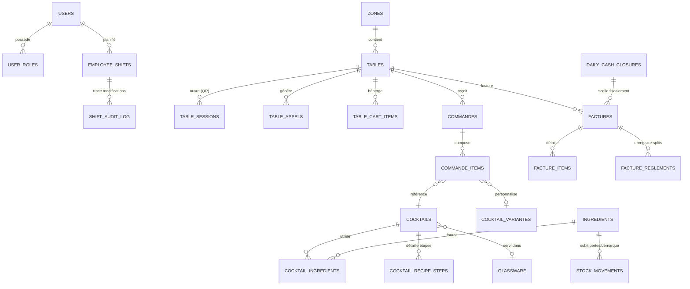

# 🛠️ OpenBar — Guide Technique & Architecture Système

> **Documentation d'ingénierie, d'architecture logicielle, d'infrastructure et d'exploitation du projet OpenBar.**  
> Pour une présentation générale du produit et de ses fonctionnalités, consultez le [README.md](../README.md).

---

## 📑 Sommaire Technique

1. [Principes d'Ingénierie & Contraintes](#1-principes-dingénierie--contraintes)
2. [Stack Technique Détaillée & Versions](#2-stack-technique-détaillée--versions)
3. [Architecture Backend (Spring Boot 4.1.1)](#3-architecture-backend-spring-boot-411)
4. [Architecture Frontend (Angular 20 + Ionic 8)](#4-architecture-frontend-angular-20--ionic-8)
5. [Modèle de Données Relationnel](#5-modèle-de-données-relationnel)
6. [Communication Temps Réel (WebSocket STOMP)](#6-communication-temps-réel-websocket-stomp)
7. [Impression Réseau Directe ESC/POS (TCP 9100)](#7-impression-réseau-directe-escpos-tcp-9100)
8. [Conformité Légale, Clôture Z-Report & Export FEC](#8-conformité-légale-clôture-z-report--export-fec)
9. [Déploiement Embarqué & Reverse Proxy Nginx TLS](#9-déploiement-embarqué--reverse-proxy-nginx-tls)
10. [Sauvegardes Automatiques & Disaster Recovery](#10-sauvegardes-automatiques--disaster-recovery)
11. [Sécurité & Durcissement en Production](#11-sécurité--durcissement-en-production)
12. [Pyramide de Tests & Assurance Qualité](#12-pyramide-de-tests--assurance-qualité)

---

## 1. Principes d'Ingénierie & Contraintes

OpenBar est conçu selon 4 axiomes fondamentaux :

1. **Autonomie Locale Totale (Zero Internet Dependency)** :
   Le système fonctionne sur un réseau Wi-Fi local isolé (LAN). Aucune requête externe n'est requise pendant le service. Si la connexion Internet du fournisseur d'accès est coupée, l'établissement continue de prendre les commandes, de préparer les verres et d'encaisser les clients sans la moindre interruption.

2. **Résilience et Mode Dégradé (Offline-First)** :
   En cas d'angle mort Wi-Fi (fond de cave, terrasse éloignée), les terminaux serveurs mettent en mémoire tampon les commandes via IndexedDB (`openbar-offline-db`). Dès que le terminal capte à nouveau le réseau, la file d'attente est purgée en arrière-plan avec déduplication idempotente backend (`client_request_id`).

3. **Synchronisation Réactive Faible Latence (Sub-50ms)** :
   Toutes les mutations métier (nouvelle commande, prise en charge au bar, boisson prête, appel serveur, mise à jour du panier partagé) sont diffusées instantanément via WebSocket STOMP à tous les acteurs concernés.

4. **Conformité Fiscale Rigoureuse (Loi Anti-Fraude TVA)** :
   Enregistrement inaltérable des encaissements, clôture journalière séquentielle scellée par hachage SHA-256 (CGI art. 286 / BOI-TVA-DECLA-30-10-30), verrouillage rétroactif des ventes et export comptable FEC conforme au Plan Comptable Général français.

---

## 2. Stack Technique Détaillée & Versions

| Couche | Technologie | Version | Détails & Rôle |
|--------|-------------|---------|----------------|
| **Runtime Backend** | **Java** | **22 (épinglé)** | Lombok 1.18.34 incompatible JDK 23+. JDK 22 requis pour compilation. |
| **Framework Backend** | **Spring Boot** | **4.1.1** | Injection de dépendances, JPA, REST, validation Bean Validation. |
| **Sécurité** | **Spring Security + JJWT** | **0.13.0** | JWT asymétrique/HMAC-SHA, rotation des refresh tokens, stateless. |
| **Base de Données** | **PostgreSQL** | **15 / 16** | BDD relationnelle ACID, migrations déclaratives `schema.sql`. |
| **Temps Réel** | **WebSocket STOMP** | Natif Spring | Broker STOMP en mémoire, 11 topics avec filtres par rôle/table. |
| **Impression Réseau** | **ESC/POS Socket Client** | Natif Java | Client socket TCP brut vers port 9100, protocole binaire CP850. |
| **Génération PDF** | **OpenPDF** | **2.0.3** | Factures A4, Z-Reports certifiés et chevalets de table pliables. |
| **Génération QR** | **ZXing** | **3.5.4** | Rendu matriciel PNG et vectoriel SVG pour QR tables et Wi-Fi invité. |
| **Assainissement HTML** | **Jsoup** | **1.23.2** | Nettoyage XSS global sur tous les DTOs textuels Jackson. |
| **Framework Frontend** | **Angular** | **20** | Composants standalone, signaux réactifs, lazy-loading strict. |
| **Composants UI** | **Ionic** | **8.8.11** | Composants tactiles/mobiles pour tablettes comptoir et smartphones. |
| **Internationalisation**| **Transloco** | **8.4.0** | Parité stricte 1-pour-1 FR/EN sur plus de 2 500 clés. |
| **Canvas 2D** | **Konva.js** | **10.3.2** | Plan de salle vectoriel réactif avec grille magnétique 50cm. |
| **Base Hors-Ligne** | **IndexedDB (`idb`)** | **8.0.3** | File d'attente locale et cache d'ordres hors connexion. |
| **Reverse Proxy / TLS** | **Nginx** | **Alpine** | Port 443 HTTPS, HTTP 80 redirect, en-têtes WebRTC caméra, SAN certs. |
| **Sauvegarde** | **postgres-backup-local**| **15-alpine** | Conteneur Docker dédié, cron 03:00, rétention 7j / 4s / 6m. |

---

## 3. Architecture Backend (Spring Boot 4.1.1)

Le backend respecte une architecture en couches étanche **Controller → Service → Repository** avec découplage événementiel :

```
backend/src/main/java/com/bar/gestioncocktail/
├── config/         # Sécurité, CORS, STOMP WebSocket, Async, Swagger OpenAPI
├── controller/     # Points d'entrée REST (@PreAuthorize systématique sur écritures)
├── dto/            # Java records immuables avec méthode statique from(Entity)
├── event/          # Événements de domaine (OrderCreatedEvent, InvoiceSettledEvent...)
├── listener/       # Écouteurs asynchrones (@Async("openbarAsyncExecutor"))
├── model/          # Entités JPA Hibernate (@Data Lombok, validation d'état)
├── repository/     # Spring Data JPA (Requêtes typées, indexation)
├── security/       # Filtres JWT, token provider, gestionnaire d'accès anonyme
└── service/        # Logique métier pure (@Transactional, publication d'événements)
```

### Découplage Événementiel & Zéro Référence Circulaire
Pour garantir la maintenabilité et des démarrages ultra-rapides, l'option `spring.main.allow-circular-references: false` est strictement imposée. Les communications inter-domaines sont orchestrées via Spring `ApplicationEventPublisher` :
- `OrderCreatedEvent` ➔ Déclenche l'impression ESC/POS cuisine/bar et la notification STOMP.
- `InvoiceSettledEvent` ➔ Déclenche l'impression du reçu thermique, l'éjection du tiroir-caisse et la libération de la table.
- `TableLiberatedEvent` ➔ Invalide les sessions QR éphémères (`TableSession`) et purge le panier collaboratif.

---

## 4. Architecture Frontend (Angular 20 + Ionic 8)

L'application frontend est construite autour du paradigme moderne d'Angular 20 :
- **Composants Standalone** : Zéro `NgModule` obsolète.
- **Routage Lazy-Loaded** : 100% des routes déclarées via `loadComponent` pour un temps de chargement initial minimal.
- **Signaux & State Management** : NgRx est réservé à l'authentification et au profil utilisateur. Toute la réactivité métier s'appuie sur des services Angular injectables et les `Signals` (`computed`, `signal`, `effect`).
- **Système de Thème Adaptatif** : Zéro code couleur hexadécimal en dur dans les templates ou SCSS. Utilisation exclusive des tokens CSS de `src/theme/variables.css` (`var(--background-bg-0)`, `var(--primary)`, `var(--semantic-success)`, etc.).

---

## 5. Modèle de Données Relationnel



---

## 6. Communication Temps Réel (WebSocket STOMP)

OpenBar opère un bus WebSocket STOMP interactif accessible sur l'endpoint `/ws` avec négociation d'upgrade HTTP :

| Topic | Portée | Payload | Déclencheur |
|-------|--------|---------|-------------|
| `/topic/commandes` | Personnel (Salle/Bar) | `CommandeResponseDTO` | Création ou mise à jour globale d'une commande |
| `/topic/commandes/{id}` | Public & Personnel | `CommandeResponseDTO` | Changement de statut d'une commande spécifique |
| `/topic/tables` | Personnel (Salle/Manager)| `TableResponseDTO` | Occupation, déplacement ou libération d'une table |
| `/topic/stock/alerte` | Personnel (Bar/Manager) | `StockAlertDTO` | Seuil d'alerte critique ou warning franchi sur ingrédient |
| `/topic/serveur/appels` | Serveurs & Managers | `TableAppelResponseDTO`| Appel serveur ou demande d'addition depuis un smartphone client |
| `/topic/table/{id}/appels` | Spécifique Table | `TableAppelResponseDTO`| Acquittement d'un appel par le serveur en salle |
| `/topic/tables/{id}/cart` | Convives d'une Table | `TableCartResponseDTO` | Ajout, modification, retrait d'un article ou validation panier |
| `/topic/preparation/bar` | Postes Barman | `CommandeItemResponseDTO`| Nouvel article affecté au bar |
| `/topic/preparation/kitchen` | Écrans Cuisine KDS | `CommandeItemResponseDTO`| Nouvel article affecté à la cuisine |
| `/topic/establishment/modules`| Tous les Postes | `EstablishmentModulesDTO`| Activation/Désactivation à chaud d'un module métier |

---

## 7. Impression Réseau Directe ESC/POS (TCP 9100)

OpenBar embarque un moteur natif d'impression ESC/POS via socket TCP brut (port par défaut : **9100**) évitant tout pilote lourd (CUPS, spooler d'OS ou cloud print) :
- **Formateur Binaire `EscPosFormatter`** :
  - Réinitialisation matérielle `ESC @`
  - Table de caractères européenne **CP850** avec gestion des accents français
  - Titres grand format (hauteur et largeur doubles)
  - Tables de colonnes alignées (quantités, désignation, montants)
  - Commande de coupe totale `GS V 0`
  - Impulsion électrique de déverrouillage de tiroir-caisse `ESC p 0 2 5`
- **Routage Multi-Imprimantes** : Les tickets de bar sont adressés à l'IP configurée pour le comptoir, les commandes cuisine à l'IP cuisine, et les reçus d'encaissement à l'imprimante caisse.

---

## 8. Conformité Légale, Clôture Z-Report & Export FEC

OpenBar intègre nativement les obligations fiscales françaises (CGI article 286, 3° bis du I) :
- **Numérotation Séquentielle Inaltérable** : Factures numérotées `FAC-YYYY-NNNNN` sans trou ni rupture chronologique.
- **Clôture Journalière (Z-Report)** :
  - Comptage des espèces tiroir assisté par coupures et pièces (500 € à 1 c).
  - Calcul dynamique de l'écart de caisse avec justification textuelle obligatoire si l'écart est non nul.
  - Scellement numérique **SHA-256** combinant la date, le chiffre d'affaires HT/TTC, les totaux de TVA et les données de comptage.
  - Verrouillage irréversible interdisant toute modification ou création de facture sur une date déjà clôturée.
- **Export FEC (Fichier des Écritures Comptables)** :
  Génération du fichier normalisé d'écritures comptables (tabulations) ventilé sur le plan comptable général :
  - `530000` : Caisse espèces
  - `512000` : Banque / Cartes bancaires
  - `706000` : Prestations de services / Ventes bar
  - `445710` : TVA collectée
  - `658000` / `758000` : Charges et produits sur écarts de caisse

---

## 9. Déploiement Embarqué & Reverse Proxy Nginx TLS

Pour garantir le fonctionnement du scanner QR caméra et l'enregistrement du Service Worker PWA sur les navigateurs mobiles modernes, Nginx gère la terminaison TLS locale :

### Ports et Redirection
- **Port 80** : Redirection 301 permanente vers HTTPS (port 443).
- **Port 443** : TLS 1.2 & TLS 1.3 avec chiffrement moderne.
- **En-tête de permissions** : `Permissions-Policy: camera=(self)` indispensable pour autoriser le flux vidéo WebRTC sur les terminaux clients.

### Génération des Certificats Réseau Local (SAN)
```bash
# Génère les certificats avec Subject Alternative Names (openbar.lan, localhost, IP locale)
./scripts/generate-local-certs.sh       # Linux / macOS
.\scripts\generate-local-certs.ps1      # Windows PowerShell
```

---

## 10. Sauvegardes Automatiques & Disaster Recovery

Le conteneur `backup` gère les sauvegardes nocturnes et leur rétention dans le volume persistant `openbar_backups` :
- **Snapshot quotidien** : 03:00 (cron `0 3 * * *`).
- **Rétention** : 7 jours glissants, 4 sauvegardes hebdomadaires, 6 sauvegardes mensuelles.

### Procédure de Disaster Recovery
```bash
# Restaure une sauvegarde avec snapshot de sécurité automatique préalable
./scripts/restore-db.sh -f ./backups/openbar_backup_YYYY-MM-DD_HHMMSS.sql.gz
.\scripts\restore-db.ps1 -File .\backups\openbar_backup_YYYY-MM-DD_HHMMSS.sql.gz
```

---

## 11. Sécurité & Durcissement en Production

- **Filtrage Anti-XSS Global** : Jackson désinfecte automatiquement toutes les chaînes entrantes grâce à `Jsoup`.
- **Validation Anti-Fraude QR** : Les commandes publiques requièrent un jeton de session de table éphémère (`TableSession`), empêchant les commandes pirates depuis l'extérieur de l'établissement.
- **Masquage des Erreurs en Production** : `server.error.include-stacktrace: never` et `include-message: never` interdisent toute fuite d'informations système.
- **CORS Restreint** : Restriction aux sous-réseaux locaux privés et domaines autorisés (`OPENBAR_CORS_ALLOWED_ORIGINS`).

---

## 12. Pyramide de Tests & Assurance Qualité

### 1. Tests Unitaires Frontend (Karma / Jasmine)
```bash
cd frontend && npx tsc --noEmit && npx ng test --watch=false --browsers=ChromeHeadless
```

### 2. Tests End-to-End (Playwright)
```bash
cd frontend && npm run test:e2e
```

### 3. Tests Backend Unitaires & Intégration (Spring Boot + Testcontainers)
```bash
cd backend && mvn test
```

### 4. Audit Qualité SonarCloud Local
```powershell
.\scripts\sonar-scan.ps1   # PowerShell
./scripts/sonar-scan.sh    # Bash
```
*Le seuil d'exigence du projet impose un Quality Gate vert (Grade A, couverture > 80%, zéro vulnérabilité, zéro `@SuppressWarnings`).*
